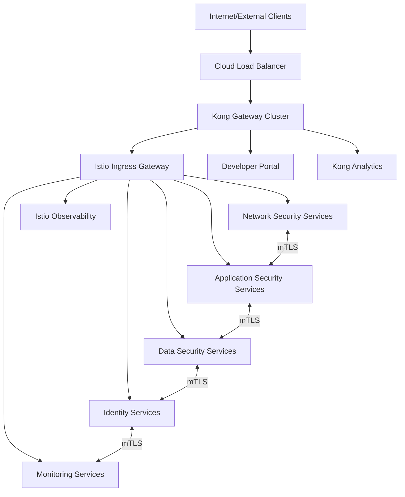

# iSECTECH Protect - API Gateway Design

**Version:** 1.0  
**Date:** 2025-07-31  
**Status:** In Progress  
**Task Reference:** 26.4

## Executive Summary

This document defines the API gateway architecture for the iSECTECH Protect platform using **Kong Gateway** for north-south traffic management and **Istio Service Mesh** for east-west traffic security. The design supports 10K+ concurrent users, 1M+ endpoints, with enterprise-grade security, multi-tenancy, and compliance requirements.

## Design Decisions

### Primary API Gateway: Kong Gateway

**Rationale:** Selected Kong Gateway for its proven scalability, extensive plugin ecosystem, enterprise security features, and strong multi-tenancy support essential for MSSP requirements.

### Service Mesh: Istio (with Envoy)

**Rationale:** Istio provides best-in-class east-west traffic security with mTLS, advanced traffic management, and deep observability for microservice communication.

### Hybrid Architecture Benefits

- **Kong:** Excels at API management, developer portal, rate limiting, authentication
- **Istio:** Provides zero-trust service mesh, advanced traffic policies, observability
- **Combined:** Comprehensive coverage for both external and internal traffic

---

## 1. Architecture Overview

### High-Level Traffic Flow



### Component Responsibilities

#### Kong Gateway (North-South Traffic)

- **External API Management:** Public API endpoints, developer portal
- **Authentication & Authorization:** JWT, OAuth, API keys, MFA integration
- **Rate Limiting & Quotas:** Per-tenant, per-API, global rate limits
- **Traffic Policies:** Request/response transformation, caching
- **Analytics & Monitoring:** API usage metrics, performance monitoring

#### Istio Service Mesh (East-West Traffic)

- **mTLS Encryption:** Automatic service-to-service encryption
- **Zero Trust Security:** Identity-based access control
- **Traffic Management:** Load balancing, circuit breaking, retries
- **Observability:** Distributed tracing, metrics, service topology
- **Policy Enforcement:** Network policies, security policies

---

## 2. Kong Gateway Configuration

### Deployment Architecture

#### Kong Gateway Cluster Setup

```yaml
# Kong Deployment Configuration
apiVersion: v1
kind: ConfigMap
metadata:
  name: kong-config
data:
  # High Performance Configuration
  nginx_worker_processes: 'auto'
  nginx_worker_connections: '16384'
  mem_cache_size: '256m'

  # Database Configuration (PostgreSQL)
  database: 'postgres'
  pg_host: 'kong-postgres-service'
  pg_port: '5432'
  pg_database: 'kong'
  pg_user: 'kong'

  # Security Configuration
  ssl_cert: '/etc/kong/certs/tls.crt'
  ssl_cert_key: '/etc/kong/certs/tls.key'
  admin_ssl_cert: '/etc/kong/admin-certs/tls.crt'
  admin_ssl_cert_key: '/etc/kong/admin-certs/tls.key'

  # Clustering Configuration
  cluster_listen: '0.0.0.0:8005'
  cluster_cert: '/etc/kong/cluster-certs/tls.crt'
  cluster_cert_key: '/etc/kong/cluster-certs/tls.key'

  # Performance Tuning
  upstream_keepalive_max_requests: '10000'
  upstream_keepalive_pool_size: '60'
```

#### Scaling Configuration

```yaml
# Kong HPA Configuration
apiVersion: autoscaling/v2
kind: HorizontalPodAutoscaler
metadata:
  name: kong-gateway-hpa
spec:
  scaleTargetRef:
    apiVersion: apps/v1
    kind: Deployment
    name: kong-gateway
  minReplicas: 3
  maxReplicas: 50
  metrics:
    - type: Resource
      resource:
        name: cpu
        target:
          type: Utilization
          averageUtilization: 70
    - type: Resource
      resource:
        name: memory
        target:
          type: Utilization
          averageUtilization: 80
```

### Core Plugin Configuration

#### 1. Authentication Plugins

**JWT Plugin Configuration**

```yaml
plugins:
  - name: jwt
    config:
      uri_param_names:
        - jwt
      header_names:
        - authorization
      claims_to_verify:
        - exp
        - sub
        - iss
      key_claim_name: iss
      secret_is_base64: false
      anonymous: false
      run_on_preflight: true
```

**OAuth 2.0 Plugin Configuration**

```yaml
plugins:
  - name: oauth2
    config:
      token_expiration: 7200
      enable_authorization_code: true
      enable_client_credentials: true
      enable_implicit_grant: false
      enable_password_grant: false
      hide_credentials: true
      accept_http_if_already_terminated: false
```

**Rate Limiting Plugin Configuration**

```yaml
plugins:
  - name: rate-limiting-advanced
    config:
      limit:
        - 1000 # requests per minute for authenticated users
        - 100 # requests per minute for anonymous users
      window_size:
        - 60 # 1 minute window
      identifier: consumer
      sync_rate: 10
      strategy: redis
      redis:
        host: kong-redis-service
        port: 6379
        timeout: 2000
        password: ${REDIS_PASSWORD}
        database: 0
      hide_client_headers: false
```

#### 2. Security Plugins

**CORS Plugin Configuration**

```yaml
plugins:
  - name: cors
    config:
      origins:
        - 'https://app.isectech.org'
        - 'https://portal.isectech.org'
      methods:
        - GET
        - POST
        - PUT
        - DELETE
        - PATCH
        - OPTIONS
      headers:
        - Accept
        - Accept-Version
        - Content-Length
        - Content-MD5
        - Content-Type
        - Date
        - Authorization
        - X-Requested-With
      exposed_headers:
        - X-Auth-Token
      credentials: true
      max_age: 3600
```

**Request Size Limiting Plugin**

```yaml
plugins:
  - name: request-size-limiting
    config:
      allowed_payload_size: 10 # 10MB max
      size_unit: megabytes
      require_content_length: false
```

#### 3. Transformation Plugins

**Request Transformer Plugin**

```yaml
plugins:
  - name: request-transformer-advanced
    config:
      add:
        headers:
          - 'X-Tenant-ID:$(headers.authorization | base64_decode | json_decode | .tenant_id)'
          - 'X-User-ID:$(headers.authorization | base64_decode | json_decode | .sub)'
          - 'X-Request-ID:$(uuid)'
      remove:
        headers:
          - 'X-Internal-Header'
```

#### 4. Observability Plugins

**Prometheus Plugin Configuration**

```yaml
plugins:
  - name: prometheus
    config:
      per_consumer: true
      status_code_metrics: true
      latency_metrics: true
      bandwidth_metrics: true
      upstream_health_metrics: true
```

**Zipkin Plugin Configuration**

```yaml
plugins:
  - name: zipkin
    config:
      http_endpoint: 'http://jaeger-collector:9411/api/v2/spans'
      sample_ratio: 0.01 # 1% sampling for production
      include_credential: false
      traceid_byte_count: 16
      spanid_byte_count: 8
      default_service_name: 'kong-gateway'
```

### API Route Configuration

#### Security Domain APIs

```yaml
# Network Security APIs
- name: network-security-api
  paths:
    - /api/v1/network
  methods:
    - GET
    - POST
    - PUT
    - DELETE
  strip_path: false
  preserve_host: false
  plugins:
    - name: jwt
    - name: rate-limiting-advanced
      config:
        limit: [1000] # Higher limit for security operations
    - name: prometheus
  upstream:
    name: network-security-upstream
    algorithm: round-robin
    healthchecks:
      active:
        http_path: /health
        healthy:
          interval: 5
          successes: 2
        unhealthy:
          interval: 5
          tcp_failures: 3
          http_failures: 3

# Identity Security APIs
- name: identity-security-api
  paths:
    - /api/v1/identity
    - /api/v1/auth
  methods:
    - GET
    - POST
    - PUT
    - DELETE
  strip_path: false
  preserve_host: false
  plugins:
    - name: jwt
    - name: rate-limiting-advanced
      config:
        limit: [500] # Stricter limits for identity operations
    - name: prometheus
  upstream:
    name: identity-security-upstream
    algorithm: least-connections # Better for auth operations
```

### Multi-Tenant Configuration

#### Tenant-Aware Rate Limiting

```yaml
plugins:
  - name: rate-limiting-advanced
    config:
      limit: [1000, 5000, 10000] # Tier-based limits
      window_size: [60, 3600, 86400] # 1min, 1hr, 1day windows
      identifier: consumer
      dictionary_name: 'tenant_limits'
      sync_rate: 10
      strategy: redis
      redis:
        host: kong-redis-service
        port: 6379
        database: 1 # Separate DB for tenant data
```

#### Tenant Isolation Plugin

```yaml
plugins:
  - name: request-transformer-advanced
    config:
      add:
        headers:
          - 'X-Tenant-ID:$(consumer.custom_id)'
        querystring:
          - 'tenant_id:$(consumer.custom_id)'
      remove:
        headers:
          - 'X-Admin-Token' # Remove admin headers for tenant requests
```

---

## 3. Istio Service Mesh Configuration

### Istio Installation & Configuration

#### Control Plane Configuration

```yaml
# Istio Control Plane Configuration
apiVersion: v1
kind: ConfigMap
metadata:
  name: istio-config
  namespace: istio-system
data:
  mesh: |
    defaultConfig:
      discoveryRefreshDelay: 10s
      proxyMetadata:
        PILOT_ENABLE_WORKLOAD_ENTRY_AUTOREGISTRATION: true
        PILOT_ENABLE_CROSS_CLUSTER_WORKLOAD_ENTRY: true
    defaultProviders:
      metrics:
      - prometheus
      tracing:
      - jaeger
      accessLogging:
      - envoy
    extensionProviders:
    - name: prometheus
      prometheus:
        configOverride:
          metric_relabeling_configs:
          - source_labels: [__name__]
            regex: istio_.*
            target_label: __tmp_istio_metric
    - name: jaeger
      zipkin:
        service: jaeger-collector.istio-system.svc.cluster.local
        port: 9411
```

#### Gateway Configuration

```yaml
# Istio Ingress Gateway
apiVersion: networking.istio.io/v1beta1
kind: Gateway
metadata:
  name: isectech-gateway
  namespace: istio-system
spec:
  selector:
    istio: ingressgateway
  servers:
    - port:
        number: 443
        name: https
        protocol: HTTPS
      tls:
        mode: SIMPLE
        credentialName: isectech-tls-secret
      hosts:
        - api.isectech.org
        - app.isectech.org
    - port:
        number: 80
        name: http
        protocol: HTTP
      hosts:
        - '*'
      tls:
        httpsRedirect: true
```

### mTLS Configuration

#### Cluster-Wide mTLS Policy

```yaml
# Strict mTLS for all services
apiVersion: security.istio.io/v1beta1
kind: PeerAuthentication
metadata:
  name: default
  namespace: istio-system
spec:
  mtls:
    mode: STRICT
---
# Permissive mode for Kong integration
apiVersion: security.istio.io/v1beta1
kind: PeerAuthentication
metadata:
  name: kong-integration
  namespace: isectech-system
spec:
  selector:
    matchLabels:
      app: kong-integration
  mtls:
    mode: PERMISSIVE
```

#### Service-Specific Authorization Policies

```yaml
# Network Service Authorization
apiVersion: security.istio.io/v1beta1
kind: AuthorizationPolicy
metadata:
  name: network-service-authz
  namespace: isectech-system
spec:
  selector:
    matchLabels:
      app: network-security-service
  rules:
    - from:
        - source:
            principals: ['cluster.local/ns/isectech-system/sa/kong-gateway']
        - source:
            principals: ['cluster.local/ns/isectech-system/sa/monitoring-service']
    - to:
        - operation:
            methods: ['GET', 'POST', 'PUT', 'DELETE']
    - when:
        - key: request.headers[x-tenant-id]
          values: ['*'] # Must have tenant ID
```

### Traffic Management

#### Load Balancing & Circuit Breaking

```yaml
# Destination Rules for Services
apiVersion: networking.istio.io/v1beta1
kind: DestinationRule
metadata:
  name: network-security-destination
  namespace: isectech-system
spec:
  host: network-security-service
  trafficPolicy:
    loadBalancer:
      simple: LEAST_CONN
    connectionPool:
      tcp:
        maxConnections: 100
        connectTimeout: 30s
        tcpKeepalive:
          time: 7200s
          interval: 75s
      http:
        http1MaxPendingRequests: 64
        http2MaxRequests: 1000
        maxRequestsPerConnection: 10
        maxRetries: 3
        consecutiveGatewayErrors: 5
        interval: 30s
        baseEjectionTime: 30s
    circuitBreaker:
      consecutiveErrors: 5
      interval: 30s
      baseEjectionTime: 30s
      maxEjectionPercent: 50
      minHealthPercent: 30
```

#### Virtual Services for Traffic Routing

```yaml
# Traffic routing for microservices
apiVersion: networking.istio.io/v1beta1
kind: VirtualService
metadata:
  name: security-services-vs
  namespace: isectech-system
spec:
  hosts:
    - api.isectech.org
  gateways:
    - istio-system/isectech-gateway
  http:
    - match:
        - uri:
            prefix: /api/v1/network
      route:
        - destination:
            host: network-security-service
            port:
              number: 8080
      timeout: 30s
      retries:
        attempts: 3
        perTryTimeout: 10s
    - match:
        - uri:
            prefix: /api/v1/identity
      route:
        - destination:
            host: identity-service
            port:
              number: 8080
      timeout: 15s
      retries:
        attempts: 2
        perTryTimeout: 5s
```

---

## 4. Integration Pattern: Kong + Istio

### Integration Architecture

#### Kong to Istio Integration

```yaml
# Kong Service Configuration for Istio
apiVersion: v1
kind: Service
metadata:
  name: kong-to-istio-service
  namespace: isectech-system
spec:
  selector:
    app: istio-ingress-gateway
  ports:
    - name: http
      port: 80
      targetPort: 8080
    - name: https
      port: 443
      targetPort: 8443
---
# Kong Upstream Configuration
upstream:
  name: istio-upstream
  algorithm: round-robin
  slots: 10000
  healthchecks:
    active:
      type: http
      http_path: /healthz/ready
      healthy:
        interval: 10
        successes: 2
      unhealthy:
        interval: 10
        tcp_failures: 3
        http_failures: 5
        timeouts: 3
  targets:
    - target: istio-ingressgateway.istio-system.svc.cluster.local:80
      weight: 100
```

#### Header Propagation

```yaml
# Kong Plugin: Header Propagation to Istio
plugins:
  - name: request-transformer-advanced
    config:
      add:
        headers:
          - 'x-forwarded-proto:https'
          - 'x-forwarded-for:$(client_ip)'
          - 'x-request-id:$(request_id)'
          - 'x-trace-id:$(uuid)'
          - 'x-tenant-id:$(consumer.custom_id)'
          - 'x-user-id:$(jwt_claim.sub)'
          - 'x-user-roles:$(jwt_claim.roles)'
      remove:
        headers:
          - 'authorization' # Remove after processing
```

### Security Integration

#### End-to-End Security Flow

1. **External Request** → Kong Gateway (TLS termination)
2. **Kong Authentication** → JWT/OAuth validation
3. **Kong Rate Limiting** → Per-tenant quota enforcement
4. **Kong to Istio** → Header injection with user context
5. **Istio mTLS** → Service-to-service encryption
6. **Istio Authorization** → Fine-grained access control
7. **Service Processing** → Business logic execution
8. **Response Path** → Reverse flow with observability

#### Certificate Management

```yaml
# External Certificate (Kong)
apiVersion: v1
kind: Secret
metadata:
  name: kong-tls-secret
  namespace: kong-system
type: kubernetes.io/tls
data:
  tls.crt: <base64-encoded-cert>
  tls.key: <base64-encoded-key>

# Internal Certificate (Istio)
apiVersion: v1
kind: Secret
metadata:
  name: istio-ca-secret
  namespace: istio-system
type: Opaque
data:
  root-cert.pem: <base64-encoded-root-cert>
  cert-chain.pem: <base64-encoded-cert-chain>
  ca-cert.pem: <base64-encoded-ca-cert>
  ca-key.pem: <base64-encoded-ca-key>
```

---

## 5. Developer Portal Configuration

### Kong Developer Portal Setup

#### Portal Configuration

```yaml
# Kong Developer Portal Config
portal_gui_host: portal.isectech.org
portal_gui_protocol: https
portal_gui_use_subdomains: false

# Authentication
portal_auth: basic-auth
portal_session_conf: '{"secret":"your-secret-key","storage":"kong","cookie_secure":true}'

# Portal Features
portal_auto_approve: false
portal_token_exp: 21600 # 6 hours
portal_invite_email: true
portal_access_request_email: admin@isectech.org

# SMTP Configuration for notifications
smtp_mock: false
smtp_host: smtp.gmail.com
smtp_port: 587
smtp_starttls: true
smtp_username: ${SMTP_USERNAME}
smtp_password: ${SMTP_PASSWORD}
smtp_auth_type: plain
```

#### API Documentation Integration

```yaml
# Swagger/OpenAPI Integration
plugins:
  - name: openapi-validator
    config:
      api_spec: |
        openapi: 3.0.0
        info:
          title: iSECTECH Protect API
          version: 1.0.0
          description: Cybersecurity Platform API
        servers:
        - url: https://api.isectech.org/v1
          description: Production API
        paths:
          /network/threats:
            get:
              summary: Get threat detections
              security:
              - BearerAuth: []
              responses:
                200:
                  description: Successful response
                  content:
                    application/json:
                      schema:
                        type: array
                        items:
                          $ref: '#/components/schemas/Threat'
        components:
          securitySchemes:
            BearerAuth:
              type: http
              scheme: bearer
              bearerFormat: JWT
```

---

## 6. Performance Optimization

### Kong Performance Tuning

#### Database Optimization

```yaml
# PostgreSQL Configuration for Kong
postgresql.conf:
  max_connections: 200
  shared_buffers: 2GB
  effective_cache_size: 6GB
  work_mem: 16MB
  maintenance_work_mem: 512MB
  checkpoint_completion_target: 0.9
  wal_buffers: 16MB
  default_statistics_target: 100
  random_page_cost: 1.1
  effective_io_concurrency: 200
```

#### Redis Configuration for Rate Limiting

```yaml
# Redis Configuration
redis.conf:
  maxmemory: 4gb
  maxmemory-policy: allkeys-lru
  timeout: 300
  tcp-keepalive: 60
  databases: 16
  save: '900 1 300 10 60 10000'
  rdbcompression: yes
  stop-writes-on-bgsave-error: no
```

### Istio Performance Tuning

#### Pilot Configuration

```yaml
# Istio Pilot Tuning
env:
  - name: PILOT_PUSH_THROTTLE
    value: '100'
  - name: PILOT_MAX_REQUESTS_PER_SECOND
    value: '25'
  - name: PILOT_TRACE_SAMPLING
    value: '1.0'
resources:
  requests:
    cpu: 500m
    memory: 2Gi
  limits:
    cpu: 2000m
    memory: 8Gi
```

#### Envoy Proxy Tuning

```yaml
# Envoy Proxy Configuration
proxyMetadata:
  PILOT_ENABLE_WORKLOAD_ENTRY_AUTOREGISTRATION: 'true'
  BOOTSTRAP_XDS_AGENT: 'true'
resources:
  requests:
    cpu: 100m
    memory: 128Mi
  limits:
    cpu: 2000m
    memory: 1Gi
```

---

## 7. Monitoring & Observability

### Kong Metrics & Monitoring

#### Prometheus Metrics

```yaml
# Kong Prometheus Metrics
kong_bandwidth_bytes: Total bandwidth in bytes
kong_http_requests_total: Total HTTP requests
kong_http_status: HTTP status code per service/route
kong_latency_ms: Request latency in milliseconds
kong_nginx_http_current_connections: Current connections
kong_memory_workers_lua_vms_bytes: Memory usage per worker
```

#### Grafana Dashboard Configuration

```json
{
  "dashboard": {
    "title": "Kong Gateway Performance",
    "panels": [
      {
        "title": "Request Rate",
        "type": "graph",
        "targets": [
          {
            "expr": "rate(kong_http_requests_total[5m])",
            "legendFormat": "{{service}}"
          }
        ]
      },
      {
        "title": "Response Latency",
        "type": "graph",
        "targets": [
          {
            "expr": "histogram_quantile(0.95, rate(kong_latency_ms_bucket[5m]))",
            "legendFormat": "95th percentile"
          }
        ]
      }
    ]
  }
}
```

### Istio Observability

#### Service Map & Tracing

```yaml
# Kiali Configuration
apiVersion: v1
kind: ConfigMap
metadata:
  name: kiali
  namespace: istio-system
data:
  config.yaml: |
    server:
      web_root: /kiali
    auth:
      strategy: anonymous
    external_services:
      prometheus:
        url: "http://prometheus:9090"
      grafana:
        url: "http://grafana:3000"
      jaeger:
        url: "http://jaeger-query:16686"
```

#### Distributed Tracing

```yaml
# Jaeger Configuration
apiVersion: v1
kind: ConfigMap
metadata:
  name: jaeger-config
  namespace: istio-system
data:
  jaeger.yaml: |
    query:
      max-traces: 10000
    collector:
      zipkin:
        host-port: ":9411"
    storage:
      type: elasticsearch
      elasticsearch:
        server-urls: http://elasticsearch:9200
        index-prefix: jaeger
```

---

## 8. Security Hardening

### Kong Security Configuration

#### SSL/TLS Configuration

```yaml
# Kong SSL Configuration
ssl_protocols: TLSv1.2 TLSv1.3
ssl_ciphers: ECDHE-ECDSA-AES256-GCM-SHA384:ECDHE-RSA-AES256-GCM-SHA384
ssl_prefer_server_ciphers: on
ssl_dhparam: /etc/kong/dhparam.pem
ssl_session_cache: shared:SSL:10m
ssl_session_timeout: 10m
```

#### Admin API Security

```yaml
# Secure Admin API
admin_listen: 127.0.0.1:8001 ssl
admin_ssl_cert: /etc/kong/admin-ssl/tls.crt
admin_ssl_cert_key: /etc/kong/admin-ssl/tls.key
admin_access_log: /dev/stdout
admin_error_log: /dev/stderr
admin_gui_access_log: /dev/stdout
admin_gui_error_log: /dev/stderr
```

### Istio Security Policies

#### Network Policies

```yaml
# Deny-all default policy
apiVersion: networking.k8s.io/v1
kind: NetworkPolicy
metadata:
  name: deny-all
  namespace: isectech-system
spec:
  podSelector: {}
  policyTypes:
    - Ingress
    - Egress
---
# Allow Kong to Istio
apiVersion: networking.k8s.io/v1
kind: NetworkPolicy
metadata:
  name: allow-kong-to-istio
  namespace: isectech-system
spec:
  podSelector:
    matchLabels:
      app: istio-ingressgateway
  policyTypes:
    - Ingress
  ingress:
    - from:
        - namespaceSelector:
            matchLabels:
              name: kong-system
```

---

## 9. Disaster Recovery & High Availability

### Kong HA Configuration

#### Multi-Region Setup

```yaml
# Kong Multi-Region Configuration
# Primary Region: us-central1
# Secondary Region: us-east1
# Tertiary Region: us-west1

# Regional Service Configuration
regions:
  primary:
    name: us-central1
    weight: 100
    health_check: /status
  secondary:
    name: us-east1
    weight: 0 # Standby
    health_check: /status
  tertiary:
    name: us-west1
    weight: 0 # Standby
    health_check: /status
```

#### Database Failover

```yaml
# PostgreSQL Failover Configuration
primary:
  host: kong-postgres-primary.us-central1
  read_replica: kong-postgres-replica.us-central1
secondary:
  host: kong-postgres-secondary.us-east1
  read_replica: kong-postgres-replica.us-east1
failover:
  detection_timeout: 30s
  promotion_timeout: 60s
  health_check_interval: 10s
```

### Istio HA Configuration

#### Control Plane HA

```yaml
# Istio Control Plane HA
apiVersion: install.istio.io/v1alpha1
kind: IstioOperator
metadata:
  name: isectech-istio
spec:
  values:
    pilot:
      replica_count: 3
      resources:
        requests:
          cpu: 500m
          memory: 2Gi
    global:
      meshID: isectech-mesh
      multiCluster:
        clusterName: isectech-primary
      network: isectech-network
```

---

## 10. Implementation Roadmap

### Phase 1: Kong Gateway Setup (Week 1-2)

- **Day 1-3:** Kong cluster deployment on GKE
- **Day 4-7:** Basic authentication and rate limiting plugins
- **Day 8-10:** SSL/TLS configuration and security hardening
- **Day 11-14:** Developer portal setup and API documentation

### Phase 2: Istio Integration (Week 3-4)

- **Day 15-17:** Istio control plane installation
- **Day 18-21:** mTLS configuration and security policies
- **Day 22-24:** Kong-to-Istio integration and testing
- **Day 25-28:** Observability setup (Prometheus, Grafana, Jaeger)

### Phase 3: Advanced Features (Week 5-6)

- **Day 29-31:** Multi-tenant configuration and testing
- **Day 32-35:** Performance optimization and load testing
- **Day 36-38:** Disaster recovery setup and testing
- **Day 39-42:** Production readiness and documentation

### Phase 4: Go-Live (Week 7-8)

- **Day 43-45:** Staging environment validation
- **Day 46-49:** Production deployment and migration
- **Day 50-52:** Post-deployment monitoring and optimization
- **Day 53-56:** Team training and operational handover

---

## 11. Success Criteria

### Performance Criteria

- **Throughput:** Handle 10K+ concurrent users
- **Latency:** P95 < 200ms, P99 < 500ms API response time
- **Availability:** 99.99% uptime for both Kong and Istio
- **Scalability:** Auto-scale from 3 to 50 Kong replicas based on load

### Security Criteria

- **Authentication:** 100% API authentication enforcement
- **Authorization:** Role-based access control validation
- **Encryption:** End-to-end encryption for all traffic
- **Compliance:** SOC 2, ISO 27001, GDPR audit readiness

### Operational Criteria

- **Monitoring:** Complete observability with alerts
- **Recovery:** < 30 second failover for Kong, < 1 minute for Istio
- **Documentation:** Complete operational runbooks
- **Team Readiness:** Training completed for operations team

---

**Next Steps:**

- Proceed to Task 26.5: Plan Multi-Region Deployment on Google Cloud Platform
- Begin Kong Gateway cluster provisioning
- Set up Istio control plane in parallel
- Configure monitoring and observability stack
- Plan integration testing scenarios
