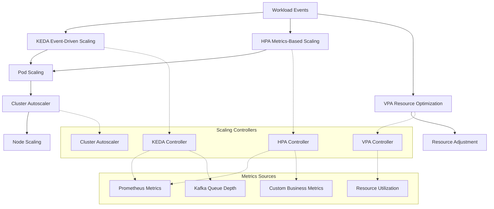

# Auto-Scaling Policies and Resource Management for iSECTECH Platform

## Executive Summary

This document defines comprehensive auto-scaling policies and resource management strategies for the iSECTECH cybersecurity platform, designed to handle 1M+ endpoints and 1B+ events/day with elastic resource allocation, cost optimization, and 99.99% availability. The solution leverages Kubernetes HPA, VPA, KEDA, and Cluster Autoscaler with custom metrics integration to achieve optimal performance under variable security workloads.

## 1. Auto-Scaling Architecture Overview

### 1.1 Multi-Layer Scaling Strategy



### 1.2 Scaling Dimensions

1. **Horizontal Pod Autoscaling (HPA)**

   - CPU/Memory-based scaling
   - Custom metrics scaling (event rates, queue depth)
   - Multi-metric scaling policies
   - Stabilization windows for burst handling

2. **Event-Driven Autoscaling (KEDA)**

   - Kafka queue depth-based scaling
   - Message queue backlog scaling
   - HTTP request rate scaling
   - Scheduled pre-scaling for predictable peaks

3. **Vertical Pod Autoscaling (VPA)**

   - Resource request/limit optimization
   - Historical usage analysis
   - Recommendation-mode for critical services
   - Cost optimization through right-sizing

4. **Cluster Autoscaling**
   - Node group management
   - Multi-instance type support
   - Spot/preemptible instance integration
   - Zone-aware scaling

## 2. Service-Specific Auto-Scaling Policies

### 2.1 Critical Security Services (High Priority)

#### 2.1.1 Authentication Service

```yaml
apiVersion: autoscaling/v2
kind: HorizontalPodAutoscaler
metadata:
  name: authentication-service-hpa
  namespace: isectech-critical
  labels:
    security-domain: identity
    scaling-tier: critical
spec:
  scaleTargetRef:
    apiVersion: apps/v1
    kind: Deployment
    name: authentication-service
  minReplicas: 10
  maxReplicas: 100
  metrics:
    - type: Resource
      resource:
        name: cpu
        target:
          type: Utilization
          averageUtilization: 70
    - type: Resource
      resource:
        name: memory
        target:
          type: Utilization
          averageUtilization: 80
    - type: Pods
      pods:
        metric:
          name: auth_requests_per_second
        target:
          type: AverageValue
          averageValue: '100'
  behavior:
    scaleDown:
      stabilizationWindowSeconds: 300
      policies:
        - type: Percent
          value: 10
          periodSeconds: 60
    scaleUp:
      stabilizationWindowSeconds: 30
      policies:
        - type: Percent
          value: 50
          periodSeconds: 30
        - type: Pods
          value: 5
          periodSeconds: 30
      selectPolicy: Max
```

#### 2.1.2 Threat Detection Service

```yaml
apiVersion: keda.sh/v1alpha1
kind: ScaledObject
metadata:
  name: threat-detection-scaler
  namespace: isectech-critical
  labels:
    security-domain: application
    scaling-tier: critical
spec:
  scaleTargetRef:
    name: threat-detection-service
  minReplicaCount: 15
  maxReplicaCount: 500
  pollingInterval: 10
  cooldownPeriod: 60
  idleReplicaCount: 15
  triggers:
    - type: kafka
      metadata:
        bootstrapServers: kafka-cluster:9092
        topic: security-events
        lagThreshold: '5000'
        consumerGroup: threat-detection-group
    - type: prometheus
      metadata:
        serverAddress: http://prometheus:9090
        metricName: threat_detection_backlog
        threshold: '10000'
        query: sum(threat_detection_queue_depth)
    - type: cron
      metadata:
        timezone: UTC
        start: '0 8 * * 1-5' # Scale up at 8 AM weekdays
        end: '0 18 * * 1-5' # Scale down at 6 PM weekdays
        desiredReplicas: '50'
```

#### 2.1.3 Real-Time Security Analytics

```yaml
apiVersion: autoscaling/v2
kind: HorizontalPodAutoscaler
metadata:
  name: analytics-service-hpa
  namespace: isectech-critical
spec:
  scaleTargetRef:
    apiVersion: apps/v1
    kind: Deployment
    name: analytics-service
  minReplicas: 20
  maxReplicas: 1000
  metrics:
    - type: External
      external:
        metric:
          name: events_processed_per_second
          selector:
            matchLabels:
              service: analytics-service
        target:
          type: AverageValue
          averageValue: '1000'
    - type: External
      external:
        metric:
          name: analytics_queue_depth
        target:
          type: Value
          value: '50000'
  behavior:
    scaleDown:
      stabilizationWindowSeconds: 600 # 10 minutes
      policies:
        - type: Percent
          value: 5
          periodSeconds: 60
    scaleUp:
      stabilizationWindowSeconds: 60
      policies:
        - type: Percent
          value: 100
          periodSeconds: 30
```

### 2.2 Standard Security Services (Medium Priority)

#### 2.2.1 Vulnerability Management Service

```yaml
apiVersion: autoscaling/v2
kind: HorizontalPodAutoscaler
metadata:
  name: vuln-mgmt-hpa
  namespace: isectech-standard
  labels:
    security-domain: application
    scaling-tier: standard
spec:
  scaleTargetRef:
    apiVersion: apps/v1
    kind: Deployment
    name: vulnerability-management-service
  minReplicas: 5
  maxReplicas: 200
  metrics:
    - type: Resource
      resource:
        name: cpu
        target:
          type: Utilization
          averageUtilization: 80
    - type: Pods
      pods:
        metric:
          name: scan_requests_per_minute
        target:
          type: AverageValue
          averageValue: '50'
  behavior:
    scaleDown:
      stabilizationWindowSeconds: 900 # 15 minutes
    scaleUp:
      stabilizationWindowSeconds: 120 # 2 minutes
```

#### 2.2.2 Compliance Automation Service

```yaml
apiVersion: keda.sh/v1alpha1
kind: ScaledObject
metadata:
  name: compliance-automation-scaler
  namespace: isectech-standard
spec:
  scaleTargetRef:
    name: compliance-automation-service
  minReplicaCount: 3
  maxReplicaCount: 50
  triggers:
    - type: cron
      metadata:
        timezone: UTC
        start: '0 2 * * *' # Scale up at 2 AM for daily reports
        end: '0 6 * * *' # Scale down at 6 AM
        desiredReplicas: '20'
    - type: cron
      metadata:
        timezone: UTC
        start: '0 1 1 * *' # Scale up on 1st of month for monthly reports
        end: '0 8 1 * *' # Scale down later
        desiredReplicas: '30'
    - type: prometheus
      metadata:
        serverAddress: http://prometheus:9090
        metricName: compliance_reports_pending
        threshold: '100'
        query: sum(compliance_queue_depth)
```

### 2.3 Background Processing Services (Low Priority)

#### 2.3.1 Data Analytics and Reporting

```yaml
apiVersion: autoscaling/v2
kind: HorizontalPodAutoscaler
metadata:
  name: data-analytics-hpa
  namespace: isectech-background
spec:
  scaleTargetRef:
    apiVersion: apps/v1
    kind: Deployment
    name: data-analytics-service
  minReplicas: 2
  maxReplicas: 100
  metrics:
    - type: Resource
      resource:
        name: cpu
        target:
          type: Utilization
          averageUtilization: 85
    - type: Pods
      pods:
        metric:
          name: analytics_jobs_queued
        target:
          type: AverageValue
          averageValue: '20'
  behavior:
    scaleDown:
      stabilizationWindowSeconds: 1800 # 30 minutes
      policies:
        - type: Percent
          value: 10
          periodSeconds: 300
    scaleUp:
      stabilizationWindowSeconds: 300 # 5 minutes
      policies:
        - type: Percent
          value: 25
          periodSeconds: 60
```

## 3. Vertical Pod Autoscaler Configuration

### 3.1 VPA for Critical Services (Recommendation Mode)

```yaml
apiVersion: autoscaling.k8s.io/v1
kind: VerticalPodAutoscaler
metadata:
  name: authentication-service-vpa
  namespace: isectech-critical
spec:
  targetRef:
    apiVersion: apps/v1
    kind: Deployment
    name: authentication-service
  updatePolicy:
    updateMode: 'Off' # Recommendation only for critical services
  resourcePolicy:
    containerPolicies:
      - containerName: authentication-service
        minAllowed:
          cpu: 100m
          memory: 128Mi
        maxAllowed:
          cpu: 2000m
          memory: 4Gi
        controlledResources: ['cpu', 'memory']
        controlledValues: RequestsAndLimits
---
apiVersion: autoscaling.k8s.io/v1
kind: VerticalPodAutoscaler
metadata:
  name: threat-detection-vpa
  namespace: isectech-critical
spec:
  targetRef:
    apiVersion: apps/v1
    kind: Deployment
    name: threat-detection-service
  updatePolicy:
    updateMode: 'Off'
  resourcePolicy:
    containerPolicies:
      - containerName: threat-detection-service
        minAllowed:
          cpu: 200m
          memory: 256Mi
        maxAllowed:
          cpu: 4000m
          memory: 8Gi
        controlledResources: ['cpu', 'memory']
```

### 3.2 VPA for Standard Services (Auto Mode)

```yaml
apiVersion: autoscaling.k8s.io/v1
kind: VerticalPodAutoscaler
metadata:
  name: vulnerability-mgmt-vpa
  namespace: isectech-standard
spec:
  targetRef:
    apiVersion: apps/v1
    kind: Deployment
    name: vulnerability-management-service
  updatePolicy:
    updateMode: 'Auto'
    evictionRequirements:
      - resources: ['memory']
        changeRequirement: 'TargetHigherThanRequests'
  resourcePolicy:
    containerPolicies:
      - containerName: vulnerability-management-service
        minAllowed:
          cpu: 100m
          memory: 128Mi
        maxAllowed:
          cpu: 2000m
          memory: 4Gi
```

## 4. Resource Requests and Limits

### 4.1 Critical Services Resource Configuration

```yaml
apiVersion: apps/v1
kind: Deployment
metadata:
  name: authentication-service
  namespace: isectech-critical
spec:
  template:
    spec:
      containers:
        - name: authentication-service
          image: isectech/authentication-service:latest
          resources:
            requests:
              cpu: 500m
              memory: 1Gi
              ephemeral-storage: 1Gi
            limits:
              cpu: 1000m
              memory: 2Gi
              ephemeral-storage: 2Gi
          env:
            - name: JAVA_OPTS
              value: '-Xms1g -Xmx1800m -XX:+UseG1GC'
      priorityClassName: high-priority
---
apiVersion: v1
kind: PriorityClass
metadata:
  name: high-priority
value: 1000000
globalDefault: false
description: 'High priority class for critical security services'
```

### 4.2 Standard Services Resource Configuration

```yaml
apiVersion: apps/v1
kind: Deployment
metadata:
  name: vulnerability-management-service
  namespace: isectech-standard
spec:
  template:
    spec:
      containers:
        - name: vulnerability-management-service
          image: isectech/vulnerability-management:latest
          resources:
            requests:
              cpu: 250m
              memory: 512Mi
              ephemeral-storage: 500Mi
            limits:
              cpu: 1000m
              memory: 2Gi
              ephemeral-storage: 2Gi
      priorityClassName: medium-priority
---
apiVersion: v1
kind: PriorityClass
metadata:
  name: medium-priority
value: 100000
globalDefault: false
description: 'Medium priority class for standard security services'
```

### 4.3 Background Services Resource Configuration

```yaml
apiVersion: apps/v1
kind: Deployment
metadata:
  name: data-analytics-service
  namespace: isectech-background
spec:
  template:
    spec:
      containers:
        - name: data-analytics-service
          image: isectech/data-analytics:latest
          resources:
            requests:
              cpu: 100m
              memory: 256Mi
              ephemeral-storage: 200Mi
            limits:
              cpu: 2000m
              memory: 4Gi
              ephemeral-storage: 4Gi
      priorityClassName: low-priority
---
apiVersion: v1
kind: PriorityClass
metadata:
  name: low-priority
value: 10000
globalDefault: true
description: 'Low priority class for background services'
```

## 5. Cluster Autoscaler Configuration

### 5.1 Multi-Node Group Setup

```yaml
apiVersion: v1
kind: ConfigMap
metadata:
  name: cluster-autoscaler-status
  namespace: kube-system
data:
  nodes.max: '1000'
  scale-down-enabled: 'true'
  scale-down-delay-after-add: '10m'
  scale-down-unneeded-time: '10m'
  scale-down-utilization-threshold: '0.5'
  skip-nodes-with-local-storage: 'false'
  skip-nodes-with-system-pods: 'false'
---
apiVersion: apps/v1
kind: Deployment
metadata:
  name: cluster-autoscaler
  namespace: kube-system
spec:
  template:
    spec:
      containers:
        - image: registry.k8s.io/autoscaling/cluster-autoscaler:v1.28.2
          name: cluster-autoscaler
          resources:
            limits:
              cpu: 100m
              memory: 600Mi
            requests:
              cpu: 100m
              memory: 600Mi
          command:
            - ./cluster-autoscaler
            - --v=4
            - --stderrthreshold=info
            - --cloud-provider=gce
            - --skip-nodes-with-local-storage=false
            - --expander=least-waste
            - --node-group-auto-discovery=mig:name=gke-isectech-critical,gke-isectech-standard,gke-isectech-background
            - --balance-similar-node-groups
            - --scale-down-enabled=true
            - --scale-down-delay-after-add=10m
            - --scale-down-unneeded-time=10m
            - --scale-down-utilization-threshold=0.5
            - --max-node-provision-time=15m
            - --max-graceful-termination-sec=600
            - --max-empty-bulk-delete=10
            - --max-nodes-total=1000
            - --cores-total=0:32000
            - --memory-total=0:128000
```

### 5.2 Node Group Taints and Tolerations

```yaml
# Critical node group configuration
apiVersion: v1
kind: Node
metadata:
  name: critical-node-example
  labels:
    node-type: critical
    security-domain: critical
spec:
  taints:
    - key: security-domain
      value: critical
      effect: NoSchedule
---
# Pod tolerations for critical services
apiVersion: apps/v1
kind: Deployment
metadata:
  name: authentication-service
spec:
  template:
    spec:
      tolerations:
        - key: security-domain
          operator: Equal
          value: critical
          effect: NoSchedule
      nodeSelector:
        node-type: critical
        security-domain: critical
```

## 6. Resource Quotas and Limits

### 6.1 Namespace Resource Quotas

```yaml
apiVersion: v1
kind: ResourceQuota
metadata:
  name: critical-services-quota
  namespace: isectech-critical
spec:
  hard:
    requests.cpu: '50'
    requests.memory: '100Gi'
    requests.ephemeral-storage: '100Gi'
    limits.cpu: '200'
    limits.memory: '400Gi'
    limits.ephemeral-storage: '400Gi'
    persistentvolumeclaims: '20'
    pods: '500'
    services: '50'
    secrets: '100'
    configmaps: '100'
---
apiVersion: v1
kind: ResourceQuota
metadata:
  name: standard-services-quota
  namespace: isectech-standard
spec:
  hard:
    requests.cpu: '100'
    requests.memory: '200Gi'
    requests.ephemeral-storage: '200Gi'
    limits.cpu: '400'
    limits.memory: '800Gi'
    limits.ephemeral-storage: '800Gi'
    persistentvolumeclaims: '50'
    pods: '1000'
    services: '100'
    secrets: '200'
    configmaps: '200'
---
apiVersion: v1
kind: ResourceQuota
metadata:
  name: background-services-quota
  namespace: isectech-background
spec:
  hard:
    requests.cpu: '50'
    requests.memory: '100Gi'
    requests.ephemeral-storage: '100Gi'
    limits.cpu: '200'
    limits.memory: '400Gi'
    limits.ephemeral-storage: '400Gi'
    persistentvolumeclaims: '100'
    pods: '200'
    services: '50'
```

### 6.2 Limit Ranges

```yaml
apiVersion: v1
kind: LimitRange
metadata:
  name: critical-services-limits
  namespace: isectech-critical
spec:
  limits:
    - default:
        cpu: 1000m
        memory: 2Gi
        ephemeral-storage: 2Gi
      defaultRequest:
        cpu: 500m
        memory: 1Gi
        ephemeral-storage: 1Gi
      max:
        cpu: 4000m
        memory: 8Gi
        ephemeral-storage: 8Gi
      min:
        cpu: 100m
        memory: 128Mi
        ephemeral-storage: 100Mi
      type: Container
    - default:
        storage: 10Gi
      max:
        storage: 100Gi
      min:
        storage: 1Gi
      type: PersistentVolumeClaim
```

## 7. Pod Disruption Budgets

### 7.1 Critical Services PDBs

```yaml
apiVersion: policy/v1
kind: PodDisruptionBudget
metadata:
  name: authentication-service-pdb
  namespace: isectech-critical
spec:
  minAvailable: 5
  selector:
    matchLabels:
      app: authentication-service
---
apiVersion: policy/v1
kind: PodDisruptionBudget
metadata:
  name: threat-detection-pdb
  namespace: isectech-critical
spec:
  minAvailable: 75%
  selector:
    matchLabels:
      app: threat-detection-service
---
apiVersion: policy/v1
kind: PodDisruptionBudget
metadata:
  name: analytics-service-pdb
  namespace: isectech-critical
spec:
  minAvailable: 10
  selector:
    matchLabels:
      app: analytics-service
```

### 7.2 Standard Services PDBs

```yaml
apiVersion: policy/v1
kind: PodDisruptionBudget
metadata:
  name: vulnerability-mgmt-pdb
  namespace: isectech-standard
spec:
  minAvailable: 2
  selector:
    matchLabels:
      app: vulnerability-management-service
---
apiVersion: policy/v1
kind: PodDisruptionBudget
metadata:
  name: compliance-automation-pdb
  namespace: isectech-standard
spec:
  minAvailable: 1
  selector:
    matchLabels:
      app: compliance-automation-service
```

## 8. Custom Metrics Integration

### 8.1 Prometheus Adapter Configuration

```yaml
apiVersion: v1
kind: ConfigMap
metadata:
  name: adapter-config
  namespace: custom-metrics
data:
  config.yaml: |
    rules:
    - seriesQuery: 'auth_requests_per_second{namespace!="",pod!=""}'
      resources:
        overrides:
          namespace: {resource: "namespace"}
          pod: {resource: "pod"}
      name:
        matches: "^(.*)_per_second"
        as: "${1}_per_second"
      metricsQuery: 'avg(<<.Series>>{<<.LabelMatchers>>}) by (<<.GroupBy>>)'

    - seriesQuery: 'threat_detection_queue_depth{namespace!=""}'
      resources:
        overrides:
          namespace: {resource: "namespace"}
      name:
        matches: "^(.*)_queue_depth"
        as: "${1}_backlog"
      metricsQuery: 'sum(<<.Series>>{<<.LabelMatchers>>}) by (<<.GroupBy>>)'

    - seriesQuery: 'events_processed_per_second{namespace!="",pod!=""}'
      resources:
        overrides:
          namespace: {resource: "namespace"}
          pod: {resource: "pod"}
      name:
        matches: "^(.*)_per_second"
        as: "${1}_per_second"
      metricsQuery: 'avg(<<.Series>>{<<.LabelMatchers>>}) by (<<.GroupBy>>)'

    - seriesQuery: 'vulnerability_scans_queued{namespace!=""}'
      resources:
        overrides:
          namespace: {resource: "namespace"}
      name:
        matches: "^(.*)_queued"
        as: "${1}_pending"
      metricsQuery: 'sum(<<.Series>>{<<.LabelMatchers>>}) by (<<.GroupBy>>)'
```

### 8.2 Service Metrics Exposure

```go
package metrics

import (
    "github.com/prometheus/client_golang/prometheus"
    "github.com/prometheus/client_golang/prometheus/promauto"
)

var (
    authRequestsPerSecond = promauto.NewGaugeVec(
        prometheus.GaugeOpts{
            Name: "auth_requests_per_second",
            Help: "Current authentication requests per second",
        },
        []string{"service", "method", "status"},
    )

    threatDetectionQueueDepth = promauto.NewGauge(
        prometheus.GaugeOpts{
            Name: "threat_detection_queue_depth",
            Help: "Current depth of threat detection queue",
        },
    )

    eventsProcessedPerSecond = promauto.NewGaugeVec(
        prometheus.GaugeOpts{
            Name: "events_processed_per_second",
            Help: "Current events processed per second",
        },
        []string{"service", "event_type"},
    )

    vulnerabilityScansQueued = promauto.NewGauge(
        prometheus.GaugeOpts{
            Name: "vulnerability_scans_queued",
            Help: "Number of vulnerability scans currently queued",
        },
    )

    complianceReportsPending = promauto.NewGauge(
        prometheus.GaugeOpts{
            Name: "compliance_reports_pending",
            Help: "Number of compliance reports pending generation",
        },
    )
)

// MetricsCollector provides methods to update metrics
type MetricsCollector struct{}

func (mc *MetricsCollector) UpdateAuthRequests(service, method, status string, rate float64) {
    authRequestsPerSecond.WithLabelValues(service, method, status).Set(rate)
}

func (mc *MetricsCollector) UpdateThreatDetectionQueue(depth float64) {
    threatDetectionQueueDepth.Set(depth)
}

func (mc *MetricsCollector) UpdateEventsProcessed(service, eventType string, rate float64) {
    eventsProcessedPerSecond.WithLabelValues(service, eventType).Set(rate)
}

func (mc *MetricsCollector) UpdateVulnerabilityScansQueue(count float64) {
    vulnerabilityScansQueued.Set(count)
}

func (mc *MetricsCollector) UpdateComplianceReportsQueue(count float64) {
    complianceReportsPending.Set(count)
}
```

## 9. Monitoring and Alerting

### 9.1 Scaling-Related Alerts

```yaml
groups:
  - name: auto-scaling
    rules:
      - alert: HPAMaxReplicasReached
        expr: |
          kube_horizontalpodautoscaler_status_current_replicas 
          >= 
          kube_horizontalpodautoscaler_spec_max_replicas * 0.95
        for: 5m
        labels:
          severity: warning
        annotations:
          summary: 'HPA {{ $labels.horizontalpodautoscaler }} approaching max replicas'
          description: 'HPA {{ $labels.horizontalpodautoscaler }} in namespace {{ $labels.namespace }} is at {{ $value }} replicas, approaching max limit'

      - alert: HPAScalingFailure
        expr: |
          increase(kube_horizontalpodautoscaler_status_condition{condition="ScalingLimited",status="true"}[5m]) > 0
        for: 2m
        labels:
          severity: critical
        annotations:
          summary: 'HPA scaling failure detected'
          description: 'HPA {{ $labels.horizontalpodautoscaler }} failed to scale in namespace {{ $labels.namespace }}'

      - alert: ClusterAutoscalerFailure
        expr: |
          increase(cluster_autoscaler_errors_total[5m]) > 0
        for: 1m
        labels:
          severity: critical
        annotations:
          summary: 'Cluster Autoscaler errors detected'
          description: 'Cluster Autoscaler has encountered {{ $value }} errors in the last 5 minutes'

      - alert: NodeGroupCapacityExhausted
        expr: |
          (
            sum(kube_node_status_allocatable{resource="cpu"}) by (node_group) 
            - 
            sum(kube_pod_container_resource_requests{resource="cpu"}) by (node_group)
          ) / sum(kube_node_status_allocatable{resource="cpu"}) by (node_group) < 0.1
        for: 5m
        labels:
          severity: warning
        annotations:
          summary: 'Node group {{ $labels.node_group }} CPU capacity nearly exhausted'
          description: 'Node group {{ $labels.node_group }} has less than 10% CPU capacity remaining'

      - alert: HighScalingFrequency
        expr: |
          rate(kube_horizontalpodautoscaler_status_desired_replicas[1h]) > 10
        for: 10m
        labels:
          severity: warning
        annotations:
          summary: 'High scaling frequency detected for HPA {{ $labels.horizontalpodautoscaler }}'
          description: 'HPA {{ $labels.horizontalpodautoscaler }} is scaling very frequently, indicating possible thrashing'
```

### 9.2 Resource Utilization Alerts

```yaml
groups:
  - name: resource-utilization
    rules:
      - alert: HighCPUUtilization
        expr: |
          (
            sum(rate(container_cpu_usage_seconds_total{container!="POD",container!=""}[5m])) by (namespace, pod, container)
            /
            sum(container_spec_cpu_quota{container!="POD",container!=""}/container_spec_cpu_period{container!="POD",container!=""}) by (namespace, pod, container)
          ) > 0.9
        for: 10m
        labels:
          severity: warning
        annotations:
          summary: 'High CPU utilization in pod {{ $labels.pod }}'
          description: 'Pod {{ $labels.pod }} in namespace {{ $labels.namespace }} has CPU utilization above 90%'

      - alert: HighMemoryUtilization
        expr: |
          (
            container_memory_working_set_bytes{container!="POD",container!=""}
            /
            container_spec_memory_limit_bytes{container!="POD",container!=""}
          ) > 0.9
        for: 5m
        labels:
          severity: warning
        annotations:
          summary: 'High memory utilization in pod {{ $labels.pod }}'
          description: 'Pod {{ $labels.pod }} in namespace {{ $labels.namespace }} has memory utilization above 90%'

      - alert: ResourceQuotaExhausted
        expr: |
          (
            kube_resourcequota{type="used"}
            /
            kube_resourcequota{type="hard"}
          ) > 0.9
        for: 5m
        labels:
          severity: critical
        annotations:
          summary: 'Resource quota nearly exhausted in namespace {{ $labels.namespace }}'
          description: 'Resource quota for {{ $labels.resource }} in namespace {{ $labels.namespace }} is {{ $value | humanizePercentage }} utilized'
```

## 10. Performance Optimization Strategies

### 10.1 Cold Start Mitigation

```yaml
apiVersion: apps/v1
kind: Deployment
metadata:
  name: authentication-service
spec:
  template:
    spec:
      containers:
        - name: authentication-service
          readinessProbe:
            httpGet:
              path: /health/ready
              port: 8080
            initialDelaySeconds: 10
            periodSeconds: 5
            timeoutSeconds: 3
            successThreshold: 1
            failureThreshold: 3
          livenessProbe:
            httpGet:
              path: /health/live
              port: 8080
            initialDelaySeconds: 30
            periodSeconds: 10
            timeoutSeconds: 5
            successThreshold: 1
            failureThreshold: 3
          startupProbe:
            httpGet:
              path: /health/startup
              port: 8080
            initialDelaySeconds: 5
            periodSeconds: 5
            timeoutSeconds: 3
            successThreshold: 1
            failureThreshold: 20
          lifecycle:
            preStop:
              exec:
                command: ['/bin/sh', '-c', 'sleep 15']
```

### 10.2 Predictive Scaling with Machine Learning

```python
# Predictive scaling script example
import numpy as np
from sklearn.linear_model import LinearRegression
from kubernetes import client, config
import time
import logging

class PredictiveScaler:
    def __init__(self):
        config.load_incluster_config()
        self.apps_v1 = client.AppsV1Api()
        self.autoscaling_v2 = client.AutoscalingV2Api()
        self.logger = logging.getLogger(__name__)

    def collect_metrics(self, namespace, deployment_name, hours=24):
        """Collect historical metrics for training"""
        # Implementation would connect to Prometheus and collect:
        # - Request rates
        # - Response times
        # - Queue depths
        # - Current replica counts
        # - Time patterns (hourly, daily, weekly)
        pass

    def predict_replica_count(self, features):
        """Predict optimal replica count based on historical patterns"""
        # Machine learning model to predict replica needs
        # Based on features like:
        # - Time of day/week
        # - Historical load patterns
        # - Seasonal trends
        # - Event correlations
        pass

    def scale_deployment(self, namespace, deployment_name, predicted_replicas):
        """Apply predictive scaling recommendations"""
        try:
            # Get current HPA
            hpa = self.autoscaling_v2.read_namespaced_horizontal_pod_autoscaler(
                name=f"{deployment_name}-hpa",
                namespace=namespace
            )

            # Adjust min replicas based on prediction
            current_min = hpa.spec.min_replicas
            suggested_min = max(predicted_replicas, 1)

            if abs(suggested_min - current_min) > 2:
                hpa.spec.min_replicas = suggested_min
                self.autoscaling_v2.patch_namespaced_horizontal_pod_autoscaler(
                    name=f"{deployment_name}-hpa",
                    namespace=namespace,
                    body=hpa
                )
                self.logger.info(f"Adjusted min replicas for {deployment_name} to {suggested_min}")

        except Exception as e:
            self.logger.error(f"Failed to apply predictive scaling: {e}")
```

## 11. Cost Optimization

### 11.1 Spot Instance Integration

```yaml
apiVersion: v1
kind: Node
metadata:
  labels:
    node-lifecycle: spot
    security-domain: background
spec:
  taints:
    - key: node-lifecycle
      value: spot
      effect: NoSchedule
---
apiVersion: apps/v1
kind: Deployment
metadata:
  name: data-analytics-service
spec:
  template:
    spec:
      tolerations:
        - key: node-lifecycle
          operator: Equal
          value: spot
          effect: NoSchedule
      nodeSelector:
        node-lifecycle: spot
      containers:
        - name: data-analytics-service
          image: isectech/data-analytics:latest
          resources:
            requests:
              cpu: 100m
              memory: 256Mi
            limits:
              cpu: 2000m
              memory: 4Gi
```

### 11.2 Resource Efficiency Monitoring

```go
package efficiency

import (
    "context"
    "time"
    "github.com/prometheus/client_golang/api"
    v1 "github.com/prometheus/client_golang/api/prometheus/v1"
)

type ResourceEfficiencyMonitor struct {
    prometheusClient v1.API
}

func (rem *ResourceEfficiencyMonitor) CalculateEfficiency(namespace string) (*EfficiencyReport, error) {
    ctx, cancel := context.WithTimeout(context.Background(), 30*time.Second)
    defer cancel()

    // Query CPU utilization vs requests
    cpuUtilQuery := `
        avg by (namespace, pod) (
            rate(container_cpu_usage_seconds_total{namespace="` + namespace + `"}[5m])
        ) / avg by (namespace, pod) (
            container_spec_cpu_quota{namespace="` + namespace + `"} /
            container_spec_cpu_period{namespace="` + namespace + `"}
        )
    `

    cpuResult, _, err := rem.prometheusClient.Query(ctx, cpuUtilQuery, time.Now())
    if err != nil {
        return nil, err
    }

    // Query memory utilization vs requests
    memUtilQuery := `
        avg by (namespace, pod) (
            container_memory_working_set_bytes{namespace="` + namespace + `"}
        ) / avg by (namespace, pod) (
            container_spec_memory_limit_bytes{namespace="` + namespace + `"}
        )
    `

    memResult, _, err := rem.prometheusClient.Query(ctx, memUtilQuery, time.Now())
    if err != nil {
        return nil, err
    }

    // Calculate efficiency scores and recommendations
    report := &EfficiencyReport{
        Namespace:     namespace,
        CPUEfficiency: calculateCPUEfficiency(cpuResult),
        MemEfficiency: calculateMemEfficiency(memResult),
        Recommendations: generateRecommendations(cpuResult, memResult),
    }

    return report, nil
}

type EfficiencyReport struct {
    Namespace       string
    CPUEfficiency   float64
    MemEfficiency   float64
    Recommendations []string
}
```

## 12. Testing and Validation

### 12.1 Load Testing Configuration

```yaml
apiVersion: v1
kind: ConfigMap
metadata:
  name: autoscaling-load-test
data:
  load-test.js: |
    import http from 'k6/http';
    import { check, sleep } from 'k6';
    import { Rate } from 'k6/metrics';

    export let errorRate = new Rate('errors');

    export let options = {
      stages: [
        // Ramp-up phase
        { duration: '5m', target: 100 },   // Normal load
        { duration: '10m', target: 500 },  // Increased load  
        { duration: '5m', target: 1000 },  // Peak load
        { duration: '10m', target: 2000 }, // Burst load
        { duration: '5m', target: 5000 },  // Extreme load
        { duration: '15m', target: 5000 }, // Sustained extreme load
        { duration: '10m', target: 100 },  // Scale down
        { duration: '5m', target: 0 },     // Complete scale down
      ],
      thresholds: {
        http_req_duration: ['p(95)<2000'], // 95% of requests under 2s
        http_req_failed: ['rate<0.1'],     // Error rate under 10%
        'errors': ['rate<0.1'],
      },
    };

    export default function() {
      // Test authentication service scaling
      let authResponse = http.post('https://api.isectech.com/auth/login', {
        username: 'test-user',
        password: 'test-password'
      });
      
      check(authResponse, {
        'auth status is 200': (r) => r.status === 200,
        'auth response time < 2s': (r) => r.timings.duration < 2000,
      }) || errorRate.add(1);
      
      // Test threat detection service scaling
      let threatResponse = http.post('https://api.isectech.com/threats/analyze', {
        event_data: generateMockSecurityEvent(),
        headers: { 'Authorization': `Bearer ${authResponse.json('token')}` }
      });
      
      check(threatResponse, {
        'threat analysis status is 200': (r) => r.status === 200,
        'threat analysis response time < 5s': (r) => r.timings.duration < 5000,
      }) || errorRate.add(1);
      
      sleep(Math.random() * 2); // Random sleep between 0-2 seconds
    }

    function generateMockSecurityEvent() {
      return JSON.stringify({
        timestamp: new Date().toISOString(),
        source_ip: `192.168.1.${Math.floor(Math.random() * 255)}`,
        event_type: 'login_attempt',
        severity: Math.random() > 0.8 ? 'high' : 'medium',
        details: 'Mock security event for load testing'
      });
    }
```

### 12.2 Scaling Behavior Validation

```bash
#!/bin/bash
# Auto-scaling validation script

NAMESPACE="isectech-critical"
DEPLOYMENT="authentication-service"
HPA_NAME="${DEPLOYMENT}-hpa"

echo "Testing auto-scaling behavior for ${DEPLOYMENT}"

# Function to get current replica count
get_replicas() {
    kubectl get hpa ${HPA_NAME} -n ${NAMESPACE} -o jsonpath='{.status.currentReplicas}'
}

# Function to get target utilization
get_cpu_utilization() {
    kubectl get hpa ${HPA_NAME} -n ${NAMESPACE} -o jsonpath='{.status.currentCPUUtilizationPercentage}'
}

# Baseline measurement
echo "Baseline replicas: $(get_replicas)"
echo "Baseline CPU utilization: $(get_cpu_utilization)%"

# Generate load
echo "Starting load generation..."
kubectl run load-generator \
    --image=busybox \
    --restart=Never \
    --rm -i --tty \
    -- /bin/sh -c "while true; do wget -q -O- http://${DEPLOYMENT}.${NAMESPACE}.svc.cluster.local:8080/health; done"

# Monitor scaling behavior
for i in {1..20}; do
    sleep 30
    replicas=$(get_replicas)
    cpu_util=$(get_cpu_utilization)
    echo "Time: ${i}m30s, Replicas: ${replicas}, CPU: ${cpu_util}%"

    # Check if scaling is working
    if [ "$cpu_util" -gt 80 ] && [ "$replicas" -lt 50 ]; then
        echo "✓ Scaling up detected"
    fi
done

# Stop load generation
kubectl delete pod load-generator --ignore-not-found=true

# Monitor scale down
echo "Monitoring scale down behavior..."
for i in {1..15}; do
    sleep 60
    replicas=$(get_replicas)
    cpu_util=$(get_cpu_utilization)
    echo "Scale down time: ${i}m, Replicas: ${replicas}, CPU: ${cpu_util}%"
done

echo "Auto-scaling test completed"
```

## 13. Implementation Timeline

### Phase 1: Basic HPA Implementation (Week 1-2)

- Deploy HPA controllers for critical services
- Configure CPU/memory-based scaling
- Implement basic resource requests/limits
- Set up monitoring and alerting

### Phase 2: Custom Metrics Integration (Week 3-4)

- Deploy Prometheus adapter
- Configure custom metrics collection
- Implement business metric-based scaling
- Add KEDA for event-driven scaling

### Phase 3: VPA and Resource Optimization (Week 5-6)

- Deploy VPA controllers
- Configure recommendation mode for critical services
- Implement resource efficiency monitoring
- Optimize resource allocation

### Phase 4: Advanced Features and Testing (Week 7-8)

- Implement predictive scaling
- Configure spot instance integration
- Comprehensive load testing
- Performance optimization and tuning

## 14. Success Metrics and KPIs

### 14.1 Scaling Performance Metrics

| Metric              | Target      | Measurement                          |
| ------------------- | ----------- | ------------------------------------ |
| Scale-up Time       | <2 minutes  | Time from trigger to new pods ready  |
| Scale-down Time     | <10 minutes | Time from trigger to pods terminated |
| Scaling Accuracy    | >95%        | Correct scaling decisions vs total   |
| Resource Efficiency | >80%        | Actual usage vs allocated resources  |
| Cold Start Time     | <30 seconds | Time for new pods to become ready    |

### 14.2 Cost Optimization Metrics

| Metric                    | Target | Measurement                                  |
| ------------------------- | ------ | -------------------------------------------- |
| Resource Waste            | <20%   | Unused allocated resources                   |
| Spot Instance Usage       | >50%   | Percentage of non-critical workloads on spot |
| Auto-scaling Cost Savings | >30%   | Savings vs static allocation                 |
| Rightsizing Accuracy      | >90%   | VPA recommendations applied successfully     |

### 14.3 Availability Metrics

| Metric                              | Target | Measurement                              |
| ----------------------------------- | ------ | ---------------------------------------- |
| Service Availability During Scaling | >99.9% | Uptime during scaling events             |
| Failed Scaling Events               | <1%    | Scaling failures vs total scaling events |
| Resource Quota Violations           | 0      | Quota exceeded incidents                 |
| PDB Violations                      | 0      | Pod disruption budget breaches           |

## Conclusion

This comprehensive auto-scaling and resource management strategy ensures the iSECTECH platform can dynamically adapt to variable security workloads while maintaining cost efficiency and high availability. The multi-layer approach combining HPA, KEDA, VPA, and Cluster Autoscaler provides robust elasticity for handling 1M+ endpoints and 1B+ events/day with optimal resource utilization and predictable performance characteristics.
