# iSECTECH Platform: Comprehensive Architecture Documentation

## Executive Summary

This document provides a complete architectural overview of the iSECTECH cybersecurity platform, synthesizing all microservices, communication patterns, deployment strategies, and operational frameworks designed to support 1M+ endpoints, 1B+ events/day, and 99.99% availability. The architecture follows cloud-native, event-driven, and Zero Trust principles with comprehensive scalability, security, and observability features.

## 1. High-Level Architecture Overview

### 1.1 Platform Architecture Diagram

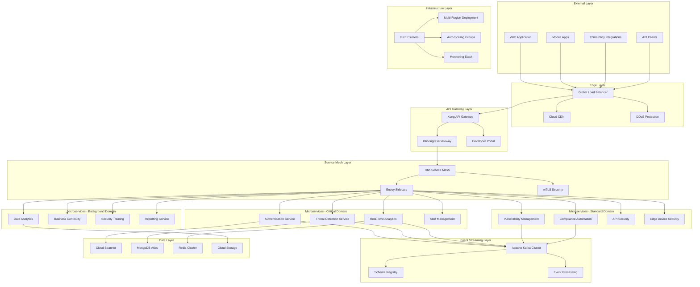

### 1.2 Security Domain Architecture

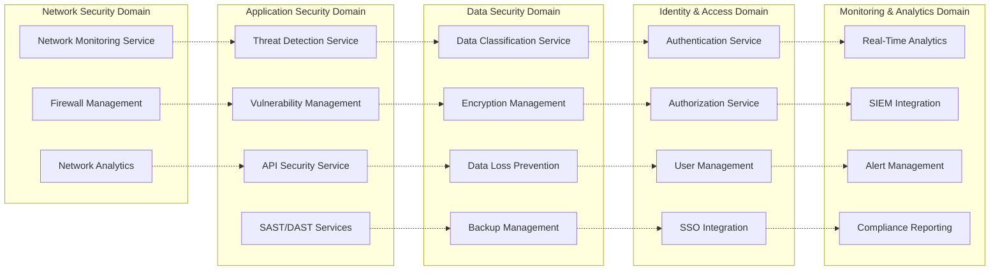

## 2. Microservices Architecture Detail

### 2.1 Service Inventory and Boundaries

#### 2.1.1 Critical Security Services

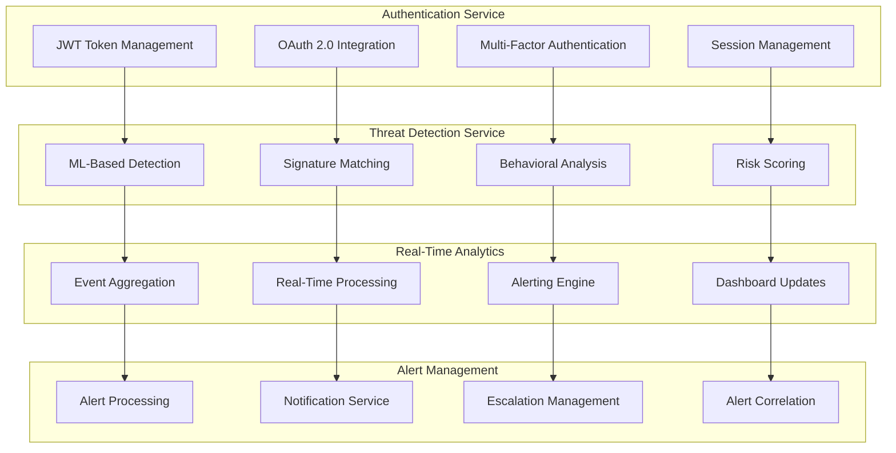

#### 2.1.2 Standard Security Services

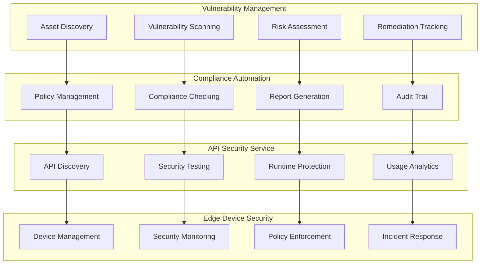

### 2.2 Service Communication Patterns

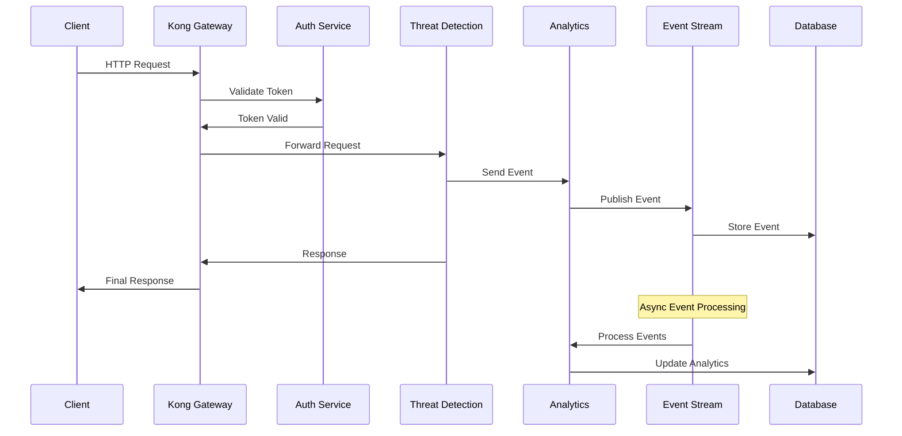

## 3. Event-Driven Communication Architecture

### 3.1 Kafka Event Streaming Topology

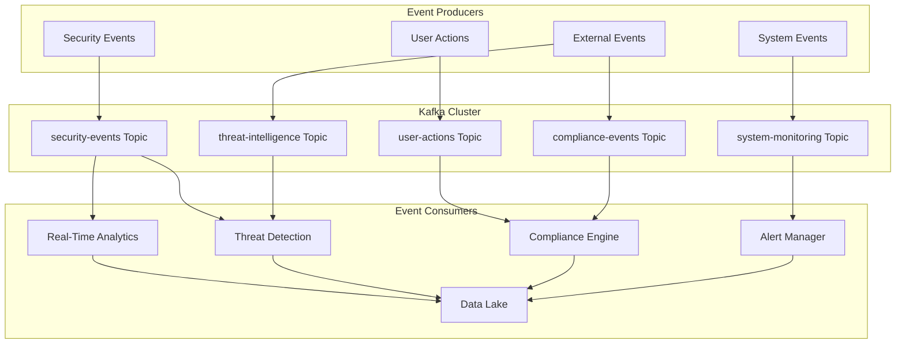

### 3.2 Event Schema and Message Flow

```yaml
# Security Event Schema
security_event_schema:
  type: object
  properties:
    event_id:
      type: string
      format: uuid
    timestamp:
      type: string
      format: date-time
    source:
      type: object
      properties:
        service: string
        instance: string
        region: string
    event_type:
      type: string
      enum: [threat_detected, vulnerability_found, compliance_violation, access_denied]
    severity:
      type: string
      enum: [critical, high, medium, low, info]
    details:
      type: object
    metadata:
      type: object
      properties:
        tenant_id: string
        correlation_id: string
        trace_id: string
```

## 4. Data Architecture and State Management

### 4.1 Polyglot Persistence Strategy

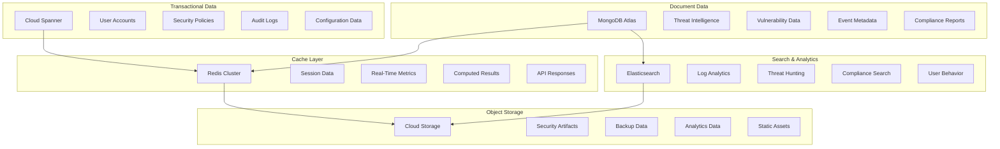

### 4.2 Data Flow Architecture

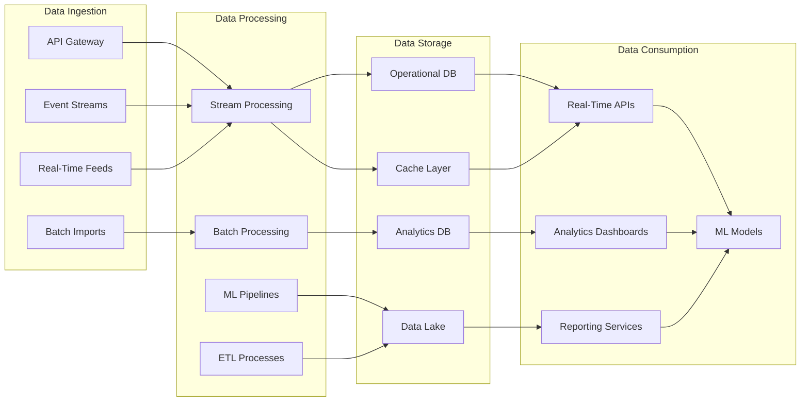

## 5. Deployment and Infrastructure Architecture

### 5.1 Multi-Region Kubernetes Deployment

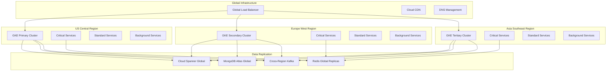

### 5.2 Namespace and Resource Organization

```yaml
# Kubernetes Namespace Structure
apiVersion: v1
kind: Namespace
metadata:
  name: isectech-critical
  labels:
    security-domain: critical
    priority: high
    disaster-recovery: enabled
---
apiVersion: v1
kind: Namespace
metadata:
  name: isectech-standard
  labels:
    security-domain: standard
    priority: medium
    disaster-recovery: enabled
---
apiVersion: v1
kind: Namespace
metadata:
  name: isectech-background
  labels:
    security-domain: background
    priority: low
    disaster-recovery: disabled
---
apiVersion: v1
kind: Namespace
metadata:
  name: isectech-infrastructure
  labels:
    security-domain: infrastructure
    priority: high
    disaster-recovery: enabled
```

## 6. Security Architecture

### 6.1 Zero Trust Security Model

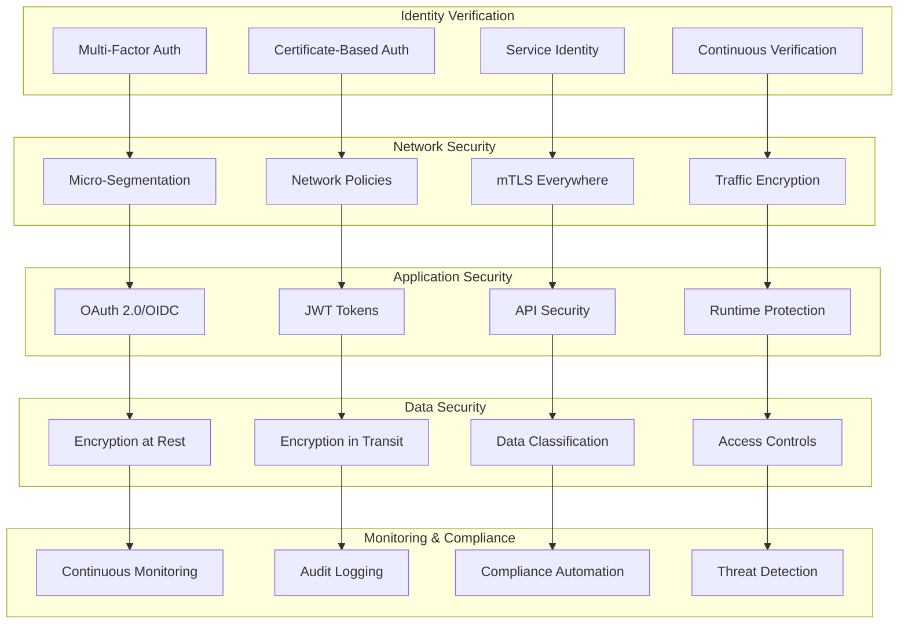

### 6.2 Security Policy Enforcement

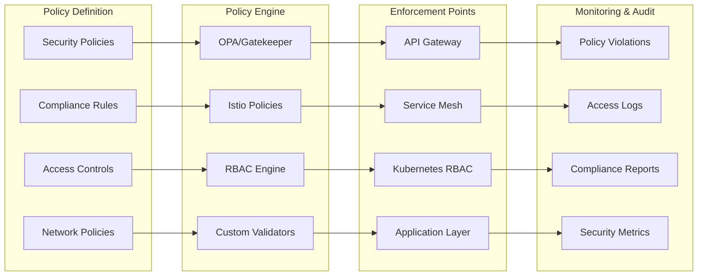

## 7. Observability and Monitoring Architecture

### 7.1 Comprehensive Observability Stack

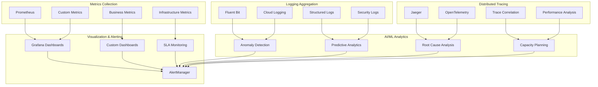

### 7.2 Monitoring Strategy by Service Tier

```yaml
# Critical Services Monitoring
critical_services_monitoring:
  metrics_interval: 15s
  log_level: debug
  tracing_sample_rate: 100%
  alerting_threshold:
    availability: 99.95%
    latency_p95: 500ms
    error_rate: 0.1%

# Standard Services Monitoring
standard_services_monitoring:
  metrics_interval: 30s
  log_level: info
  tracing_sample_rate: 10%
  alerting_threshold:
    availability: 99.9%
    latency_p95: 2s
    error_rate: 1%

# Background Services Monitoring
background_services_monitoring:
  metrics_interval: 60s
  log_level: warn
  tracing_sample_rate: 1%
  alerting_threshold:
    availability: 99%
    latency_p95: 10s
    error_rate: 5%
```

## 8. Auto-Scaling and Resource Management

### 8.1 Multi-Dimensional Scaling Strategy

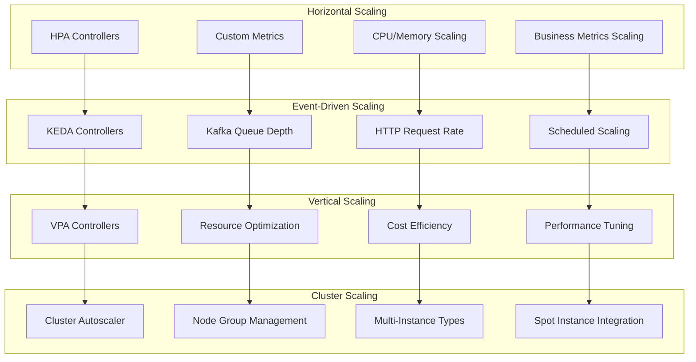

### 8.2 Resource Allocation Strategy

```yaml
# Resource Tier Definitions
resource_tiers:
  critical:
    cpu_request: 500m
    cpu_limit: 2000m
    memory_request: 1Gi
    memory_limit: 4Gi
    storage_request: 10Gi
    priority_class: high-priority

  standard:
    cpu_request: 250m
    cpu_limit: 1000m
    memory_request: 512Mi
    memory_limit: 2Gi
    storage_request: 5Gi
    priority_class: medium-priority

  background:
    cpu_request: 100m
    cpu_limit: 500m
    memory_request: 256Mi
    memory_limit: 1Gi
    storage_request: 2Gi
    priority_class: low-priority
```

## 9. Resilience and Disaster Recovery

### 9.1 Resilience Pattern Implementation

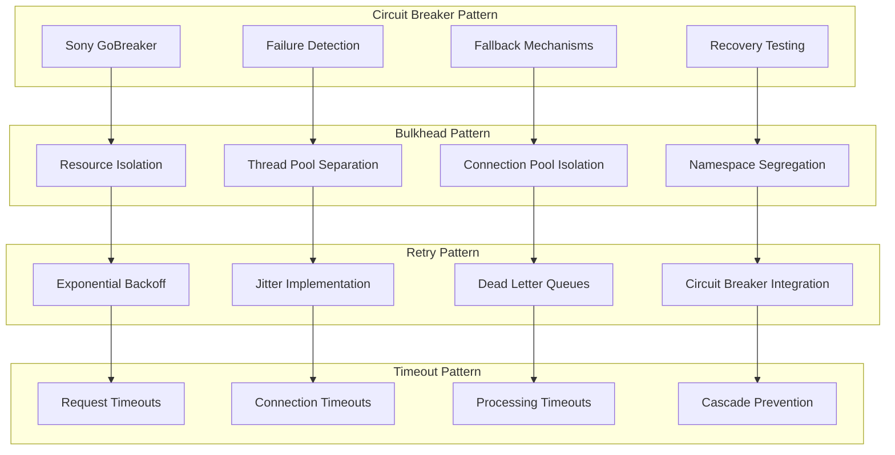

### 9.2 Disaster Recovery Architecture

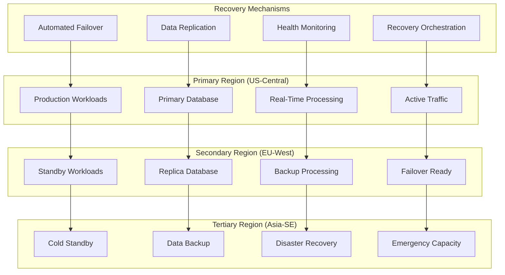

## 10. Service Discovery and Communication

### 10.1 Service Discovery Hierarchy

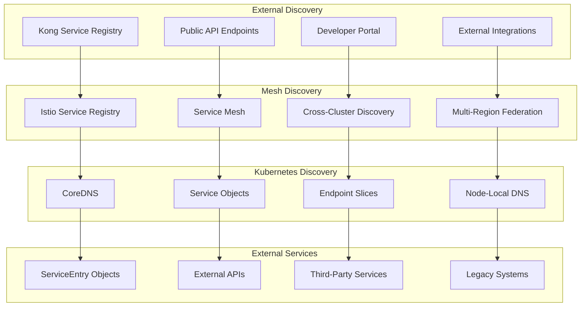

### 10.2 Communication Flow Patterns

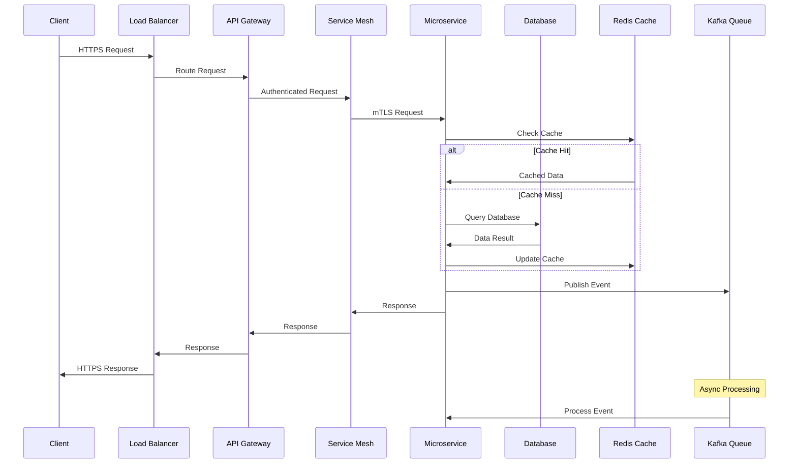

## 11. API Gateway and Traffic Management

### 11.1 Hybrid Gateway Architecture

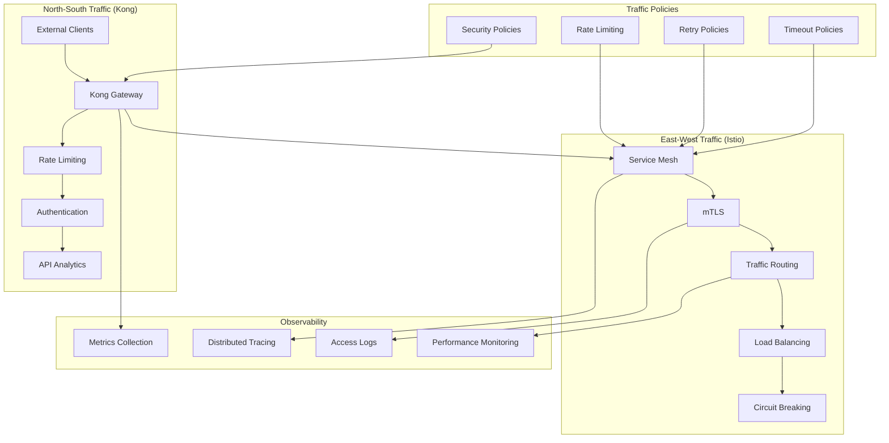

### 11.2 API Security Implementation

```yaml
# Kong API Security Configuration
kong_security_plugins:
  - name: jwt
    config:
      secret_is_base64: false
      claims_to_verify: [exp, iat]
      maximum_expiration: 3600

  - name: rate-limiting-advanced
    config:
      limit: [1000]
      window_size: [60]
      identifier: consumer

  - name: cors
    config:
      origins: ['https://*.isectech.com']
      methods: [GET, POST, PUT, DELETE]
      headers: [Authorization, Content-Type]

  - name: request-size-limiting
    config:
      allowed_payload_size: 10485760 # 10MB
```

## 12. Operational Patterns and Workflows

### 12.1 CI/CD Pipeline Architecture

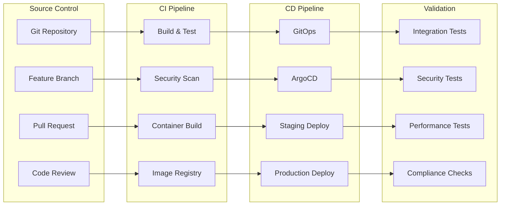

### 12.2 Incident Response Workflow

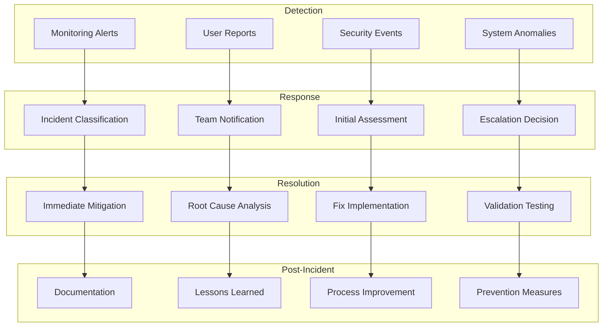

## 13. Performance and Scalability Characteristics

### 13.1 Performance Targets

| Component              | Metric            | Target     | Measurement        |
| ---------------------- | ----------------- | ---------- | ------------------ |
| Authentication Service | Response Time P95 | <100ms     | Prometheus metrics |
| Threat Detection       | Processing Time   | <5s        | Custom metrics     |
| API Gateway            | Throughput        | 100K req/s | Kong metrics       |
| Event Processing       | Latency           | <1s        | Kafka metrics      |
| Database Queries       | Response Time P95 | <50ms      | DB metrics         |
| Cache Operations       | Response Time P99 | <10ms      | Redis metrics      |

### 13.2 Scalability Metrics

| Resource              | Current Capacity | Max Capacity     | Scaling Method                 |
| --------------------- | ---------------- | ---------------- | ------------------------------ |
| Concurrent Users      | 10K              | 100K             | HPA + Load Balancing           |
| Events/Day            | 100M             | 1B+              | Event Streaming + Partitioning |
| Endpoints             | 100K             | 1M+              | Multi-Region + Sharding        |
| API Requests/Second   | 10K              | 100K             | Auto-Scaling + Caching         |
| Data Storage          | 1TB              | 100TB            | Distributed Storage            |
| Processing Throughput | 1M events/hour   | 100M events/hour | Stream Processing              |

## 14. Cost Optimization Strategy

### 14.1 Resource Efficiency

```mermaid
graph TB
    subgraph "Compute Optimization"
        A[Right-Sizing]
        B[Spot Instances]
        C[Auto-Scaling]
        D[Resource Pooling]
    end

    subgraph "Storage Optimization"
        E[Tiered Storage]
        F[Data Lifecycle]
        G[Compression]
        H[Deduplication]
    end

    subgraph "Network Optimization"
        I[CDN Usage]
        J[Traffic Optimization]
        K[Egress Minimization]
        L[Regional Placement]
    end

    subgraph "Operational Efficiency"
        M[Automation]
        N[Monitoring]
        O[Optimization]
        P[Governance]
    end

    A --> E
    B --> F
    C --> G
    D --> H

    E --> I
    F --> J
    G --> K
    H --> L

    I --> M
    J --> N
    K --> O
    L --> P
```

### 14.2 Cost Monitoring and Controls

```yaml
# Cost Management Configuration
cost_management:
  budget_alerts:
    monthly_limit: 50000 # USD
    alert_thresholds: [50, 75, 90, 100] # Percentage

  resource_quotas:
    critical_namespace:
      cpu_limit: 200
      memory_limit: 400Gi
    standard_namespace:
      cpu_limit: 400
      memory_limit: 800Gi
    background_namespace:
      cpu_limit: 200
      memory_limit: 400Gi

  optimization_policies:
    unused_resources_threshold: 7d
    underutilized_threshold: 20%
    rightsizing_recommendations: enabled
    spot_instance_preference: background_workloads
```

## 15. Compliance and Governance

### 15.1 Compliance Architecture

```mermaid
graph TB
    subgraph "Policy Management"
        A[OPA/Gatekeeper]
        B[Policy as Code]
        C[Compliance Rules]
        D[Audit Requirements]
    end

    subgraph "Data Governance"
        E[Data Classification]
        F[Access Controls]
        G[Encryption Policies]
        H[Retention Policies]
    end

    subgraph "Monitoring & Audit"
        I[Audit Logging]
        J[Compliance Monitoring]
        K[Violation Detection]
        L[Reporting]
    end

    subgraph "Compliance Frameworks"
        M[SOC 2]
        N[ISO 27001]
        O[GDPR]
        P[HIPAA]
    end

    A --> E
    B --> F
    C --> G
    D --> H

    E --> I
    F --> J
    G --> K
    H --> L

    I --> M
    J --> N
    K --> O
    L --> P
```

### 15.2 Governance Controls

```yaml
# Governance Framework
governance_controls:
  security_policies:
    - name: zero_trust_network
      enforcement: strict
      scope: all_namespaces

    - name: data_encryption
      enforcement: strict
      scope: data_services

    - name: access_control
      enforcement: strict
      scope: all_services

  compliance_requirements:
    soc2:
      controls: [access_management, encryption, monitoring, incident_response]
      audit_frequency: quarterly

    iso27001:
      controls: [risk_management, security_controls, incident_management]
      audit_frequency: annually

    gdpr:
      controls: [data_protection, consent_management, breach_notification]
      audit_frequency: continuously

  operational_policies:
    change_management: required
    code_review: mandatory
    security_scanning: automated
    vulnerability_management: continuous
```

## 16. Migration and Deployment Strategy

### 16.1 Phased Migration Approach

```mermaid
gantt
    title iSECTECH Platform Implementation Timeline
    dateFormat  YYYY-MM-DD
    section Phase 1: Foundation
    Infrastructure Setup    :p1-1, 2024-01-01, 2024-02-15
    Security Framework     :p1-2, 2024-01-15, 2024-03-01
    Basic Services         :p1-3, 2024-02-01, 2024-03-15

    section Phase 2: Core Services
    Authentication         :p2-1, 2024-03-01, 2024-04-15
    Threat Detection       :p2-2, 2024-03-15, 2024-05-01
    Real-Time Analytics    :p2-3, 2024-04-01, 2024-05-15

    section Phase 3: Extended Services
    Vulnerability Mgmt     :p3-1, 2024-05-01, 2024-06-15
    Compliance Automation  :p3-2, 2024-05-15, 2024-07-01
    API Security          :p3-3, 2024-06-01, 2024-07-15

    section Phase 4: Scale & Optimize
    Multi-Region Deploy    :p4-1, 2024-07-01, 2024-08-15
    Performance Tuning     :p4-2, 2024-07-15, 2024-09-01
    Production Ready       :p4-3, 2024-08-15, 2024-09-30
```

### 16.2 Deployment Validation

```yaml
# Deployment Validation Checklist
deployment_validation:
  infrastructure:
    - kubernetes_cluster_health: required
    - networking_connectivity: required
    - dns_resolution: required
    - load_balancer_config: required

  security:
    - mtls_configuration: required
    - rbac_policies: required
    - network_policies: required
    - secret_management: required

  services:
    - health_checks: required
    - readiness_probes: required
    - liveness_probes: required
    - startup_probes: required

  monitoring:
    - metrics_collection: required
    - log_aggregation: required
    - distributed_tracing: required
    - alerting_rules: required

  performance:
    - load_testing: required
    - capacity_testing: required
    - stress_testing: required
    - chaos_engineering: required
```

## 17. Future Architecture Evolution

### 17.1 Technology Roadmap

```mermaid
timeline
    title Technology Evolution Roadmap

    2024 Q1 : Foundation
             : Kubernetes + Istio
             : Basic Microservices
             : Core Security

    2024 Q2 : Enhancement
             : Advanced Analytics
             : ML Integration
             : Extended Monitoring

    2024 Q3 : Scale
             : Multi-Region
             : Performance Optimization
             : Advanced Security

    2024 Q4 : Innovation
             : AI/ML Platform
             : Edge Computing
             : Advanced Automation

    2025    : Evolution
             : Quantum-Ready Security
             : Serverless Migration
             : Next-Gen Analytics
```

### 17.2 Architectural Principles for Evolution

```yaml
# Evolutionary Architecture Principles
architectural_principles:
  evolvability:
    - modular_design: microservices_architecture
    - loose_coupling: event_driven_communication
    - technology_agnostic: abstraction_layers
    - api_first: contract_driven_development

  scalability:
    - horizontal_scaling: stateless_services
    - elastic_resources: auto_scaling
    - performance_isolation: bulkhead_pattern
    - global_distribution: multi_region_deployment

  reliability:
    - fault_tolerance: circuit_breaker_pattern
    - graceful_degradation: fallback_mechanisms
    - disaster_recovery: automated_failover
    - data_consistency: eventual_consistency

  security:
    - zero_trust: default_deny
    - defense_in_depth: layered_security
    - least_privilege: minimal_permissions
    - continuous_monitoring: real_time_detection

  observability:
    - telemetry_driven: metrics_logs_traces
    - proactive_monitoring: predictive_analytics
    - root_cause_analysis: correlation_analysis
    - business_visibility: custom_dashboards
```

## Conclusion

The iSECTECH platform architecture represents a comprehensive, cloud-native, and security-first approach to cybersecurity platform design. By leveraging microservices, event-driven patterns, Zero Trust security, and comprehensive observability, the architecture is designed to:

- **Scale**: Handle 1M+ endpoints and 1B+ events/day
- **Perform**: Maintain 99.99% availability with sub-second response times
- **Secure**: Implement defense-in-depth with Zero Trust principles
- **Evolve**: Support future technological advancements and business requirements
- **Optimize**: Provide cost-efficient operations with automated resource management

The modular, technology-agnostic design ensures long-term viability while the comprehensive operational patterns support reliable, secure, and efficient operations at enterprise scale.

---

**Document Version**: 1.0  
**Last Updated**: {{ current_date }}  
**Architecture Review**: Quarterly  
**Next Review Date**: {{ next_quarter }}
