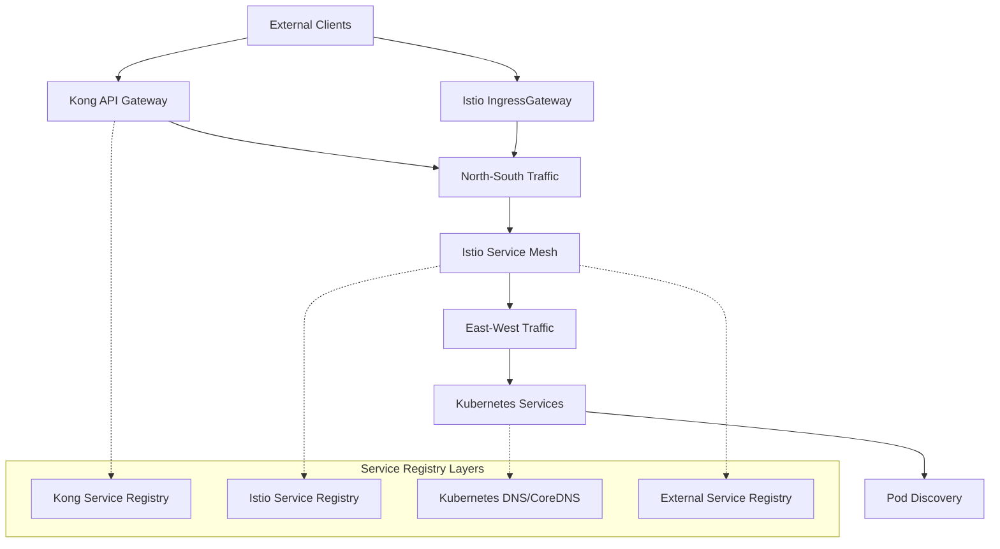

# Service Discovery Mechanism for iSECTECH Platform

## Executive Summary

This document outlines the service discovery architecture for the iSECTECH cybersecurity platform, designed to handle 1M+ endpoints and 1B+ events/day with 99.99% availability. The solution leverages a hybrid approach combining Kubernetes native DNS with Istio service mesh for comprehensive, scalable, and secure service discovery across multiple clusters and regions.

## 1. Service Discovery Architecture Overview

### 1.1 Multi-Layer Discovery Strategy



### 1.2 Discovery Layers

1. **External API Discovery (Kong Gateway)**

   - Public API endpoint registration
   - Developer portal integration
   - Rate limiting and authentication
   - Load balancing for north-south traffic

2. **Service Mesh Discovery (Istio)**

   - Internal service registry
   - Multi-cluster service federation
   - Traffic management and routing
   - Security policy enforcement

3. **Kubernetes Native Discovery (CoreDNS)**

   - Pod-to-Pod communication
   - Headless service resolution
   - Internal DNS queries
   - Endpoint slice management

4. **External Service Integration**
   - Third-party API registration
   - Legacy system integration
   - Multi-cloud service federation
   - Vendor service connections

## 2. Kubernetes Native Service Discovery

### 2.1 CoreDNS Configuration

```yaml
apiVersion: v1
kind: ConfigMap
metadata:
  name: coredns
  namespace: kube-system
data:
  Corefile: |
    .:53 {
        errors
        health {
            lameduck 5s
        }
        ready
        kubernetes cluster.local in-addr.arpa ip6.arpa {
            pods insecure
            fallthrough in-addr.arpa ip6.arpa
            ttl 30
        }
        prometheus :9153
        forward . 8.8.8.8 8.8.4.4 {
            max_concurrent 1000
            health_check 5s
        }
        cache 300 {
            success 9984 30
            denial 9984 5
        }
        loop
        reload
        loadbalance
        import custom/*.override
    }

    # Custom zones for external services
    external.local:53 {
        errors
        cache 30
        forward . 1.1.1.1 1.0.0.1
    }
```

### 2.2 Scaling CoreDNS for High Load

```yaml
apiVersion: apps/v1
kind: Deployment
metadata:
  name: coredns
  namespace: kube-system
spec:
  replicas: 6 # Scale based on cluster size
  selector:
    matchLabels:
      k8s-app: kube-dns
  template:
    metadata:
      labels:
        k8s-app: kube-dns
    spec:
      nodeSelector:
        node-type: dns-optimized
      containers:
        - name: coredns
          image: coredns/coredns:1.11.1
          resources:
            limits:
              memory: 512Mi
              cpu: 500m
            requests:
              memory: 256Mi
              cpu: 250m
          args: ['-conf', '/etc/coredns/Corefile']
          volumeMounts:
            - name: config-volume
              mountPath: /etc/coredns
              readOnly: true
          livenessProbe:
            httpGet:
              path: /health
              port: 8080
              scheme: HTTP
            initialDelaySeconds: 60
            timeoutSeconds: 5
            successThreshold: 1
            failureThreshold: 5
          readinessProbe:
            httpGet:
              path: /ready
              port: 8181
              scheme: HTTP
            initialDelaySeconds: 0
            timeoutSeconds: 1
            successThreshold: 1
            failureThreshold: 3
```

### 2.3 Node-Local DNS Cache

```yaml
apiVersion: apps/v1
kind: DaemonSet
metadata:
  name: node-local-dns
  namespace: kube-system
spec:
  selector:
    matchLabels:
      k8s-app: node-local-dns
  template:
    metadata:
      labels:
        k8s-app: node-local-dns
    spec:
      hostNetwork: true
      dnsPolicy: Default
      containers:
        - name: node-cache
          image: registry.k8s.io/dns/k8s-dns-node-cache:1.23.0
          resources:
            requests:
              cpu: 25m
              memory: 5Mi
          args: ['-localip', '169.254.20.10', '-conf', '/etc/Corefile', '-upstreamsvc', 'kube-dns-upstream']
          securityContext:
            capabilities:
              add:
                - NET_ADMIN
          volumeMounts:
            - mountPath: /run/xtables.lock
              name: xtables-lock
              readOnly: false
            - name: config-volume
              mountPath: /etc/coredns
            - name: kube-dns-config
              mountPath: /etc/kube-dns
```

### 2.4 Service Types and Patterns

#### 2.4.1 Standard ClusterIP Services

```yaml
apiVersion: v1
kind: Service
metadata:
  name: authentication-service
  namespace: isectech-critical
  labels:
    app: authentication-service
    security-domain: identity
    discovery-type: standard
spec:
  type: ClusterIP
  selector:
    app: authentication-service
  ports:
    - name: http
      port: 8080
      targetPort: 8080
      protocol: TCP
    - name: grpc
      port: 9090
      targetPort: 9090
      protocol: TCP
```

#### 2.4.2 Headless Services for Direct Pod Access

```yaml
apiVersion: v1
kind: Service
metadata:
  name: threat-detection-headless
  namespace: isectech-critical
  labels:
    app: threat-detection-service
    security-domain: application
    discovery-type: headless
spec:
  type: ClusterIP
  clusterIP: None # Headless service
  selector:
    app: threat-detection-service
  ports:
    - name: http
      port: 8080
      targetPort: 8080
      protocol: TCP
    - name: metrics
      port: 9090
      targetPort: 9090
      protocol: TCP
```

#### 2.4.3 ExternalName Services for External Integration

```yaml
apiVersion: v1
kind: Service
metadata:
  name: external-threat-intel
  namespace: isectech-standard
  labels:
    discovery-type: external
spec:
  type: ExternalName
  externalName: api.virustotal.com
  ports:
    - port: 443
      protocol: TCP
```

## 3. Istio Service Mesh Discovery

### 3.1 Multi-Cluster Service Discovery

#### 3.1.1 Primary Cluster Configuration

```yaml
apiVersion: install.istio.io/v1alpha1
kind: IstioOperator
metadata:
  name: primary-cluster
spec:
  values:
    pilot:
      env:
        EXTERNAL_ISTIOD: false
        PILOT_ENABLE_CROSS_CLUSTER_WORKLOAD_ENTRY: true
        PILOT_ENABLE_REMOTE_JWKS_CACHE: true
        PILOT_SCOPE_GATEWAY_TO_NAMESPACE: true
    global:
      meshID: isectech-mesh
      multiCluster:
        clusterName: primary-us-central1
      network: us-central1-network
```

#### 3.1.2 Remote Cluster Configuration

```yaml
apiVersion: install.istio.io/v1alpha1
kind: IstioOperator
metadata:
  name: remote-cluster
spec:
  values:
    istiodRemote:
      enabled: true
    pilot:
      env:
        PILOT_ENABLE_WORKLOAD_ENTRY_AUTOREGISTRATION: true
    global:
      meshID: isectech-mesh
      multiCluster:
        clusterName: remote-europe-west1
      network: europe-west1-network
      remotePilotAddress: ${DISCOVERY_ADDRESS}
```

### 3.2 Service Registry Integration

#### 3.2.1 Automatic Service Registration

```go
// Service registration controller
package discovery

import (
    "context"
    "fmt"
    istio "istio.io/client-go/pkg/clientset/versioned"
    networking "istio.io/api/networking/v1beta1"
    metav1 "k8s.io/apimachinery/pkg/apis/meta/v1"
)

type ServiceRegistrar struct {
    istioClient istio.Interface
    namespace   string
}

func (sr *ServiceRegistrar) RegisterExternalService(ctx context.Context, service ExternalService) error {
    serviceEntry := &networking.ServiceEntry{
        ObjectMeta: metav1.ObjectMeta{
            Name:      service.Name,
            Namespace: sr.namespace,
            Labels: map[string]string{
                "discovery-type":    "external",
                "security-domain":   service.SecurityDomain,
                "service-tier":      service.Tier,
                "data-sensitivity":  service.DataSensitivity,
            },
        },
        Spec: networking.ServiceEntry{
            Hosts:    []string{service.Host},
            Location: networking.ServiceEntry_MESH_EXTERNAL,
            Ports: []*networking.ServicePort{
                {
                    Number:   service.Port,
                    Name:     service.Protocol,
                    Protocol: service.Protocol,
                },
            },
            Resolution: networking.ServiceEntry_DNS,
            Endpoints: []*networking.WorkloadEntry{
                {
                    Address: service.Address,
                    Ports: map[string]uint32{
                        service.Protocol: service.Port,
                    },
                },
            },
        },
    }

    _, err := sr.istioClient.NetworkingV1beta1().
        ServiceEntries(sr.namespace).
        Create(ctx, serviceEntry, metav1.CreateOptions{})

    return err
}
```

#### 3.2.2 Virtual Services for Traffic Management

```yaml
apiVersion: networking.istio.io/v1beta1
kind: VirtualService
metadata:
  name: authentication-service
  namespace: isectech-critical
spec:
  hosts:
    - authentication-service.isectech-critical.svc.cluster.local
  http:
    - match:
        - headers:
            'x-client-version':
              exact: 'v2'
      route:
        - destination:
            host: authentication-service.isectech-critical.svc.cluster.local
            subset: v2
    - route:
        - destination:
            host: authentication-service.isectech-critical.svc.cluster.local
            subset: v1
          weight: 100
    - fault:
        delay:
          percentage:
            value: 0.1
          fixedDelay: 5s
    - timeout: 30s
    - retries:
        attempts: 3
        perTryTimeout: 10s
        retryOn: gateway-error,connect-failure,refused-stream
```

#### 3.2.3 Destination Rules for Load Balancing

```yaml
apiVersion: networking.istio.io/v1beta1
kind: DestinationRule
metadata:
  name: authentication-service
  namespace: isectech-critical
spec:
  host: authentication-service.isectech-critical.svc.cluster.local
  trafficPolicy:
    loadBalancer:
      simple: LEAST_CONN
      consistentHash:
        httpCookieName: 'session-id'
        ttl: 300s
    connectionPool:
      tcp:
        maxConnections: 100
        connectTimeout: 30s
        keepAlive:
          time: 7200s
          interval: 75s
      http:
        http1MaxPendingRequests: 64
        http2MaxRequests: 100
        maxRequestsPerConnection: 10
        maxRetries: 3
        consecutiveGatewayErrors: 5
        interval: 30s
        baseEjectionTime: 30s
        maxEjectionPercent: 50
        minHealthPercent: 50
    circuitBreaker:
      consecutiveGatewayErrors: 5
      interval: 30s
      baseEjectionTime: 30s
      maxEjectionPercent: 50
      minHealthPercent: 50
  subsets:
    - name: v1
      labels:
        version: v1
    - name: v2
      labels:
        version: v2
      trafficPolicy:
        loadBalancer:
          simple: ROUND_ROBIN
```

### 3.3 Cross-Cluster Service Discovery

#### 3.3.1 Secret for Cross-Cluster Communication

```yaml
apiVersion: v1
kind: Secret
metadata:
  name: istio-remote-secret-europe-west1
  namespace: istio-system
  labels:
    istio/cluster: europe-west1
type: Opaque
data:
  europe-west1: |
    apiVersion: v1
    kind: Config
    clusters:
    - cluster:
        certificate-authority-data: LS0tLS1CRUdJTi...
        server: https://europe-west1-cluster.googleapis.com
      name: europe-west1
    contexts:
    - context:
        cluster: europe-west1
        user: europe-west1
      name: europe-west1
    current-context: europe-west1
    users:
    - name: europe-west1
      user:
        token: eyJhbGciOiJSUzI1NiIsImtpZCI6...
```

#### 3.3.2 Service Endpoints for Cross-Cluster Access

```yaml
apiVersion: networking.istio.io/v1beta1
kind: ServiceEntry
metadata:
  name: threat-detection-remote
  namespace: isectech-critical
spec:
  hosts:
    - threat-detection.isectech-critical.global
  location: MESH_EXTERNAL
  ports:
    - number: 8080
      name: http
      protocol: HTTP
  resolution: DNS
  addresses:
    - 240.0.0.1 # VIP for cross-cluster service
  endpoints:
    - address: threat-detection.isectech-critical.svc.cluster.local
      network: europe-west1-network
      locality: europe-west1
      ports:
        http: 8080
```

## 4. Kong API Gateway Integration

### 4.1 Service Registration with Kong

```yaml
apiVersion: configuration.konghq.com/v1
kind: KongIngress
metadata:
  name: authentication-service-kong
  namespace: isectech-critical
proxy:
  connect_timeout: 10000
  retries: 3
  read_timeout: 60000
  write_timeout: 60000
upstream:
  algorithm: least-connections
  healthchecks:
    active:
      http_path: '/health'
      healthy:
        interval: 5
        successes: 3
      unhealthy:
        interval: 5
        http_failures: 3
        tcp_failures: 3
        timeout: 3
    passive:
      healthy:
        successes: 3
      unhealthy:
        http_failures: 3
        tcp_failures: 3
---
apiVersion: networking.k8s.io/v1
kind: Ingress
metadata:
  name: authentication-service-ingress
  namespace: isectech-critical
  annotations:
    konghq.com/plugins: rate-limiting-advanced, jwt-auth, correlation-id
    konghq.com/strip-path: 'false'
    konghq.com/preserve-host: 'true'
    konghq.com/https-redirect-status-code: '301'
spec:
  ingressClassName: kong
  tls:
    - hosts:
        - api.isectech.com
      secretName: isectech-tls-cert
  rules:
    - host: api.isectech.com
      http:
        paths:
          - path: /auth
            pathType: Prefix
            backend:
              service:
                name: authentication-service
                port:
                  number: 8080
```

### 4.2 Kong Service Discovery Configuration

```go
// Kong service registration
package kong

import (
    "context"
    "fmt"
    "github.com/kong/go-kong/kong"
)

type KongServiceRegistry struct {
    client *kong.Client
}

func (ksr *KongServiceRegistry) RegisterService(ctx context.Context, service ServiceDefinition) error {
    kongService := &kong.Service{
        Name:     kong.String(service.Name),
        Host:     kong.String(service.Host),
        Port:     kong.Int(service.Port),
        Protocol: kong.String(service.Protocol),
        Path:     kong.String(service.Path),
        Tags: kong.StringSlice([]string{
            fmt.Sprintf("security-domain:%s", service.SecurityDomain),
            fmt.Sprintf("service-tier:%s", service.Tier),
            "discovery-source:automatic",
        }),
    }

    createdService, err := ksr.client.Services.Create(ctx, kongService)
    if err != nil {
        return fmt.Errorf("failed to create Kong service: %w", err)
    }

    // Create route for the service
    route := &kong.Route{
        Service: &kong.Service{ID: createdService.ID},
        Paths:   kong.StringSlice([]string{service.RoutePath}),
        Methods: kong.StringSlice(service.Methods),
        Tags: kong.StringSlice([]string{
            fmt.Sprintf("service:%s", service.Name),
            "auto-generated",
        }),
    }

    _, err = ksr.client.Routes.Create(ctx, route)
    if err != nil {
        return fmt.Errorf("failed to create Kong route: %w", err)
    }

    return nil
}
```

## 5. External Service Integration

### 5.1 ServiceEntry for External APIs

```yaml
# Threat Intelligence APIs
apiVersion: networking.istio.io/v1beta1
kind: ServiceEntry
metadata:
  name: virustotal-api
  namespace: isectech-standard
  labels:
    security-domain: 'threat-intelligence'
    data-sensitivity: 'high'
spec:
  hosts:
    - www.virustotal.com
  ports:
    - number: 443
      name: https
      protocol: HTTPS
  location: MESH_EXTERNAL
  resolution: DNS
---
# AWS Services
apiVersion: networking.istio.io/v1beta1
kind: ServiceEntry
metadata:
  name: aws-guardduty
  namespace: isectech-standard
spec:
  hosts:
    - guardduty.us-central1.amazonaws.com
  ports:
    - number: 443
      name: https
      protocol: HTTPS
  location: MESH_EXTERNAL
  resolution: DNS
---
# Google Cloud Services
apiVersion: networking.istio.io/v1beta1
kind: ServiceEntry
metadata:
  name: gcp-security-center
  namespace: isectech-standard
spec:
  hosts:
    - securitycenter.googleapis.com
  ports:
    - number: 443
      name: https
      protocol: HTTPS
  location: MESH_EXTERNAL
  resolution: DNS
```

### 5.2 Destination Rules for External Services

```yaml
apiVersion: networking.istio.io/v1beta1
kind: DestinationRule
metadata:
  name: external-threat-intel
  namespace: isectech-standard
spec:
  host: '*.virustotal.com'
  trafficPolicy:
    connectionPool:
      tcp:
        maxConnections: 50
        connectTimeout: 30s
      http:
        http1MaxPendingRequests: 10
        maxRequestsPerConnection: 5
    circuitBreaker:
      consecutiveGatewayErrors: 3
      interval: 30s
      baseEjectionTime: 30s
```

## 6. Service Discovery Security

### 6.1 mTLS Configuration

```yaml
apiVersion: security.istio.io/v1beta1
kind: PeerAuthentication
metadata:
  name: default
  namespace: istio-system
spec:
  mtls:
    mode: STRICT
---
apiVersion: security.istio.io/v1beta1
kind: PeerAuthentication
metadata:
  name: external-services
  namespace: isectech-standard
spec:
  selector:
    matchLabels:
      discovery-type: external
  mtls:
    mode: DISABLE
```

### 6.2 Authorization Policies

```yaml
apiVersion: security.istio.io/v1beta1
kind: AuthorizationPolicy
metadata:
  name: authentication-service-authz
  namespace: isectech-critical
spec:
  selector:
    matchLabels:
      app: authentication-service
  rules:
    - from:
        - source:
            principals: ['cluster.local/ns/isectech-standard/sa/api-gateway']
        - source:
            principals: ['cluster.local/ns/istio-system/sa/istio-ingressgateway-service-account']
    - to:
        - operation:
            methods: ['GET', 'POST']
            paths: ['/health', '/metrics', '/auth/*']
    - when:
        - key: source.namespace
          values: ['isectech-critical', 'isectech-standard']
```

## 7. Observability and Monitoring

### 7.1 Service Discovery Metrics

```go
package metrics

import (
    "github.com/prometheus/client_golang/prometheus"
    "github.com/prometheus/client_golang/prometheus/promauto"
)

var (
    serviceDiscoveryRequests = promauto.NewCounterVec(
        prometheus.CounterOpts{
            Name: "service_discovery_requests_total",
            Help: "Total number of service discovery requests",
        },
        []string{"discovery_type", "namespace", "service", "status"},
    )

    serviceDiscoveryLatency = promauto.NewHistogramVec(
        prometheus.HistogramOpts{
            Name:    "service_discovery_duration_seconds",
            Help:    "Service discovery request duration",
            Buckets: prometheus.DefBuckets,
        },
        []string{"discovery_type", "service"},
    )

    registeredServices = promauto.NewGaugeVec(
        prometheus.GaugeOpts{
            Name: "registered_services_total",
            Help: "Total number of registered services",
        },
        []string{"discovery_type", "namespace", "security_domain"},
    )

    serviceHealthStatus = promauto.NewGaugeVec(
        prometheus.GaugeOpts{
            Name: "service_health_status",
            Help: "Service health status (1 = healthy, 0 = unhealthy)",
        },
        []string{"service", "namespace", "endpoint"},
    )
)
```

### 7.2 Distributed Tracing

```yaml
apiVersion: telemetry.istio.io/v1alpha1
kind: Telemetry
metadata:
  name: service-discovery-tracing
  namespace: istio-system
spec:
  tracing:
    - providers:
        - name: jaeger
    - customTags:
        discovery_type:
          header:
            name: 'x-discovery-type'
        security_domain:
          header:
            name: 'x-security-domain'
        service_tier:
          header:
            name: 'x-service-tier'
```

### 7.3 Alerting Rules

```yaml
groups:
  - name: service-discovery
    rules:
      - alert: ServiceDiscoveryHighLatency
        expr: histogram_quantile(0.95, rate(service_discovery_duration_seconds_bucket[5m])) > 1
        for: 2m
        labels:
          severity: warning
        annotations:
          summary: 'High service discovery latency'
          description: 'Service discovery latency is above 1 second for {{ $labels.service }}'

      - alert: ServiceRegistrationFailure
        expr: rate(service_discovery_requests_total{status="error"}[5m]) > 0.1
        for: 1m
        labels:
          severity: critical
        annotations:
          summary: 'Service registration failures detected'
          description: 'Service registration failure rate is {{ $value }} for {{ $labels.discovery_type }}'

      - alert: DNSResolutionFailure
        expr: increase(coredns_dns_response_total{rcode="NXDOMAIN"}[5m]) > 100
        for: 2m
        labels:
          severity: warning
        annotations:
          summary: 'High DNS resolution failures'
          description: 'DNS resolution failures increased by {{ $value }} in the last 5 minutes'
```

## 8. Performance Optimization

### 8.1 DNS Caching Strategy

```yaml
apiVersion: v1
kind: ConfigMap
metadata:
  name: coredns-custom
  namespace: kube-system
data:
  cache.override: |
    cache 300 {
        success 8192 3600   # Cache successful responses for 1 hour
        denial 2048 300     # Cache NXDOMAIN for 5 minutes
        prefetch 100 60s 20%  # Prefetch popular records
    }
```

### 8.2 Istio Performance Tuning

```yaml
apiVersion: install.istio.io/v1alpha1
kind: IstioOperator
metadata:
  name: performance-tuned
spec:
  meshConfig:
    defaultConfig:
      discoveryRefreshDelay: 10s
      proxyStatsMatcher:
        inclusionRegexps:
          - '.*circuit_breakers.*'
          - '.*outlier_detection.*'
          - '.*_cx_.*'
        exclusionRegexps:
          - '.*osconfig.*'
  values:
    pilot:
      env:
        PILOT_ENABLE_WORKLOAD_ENTRY_AUTOREGISTRATION: true
        PILOT_DEBOUNCE_AFTER: 100ms
        PILOT_DEBOUNCE_MAX: 10s
        PILOT_PUSH_THROTTLE: 100
        PILOT_MAX_REQUESTS_PER_SECOND: 25
      resources:
        requests:
          cpu: 500m
          memory: 2048Mi
        limits:
          cpu: 2000m
          memory: 4096Mi
```

## 9. Disaster Recovery and Failover

### 9.1 Multi-Region Discovery Configuration

```yaml
apiVersion: networking.istio.io/v1beta1
kind: DestinationRule
metadata:
  name: multi-region-failover
  namespace: isectech-critical
spec:
  host: authentication-service.isectech-critical.svc.cluster.local
  trafficPolicy:
    outlierDetection:
      consecutive5xxErrors: 3
      interval: 30s
      baseEjectionTime: 30s
    loadBalancer:
      localityLbSetting:
        enabled: true
        distribute:
          - from: 'region1/*'
            to:
              'region1/*': 80
              'region2/*': 20
          - from: 'region2/*'
            to:
              'region2/*': 80
              'region1/*': 20
        failover:
          - from: region1
            to: region2
          - from: region2
            to: region1
```

### 9.2 Health Check Configuration

```go
package health

import (
    "context"
    "net/http"
    "time"
)

type ServiceHealthChecker struct {
    httpClient *http.Client
    services   map[string]ServiceEndpoint
}

func (shc *ServiceHealthChecker) CheckHealth(ctx context.Context) map[string]HealthStatus {
    results := make(map[string]HealthStatus)

    for serviceName, endpoint := range shc.services {
        status := shc.checkServiceHealth(ctx, endpoint)
        results[serviceName] = status

        // Update service discovery metrics
        if status.Healthy {
            serviceHealthStatus.WithLabelValues(serviceName, endpoint.Namespace, endpoint.Address).Set(1)
        } else {
            serviceHealthStatus.WithLabelValues(serviceName, endpoint.Namespace, endpoint.Address).Set(0)
        }
    }

    return results
}

func (shc *ServiceHealthChecker) checkServiceHealth(ctx context.Context, endpoint ServiceEndpoint) HealthStatus {
    ctx, cancel := context.WithTimeout(ctx, 5*time.Second)
    defer cancel()

    req, err := http.NewRequestWithContext(ctx, "GET", endpoint.HealthCheckURL, nil)
    if err != nil {
        return HealthStatus{Healthy: false, Error: err.Error()}
    }

    resp, err := shc.httpClient.Do(req)
    if err != nil {
        return HealthStatus{Healthy: false, Error: err.Error()}
    }
    defer resp.Body.Close()

    if resp.StatusCode >= 200 && resp.StatusCode < 400 {
        return HealthStatus{Healthy: true}
    }

    return HealthStatus{
        Healthy: false,
        Error:   fmt.Sprintf("health check failed with status %d", resp.StatusCode),
    }
}
```

## 10. Testing and Validation

### 10.1 Service Discovery Testing

```go
package tests

import (
    "context"
    "testing"
    "time"
)

func TestKubernetesServiceDiscovery(t *testing.T) {
    // Test DNS resolution
    resolver := &net.Resolver{}

    // Test ClusterIP service resolution
    addrs, err := resolver.LookupHost(context.Background(), "authentication-service.isectech-critical.svc.cluster.local")
    if err != nil {
        t.Errorf("Failed to resolve service: %v", err)
    }

    if len(addrs) == 0 {
        t.Error("No addresses returned for service")
    }

    // Test headless service resolution (should return pod IPs)
    podAddrs, err := resolver.LookupHost(context.Background(), "threat-detection-headless.isectech-critical.svc.cluster.local")
    if err != nil {
        t.Errorf("Failed to resolve headless service: %v", err)
    }

    if len(podAddrs) < 2 {
        t.Error("Expected multiple pod IPs for headless service")
    }
}

func TestIstioServiceDiscovery(t *testing.T) {
    // Test Istio service registry
    istioClient := setupIstioClient()

    services, err := istioClient.NetworkingV1beta1().ServiceEntries("isectech-critical").List(context.Background(), metav1.ListOptions{})
    if err != nil {
        t.Errorf("Failed to list ServiceEntries: %v", err)
    }

    if len(services.Items) == 0 {
        t.Error("No ServiceEntries found")
    }

    // Test cross-cluster service discovery
    for _, service := range services.Items {
        if len(service.Spec.Endpoints) > 0 {
            for _, endpoint := range service.Spec.Endpoints {
                if endpoint.Network != "" {
                    // This is a cross-cluster endpoint
                    t.Logf("Found cross-cluster endpoint: %s in network %s", endpoint.Address, endpoint.Network)
                }
            }
        }
    }
}
```

### 10.2 Load Testing Service Discovery

```yaml
apiVersion: v1
kind: ConfigMap
metadata:
  name: service-discovery-load-test
data:
  test-script.js: |
    import { check } from 'k6';
    import { randomString } from 'https://jslib.k8s.io/k6-utils/1.0.0/index.js';

    export let options = {
      stages: [
        { duration: '2m', target: 100 },
        { duration: '5m', target: 500 },
        { duration: '10m', target: 1000 },
        { duration: '2m', target: 0 },
      ],
      thresholds: {
        'service_discovery_duration': ['p(95)<1000'], // 95% of requests under 1s
        'dns_resolution_duration': ['p(95)<500'],     // 95% of DNS lookups under 500ms
      },
    };

    export default function() {
      // Test DNS resolution performance
      let dnsStart = Date.now();
      let resolved = resolveService('authentication-service.isectech-critical.svc.cluster.local');
      let dnsEnd = Date.now();
      
      check(resolved, {
        'DNS resolution successful': (r) => r !== null,
      });
      
      // Record DNS resolution time
      dnsResolutionDuration.add(dnsEnd - dnsStart);
      
      // Test service endpoint availability
      let serviceStart = Date.now();
      let response = callService(resolved[0]);
      let serviceEnd = Date.now();
      
      check(response, {
        'Service responded': (r) => r.status < 400,
        'Response time acceptable': (r) => r.timings.duration < 5000,
      });
      
      // Record service discovery time
      serviceDiscoveryDuration.add(serviceEnd - serviceStart);
    }
```

## 11. Migration and Rollout Strategy

### 11.1 Phased Migration Plan

**Phase 1: Kubernetes DNS Foundation (Week 1-2)**

- Deploy and configure CoreDNS
- Implement node-local DNS caching
- Create standard ClusterIP services
- Test basic DNS resolution

**Phase 2: Istio Service Mesh Integration (Week 3-4)**

- Deploy Istio control plane
- Configure service mesh discovery
- Migrate services to mesh
- Test east-west traffic

**Phase 3: Multi-Cluster Federation (Week 5-6)**

- Configure cross-cluster discovery
- Test failover scenarios
- Implement global load balancing
- Validate disaster recovery

**Phase 4: External Service Integration (Week 7-8)**

- Register external services
- Configure security policies
- Test end-to-end flows
- Performance optimization

### 11.2 Rollback Procedures

```bash
#!/bin/bash
# Service discovery rollback script

rollback_dns() {
    echo "Rolling back CoreDNS configuration..."
    kubectl rollout undo deployment/coredns -n kube-system
    kubectl wait --for=condition=available deployment/coredns -n kube-system --timeout=300s
}

rollback_istio() {
    echo "Rolling back Istio configuration..."
    kubectl delete virtualservice --all -n isectech-critical
    kubectl delete destinationrule --all -n isectech-critical
    kubectl apply -f backup/original-services.yaml
}

rollback_kong() {
    echo "Rolling back Kong configuration..."
    kubectl apply -f backup/original-ingress.yaml
    kubectl wait --for=condition=ready pod -l app=kong -n kong --timeout=300s
}

# Execute rollback based on component
case "$1" in
    dns)
        rollback_dns
        ;;
    istio)
        rollback_istio
        ;;
    kong)
        rollback_kong
        ;;
    all)
        rollback_istio
        rollback_kong
        rollback_dns
        ;;
    *)
        echo "Usage: $0 {dns|istio|kong|all}"
        exit 1
        ;;
esac
```

## 12. Success Metrics and KPIs

### 12.1 Performance Metrics

| Metric                    | Target        | Measurement              |
| ------------------------- | ------------- | ------------------------ |
| DNS Resolution Time       | <50ms P95     | CoreDNS metrics          |
| Service Discovery Time    | <100ms P95    | Istio pilot metrics      |
| Service Registration Time | <5s P95       | Custom metrics           |
| Cross-Cluster Discovery   | <200ms P95    | Istio metrics            |
| Health Check Frequency    | 30s intervals | Kong/Istio health checks |

### 12.2 Availability Metrics

| Metric                      | Target | Measurement              |
| --------------------------- | ------ | ------------------------ |
| Service Registry Uptime     | 99.99% | Prometheus alerts        |
| DNS Resolution Success Rate | 99.95% | CoreDNS metrics          |
| Cross-Cluster Connectivity  | 99.9%  | Istio connectivity tests |
| Service Discovery Accuracy  | 99.99% | End-to-end tests         |

### 12.3 Scalability Metrics

| Metric                       | Target     | Measurement           |
| ---------------------------- | ---------- | --------------------- |
| Concurrent Service Queries   | 10,000/s   | DNS load testing      |
| Registered Services          | 1,000+     | Service registry size |
| Cross-Cluster Endpoints      | 500+       | Multi-cluster metrics |
| Discovery Latency Under Load | <500ms P95 | Load test results     |

## Conclusion

This service discovery mechanism provides a comprehensive, scalable, and secure foundation for the iSECTECH platform. The hybrid approach leveraging Kubernetes DNS, Istio service mesh, and Kong API gateway ensures robust service discovery capabilities that can handle the platform's scale requirements of 1M+ endpoints and 1B+ events/day while maintaining 99.99% availability and strong security posture.
