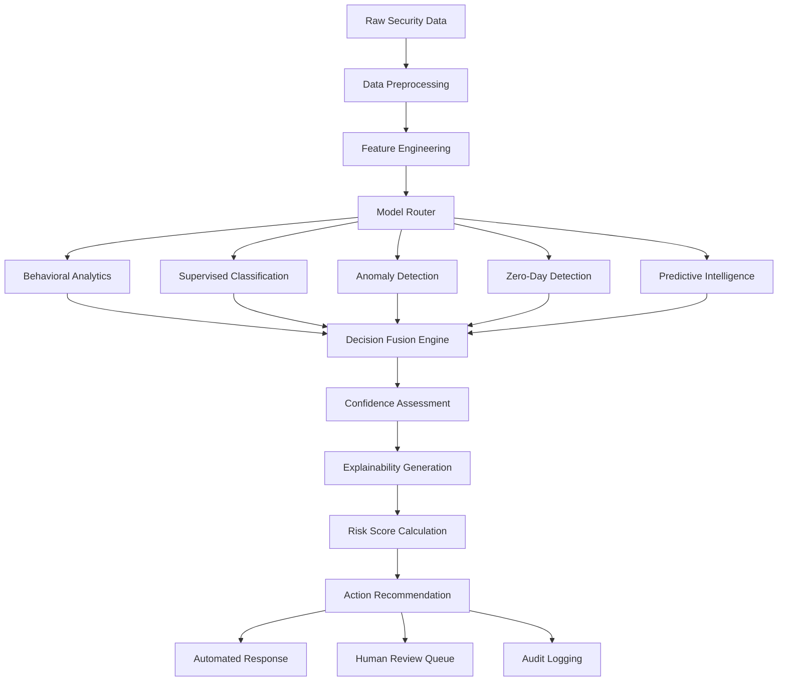

# Model Decision Processes and Feature Importance Guide
## iSECTECH AI/ML Threat Detection System

### Executive Summary

This document provides detailed technical specifications for understanding how each AI/ML model in the iSECTECH threat detection system makes decisions, including feature importance rankings, decision trees, confidence scoring, and integration workflows. It serves as the definitive reference for security analysts, data scientists, and compliance officers.

---

## Decision Process Architecture

### Model Decision Pipeline



### Decision Fusion Logic

```python
class ThreatDecisionFusion:
    """
    Combines multiple model predictions into unified threat assessment
    """
    
    def __init__(self):
        self.model_weights = {
            'behavioral_analytics': 0.30,
            'supervised_classification': 0.25,
            'anomaly_detection': 0.20,
            'zero_day_detection': 0.15,
            'predictive_intelligence': 0.10
        }
        
    def fuse_decisions(self, predictions: Dict[str, ModelPrediction]) -> FusedDecision:
        """
        Weighted fusion of model predictions with confidence assessment
        """
        # Calculate weighted risk score
        weighted_score = sum(
            predictions[model].risk_score * weight 
            for model, weight in self.model_weights.items()
            if model in predictions
        )
        
        # Assess model agreement
        agreement_score = self.calculate_agreement(predictions)
        
        # Generate confidence metrics
        confidence = self.calculate_confidence(predictions, agreement_score)
        
        # Determine final threat classification
        threat_category = self.classify_threat(predictions, weighted_score)
        
        return FusedDecision(
            risk_score=weighted_score,
            threat_category=threat_category,
            confidence=confidence,
            model_agreement=agreement_score,
            contributing_models=list(predictions.keys()),
            explanation=self.generate_explanation(predictions, weighted_score)
        )
```

---

## Behavioral Analytics Decision Process

### Core Algorithm: LSTM-based Sequence Modeling

**Model Architecture:**
- Input: Time-series behavioral features (last 30 days)
- LSTM layers: 3 layers with 128, 64, 32 hidden units
- Attention mechanism: Multi-head attention with 8 heads
- Output: Risk probability distribution across behavior categories

### Feature Engineering Pipeline

```python
class BehavioralFeatureEngineer:
    """
    Transforms raw behavioral data into ML-ready features
    """
    
    def extract_features(self, user_activity: UserActivityData) -> BehavioralFeatures:
        """
        Extract time-series behavioral features
        """
        features = {
            # Temporal patterns
            'login_time_distribution': self.analyze_login_times(user_activity),
            'session_duration_patterns': self.analyze_session_lengths(user_activity), 
            'activity_frequency': self.calculate_activity_frequency(user_activity),
            
            # Access patterns  
            'resource_access_entropy': self.calculate_access_entropy(user_activity),
            'privilege_usage_patterns': self.analyze_privilege_usage(user_activity),
            'data_transfer_volumes': self.analyze_data_transfers(user_activity),
            
            # Geographic and device patterns
            'location_consistency': self.analyze_location_patterns(user_activity),
            'device_fingerprint_stability': self.analyze_device_patterns(user_activity),
            'network_behavior': self.analyze_network_patterns(user_activity),
            
            # Interaction patterns
            'ui_interaction_patterns': self.analyze_ui_interactions(user_activity),
            'api_usage_patterns': self.analyze_api_calls(user_activity),
            'error_rate_patterns': self.analyze_error_rates(user_activity)
        }
        
        return BehavioralFeatures(**features)
```

### Decision Tree for Behavioral Risk Assessment

```
Behavioral Risk Assessment Decision Tree
├── Baseline Established (≥30 days data)
│   ├── Login Time Deviation > 3σ
│   │   ├── Geographic Location Change
│   │   │   ├── Travel Notification Exists → MEDIUM RISK (0.3-0.5)
│   │   │   └── No Travel Notification → HIGH RISK (0.7-0.9)
│   │   └── Same Geographic Location
│   │       ├── Device Fingerprint Matches → LOW RISK (0.1-0.3)
│   │       └── Device Fingerprint Different → MEDIUM RISK (0.4-0.6)
│   └── Login Time Within 2σ
│       ├── Session Duration > 5x Normal
│       │   ├── Data Access Volume Normal → MEDIUM RISK (0.3-0.5)
│       │   └── Data Access Volume High → HIGH RISK (0.6-0.8)
│       └── Session Duration Normal
│           ├── Failed Login Attempts > Threshold → MEDIUM RISK (0.4-0.6)
│           └── All Patterns Normal → LOW RISK (0.0-0.2)
└── Baseline Not Established (<30 days data)
    ├── Known High-Risk Indicators Present → HIGH RISK (0.7-0.9)
    ├── Moderate Risk Indicators Present → MEDIUM RISK (0.5-0.7)
    └── No Risk Indicators → DEFAULT RISK (0.3)
```

### Feature Importance Rankings (Behavioral Analytics)

| Rank | Feature | Weight | Calculation Method | Business Interpretation |
|------|---------|--------|-------------------|-------------------------|
| 1 | Geographic Anomaly Score | 0.35 | Haversine distance + impossible travel detection | Indicates potential credential theft or account compromise |
| 2 | Session Pattern Deviation | 0.28 | Statistical deviation from historical session behavior | Suggests automated tools or compromised access |
| 3 | Data Access Volume Z-Score | 0.22 | Standard deviations from normal data access patterns | May indicate data exfiltration attempts |
| 4 | Login Time Consistency | 0.18 | Time-of-day pattern analysis with circadian modeling | Reveals access outside normal business hours |
| 5 | Device Fingerprint Stability | 0.15 | Device characteristic change detection | New or modified devices may indicate compromise |
| 6 | Privilege Escalation Attempts | 0.12 | Failed elevated access requests tracking | Indicates lateral movement or privilege abuse |
| 7 | API Usage Pattern Changes | 0.10 | API call frequency and pattern analysis | Automated attacks often have distinct API patterns |
| 8 | Network Behavior Anomalies | 0.08 | Network traffic pattern deviation | Unusual network usage may indicate C&C communication |
| 9 | UI Interaction Patterns | 0.06 | Human vs. automated interaction detection | Distinguishes human users from automated tools |
| 10 | Error Rate Fluctuations | 0.04 | Application error rate monitoring | High error rates may indicate attack attempts |

### Confidence Calculation for Behavioral Analytics

```python
def calculate_behavioral_confidence(self, features: BehavioralFeatures, 
                                  baseline_quality: float) -> float:
    """
    Calculate confidence score for behavioral analytics prediction
    """
    confidence_factors = {
        # Data quality factors
        'baseline_completeness': min(baseline_quality, 1.0),  # 0-1 scale
        'feature_completeness': len(features.complete_features) / len(features.all_features),
        'data_recency': self.calculate_data_freshness(features.last_activity),
        
        # Model factors  
        'model_agreement': self.calculate_ensemble_agreement(features),
        'prediction_stability': self.calculate_prediction_stability(features),
        'anomaly_significance': self.calculate_statistical_significance(features),
        
        # Context factors
        'business_context_availability': self.check_business_context(features.user_id),
        'external_validation': self.check_external_indicators(features)
    }
    
    # Weighted confidence calculation
    weights = {
        'baseline_completeness': 0.25,
        'feature_completeness': 0.20,
        'data_recency': 0.15,
        'model_agreement': 0.15,
        'prediction_stability': 0.10,
        'anomaly_significance': 0.08,
        'business_context_availability': 0.04,
        'external_validation': 0.03
    }
    
    confidence = sum(factor * weights[name] for name, factor in confidence_factors.items())
    
    # Apply confidence penalties
    if baseline_quality < 0.7:
        confidence *= 0.85  # Penalty for insufficient baseline
    if features.missing_critical_features > 2:
        confidence *= 0.80  # Penalty for missing features
        
    return max(0.1, min(1.0, confidence))  # Clamp between 0.1 and 1.0
```

---

## Supervised Threat Classification Decision Process

### Model Architecture: Gradient Boosting Ensemble

**Core Components:**
- Primary Model: XGBoost classifier with 1000 estimators
- Feature Selection: Recursive Feature Elimination with Cross-Validation
- Ensemble Methods: Voting classifier with Random Forest and SVM
- Calibration: Platt scaling for probability calibration

### Feature Categories and Weights

#### 1. Network Protocol Features (28% Total Weight)

```python
NETWORK_PROTOCOL_FEATURES = {
    'protocol_type': {
        'weight': 0.08,
        'values': ['TCP', 'UDP', 'ICMP', 'HTTP', 'HTTPS', 'DNS', 'SMTP'],
        'risk_mapping': {
            'HTTP': 0.3,  # Unencrypted traffic risk
            'HTTPS': 0.1,  # Encrypted traffic baseline
            'TCP_RAW': 0.7,  # Raw TCP may indicate tunneling
            'ICMP_FLOOD': 0.9  # ICMP flooding attacks
        }
    },
    'port_analysis': {
        'weight': 0.06,
        'standard_ports': [80, 443, 22, 21, 25, 53, 110, 143],
        'high_risk_ports': [1433, 3389, 5432, 6379],  # Database/RDP ports
        'ephemeral_port_usage': 'dynamic_scoring'
    },
    'encryption_status': {
        'weight': 0.05,
        'tls_version_scoring': {
            'TLS_1.3': 0.0,  # Secure
            'TLS_1.2': 0.1,  # Acceptable
            'TLS_1.1': 0.5,  # Deprecated
            'TLS_1.0': 0.8,  # Insecure
            'SSL_3.0': 0.9,  # Very insecure
            'NO_ENCRYPTION': 1.0  # Unencrypted
        }
    },
    'certificate_validation': {
        'weight': 0.04,
        'validation_results': {
            'VALID_TRUSTED': 0.0,
            'VALID_SELF_SIGNED': 0.3,
            'EXPIRED': 0.7,
            'INVALID_CHAIN': 0.8,
            'REVOKED': 0.9
        }
    },
    'protocol_violations': {
        'weight': 0.05,
        'violation_types': [
            'malformed_headers',
            'invalid_sequences',
            'protocol_version_mismatch',
            'unexpected_payload_size'
        ]
    }
}
```

#### 2. Traffic Volume and Pattern Features (22% Total Weight)

```python
TRAFFIC_PATTERN_FEATURES = {
    'volume_analysis': {
        'weight': 0.08,
        'metrics': {
            'bytes_per_second': 'z_score_analysis',
            'packets_per_second': 'statistical_deviation',
            'session_duration': 'outlier_detection',
            'concurrent_connections': 'threshold_based'
        },
        'thresholds': {
            'high_volume_threshold': '3_standard_deviations',
            'ddos_indicator_threshold': '1000_requests_per_second',
            'data_exfiltration_threshold': '100MB_per_session'
        }
    },
    'frequency_patterns': {
        'weight': 0.06,
        'pattern_types': {
            'periodic_beaconing': 'fft_analysis',
            'burst_patterns': 'clustering_analysis', 
            'gradual_increase': 'trend_analysis',
            'random_intervals': 'entropy_calculation'
        }
    },
    'bandwidth_utilization': {
        'weight': 0.04,
        'analysis_methods': {
            'baseline_comparison': 'historical_7_day_average',
            'peer_comparison': 'similar_user_groups',
            'time_of_day_analysis': 'circadian_patterns',
            'anomaly_scoring': 'isolation_forest'
        }
    },
    'connection_patterns': {
        'weight': 0.04,
        'metrics': {
            'connection_establishment_rate': 'connections_per_minute',
            'connection_duration_distribution': 'statistical_analysis',
            'failed_connection_ratio': 'error_rate_calculation',
            'simultaneous_connections': 'concurrency_analysis'
        }
    }
}
```

#### 3. Endpoint Reputation Features (18% Total Weight)

```python
ENDPOINT_REPUTATION_FEATURES = {
    'ip_reputation_scoring': {
        'weight': 0.07,
        'reputation_sources': [
            'virustotal_api',
            'alienvault_otx',
            'threatcrowd_api',
            'abuseipdb_api',
            'internal_threat_intel'
        ],
        'scoring_algorithm': {
            'known_malicious': 1.0,
            'suspicious_activity': 0.7,
            'recently_compromised': 0.8,
            'known_good': 0.0,
            'unknown': 0.3  # Default risk for unknown IPs
        }
    },
    'domain_analysis': {
        'weight': 0.05,
        'analysis_factors': {
            'domain_age': 'whois_analysis',
            'registration_details': 'registrar_reputation',
            'dns_characteristics': 'dns_record_analysis',
            'subdomain_patterns': 'dga_detection',
            'tld_reputation': 'tld_risk_scoring'
        }
    },
    'geolocation_risk': {
        'weight': 0.03,
        'risk_factors': {
            'country_risk_score': 'geopolitical_risk_index',
            'tor_exit_nodes': 'tor_network_detection',
            'vpn_detection': 'commercial_vpn_identification',
            'hosting_provider': 'infrastructure_analysis'
        }
    },
    'asn_reputation': {
        'weight': 0.03,
        'asn_factors': {
            'malware_hosting_history': 'historical_abuse_analysis',
            'botnet_infrastructure': 'c2_infrastructure_detection',
            'bulletproof_hosting': 'hosting_service_reputation',
            'legitimate_business': 'business_verification'
        }
    }
}
```

### Decision Tree for Threat Classification

```
Threat Classification Decision Tree
├── Network Protocol Analysis
│   ├── Encrypted Traffic (HTTPS/TLS)
│   │   ├── Certificate Valid
│   │   │   ├── Destination Reputation Good → LOW RISK (0.0-0.2)
│   │   │   └── Destination Reputation Bad → HIGH RISK (0.7-0.9)
│   │   └── Certificate Invalid/Expired
│   │       ├── Internal Network → MEDIUM RISK (0.3-0.5)
│   │       └── External Network → HIGH RISK (0.6-0.8)
│   └── Unencrypted Traffic (HTTP/Plain)
│       ├── Internal Communications
│       │   ├── Standard Ports (80, 8080) → LOW RISK (0.1-0.3)
│       │   └── Non-Standard Ports → MEDIUM RISK (0.4-0.6)
│       └── External Communications → HIGH RISK (0.7-0.9)
│
├── Traffic Volume Analysis  
│   ├── Volume Within Normal Range
│   │   ├── Pattern Regular → LOW RISK (0.0-0.2)
│   │   └── Pattern Irregular → MEDIUM RISK (0.3-0.5)
│   └── Volume Excessive (>3σ)
│       ├── Burst Pattern (DDoS Indicator) → CRITICAL RISK (0.9-1.0)
│       ├── Gradual Increase (Data Exfiltration) → HIGH RISK (0.7-0.9)
│       └── Periodic Pattern (Beaconing) → HIGH RISK (0.8-0.9)
│
└── Endpoint Reputation Analysis
    ├── Known Malicious IP/Domain → CRITICAL RISK (0.9-1.0)
    ├── Suspicious Reputation → HIGH RISK (0.6-0.8)
    ├── Unknown Reputation
    │   ├── Recent Registration → MEDIUM RISK (0.4-0.6)
    │   └── Established Domain → LOW RISK (0.2-0.4)
    └── Known Good Reputation → LOW RISK (0.0-0.2)
```

### Model Ensemble Voting Logic

```python
class ThreatClassificationEnsemble:
    """
    Ensemble classifier combining multiple ML algorithms
    """
    
    def __init__(self):
        self.models = {
            'xgboost': XGBClassifier(n_estimators=1000, max_depth=6),
            'random_forest': RandomForestClassifier(n_estimators=500),
            'svm': SVC(probability=True, kernel='rbf'),
            'neural_network': MLPClassifier(hidden_layer_sizes=(128, 64, 32))
        }
        
        self.model_weights = {
            'xgboost': 0.40,      # Highest weight for gradient boosting
            'random_forest': 0.30,  # Strong for feature importance
            'svm': 0.20,           # Good for complex boundaries  
            'neural_network': 0.10  # Backup for complex patterns
        }
        
    def predict_with_explanation(self, features: np.ndarray) -> ClassificationResult:
        """
        Generate prediction with detailed explanation
        """
        predictions = {}
        feature_importance = {}
        
        # Get predictions from each model
        for model_name, model in self.models.items():
            pred_proba = model.predict_proba(features)[0]
            predictions[model_name] = {
                'threat_probability': pred_proba[1],  # Assuming binary classification
                'confidence': max(pred_proba) - min(pred_proba)  # Confidence measure
            }
            
            # Extract feature importance for tree-based models
            if hasattr(model, 'feature_importances_'):
                feature_importance[model_name] = model.feature_importances_
        
        # Calculate weighted ensemble prediction
        final_prediction = sum(
            predictions[model]['threat_probability'] * weight
            for model, weight in self.model_weights.items()
        )
        
        # Calculate ensemble confidence
        confidence_scores = [pred['confidence'] for pred in predictions.values()]
        ensemble_confidence = np.mean(confidence_scores)
        
        # Generate explanation
        explanation = self.generate_explanation(
            predictions, feature_importance, features, final_prediction
        )
        
        return ClassificationResult(
            threat_probability=final_prediction,
            threat_category=self.classify_threat_type(final_prediction, features),
            confidence=ensemble_confidence,
            model_agreement=self.calculate_model_agreement(predictions),
            explanation=explanation
        )
```

---

## Unsupervised Anomaly Detection Decision Process

### Model Architecture: Isolation Forest + One-Class SVM Hybrid

**Core Components:**
- Primary: Isolation Forest with 1000 estimators
- Secondary: One-Class SVM with RBF kernel
- Ensemble: Weighted combination with confidence scoring
- Feature Space: 127 engineered features across multiple dimensions

### Anomaly Score Calculation

```python
class HybridAnomalyDetector:
    """
    Hybrid anomaly detection combining multiple unsupervised algorithms
    """
    
    def __init__(self):
        self.isolation_forest = IsolationForest(
            n_estimators=1000,
            contamination=0.02,  # Expected 2% anomaly rate
            random_state=42
        )
        
        self.one_class_svm = OneClassSVM(
            kernel='rbf',
            gamma='scale',
            nu=0.02  # Expected anomaly rate
        )
        
        self.feature_clusters = {}
        self.anomaly_threshold = 0.75
        
    def calculate_anomaly_score(self, features: np.ndarray) -> AnomalyResult:
        """
        Calculate comprehensive anomaly score with explanation
        """
        # Isolation Forest score (0-1, higher = more anomalous)
        if_score = self.isolation_forest.decision_function(features)[0]
        if_normalized = (if_score + 0.5) / 1.0  # Normalize to 0-1 range
        
        # One-Class SVM score  
        svm_score = self.one_class_svm.decision_function(features)[0]
        svm_normalized = max(0, (0.5 - svm_score) / 0.5)  # Normalize to 0-1 range
        
        # Weighted ensemble score
        ensemble_score = 0.7 * if_normalized + 0.3 * svm_normalized
        
        # Feature-level anomaly analysis
        feature_anomalies = self.analyze_feature_anomalies(features)
        
        # Calculate confidence based on model agreement
        model_agreement = 1.0 - abs(if_normalized - svm_normalized)
        confidence = min(1.0, model_agreement + 0.2)
        
        return AnomalyResult(
            anomaly_score=ensemble_score,
            confidence=confidence,
            feature_contributions=feature_anomalies,
            isolation_forest_score=if_normalized,
            one_class_svm_score=svm_normalized,
            explanation=self.generate_anomaly_explanation(
                ensemble_score, feature_anomalies, features
            )
        )
```

### Feature Anomaly Analysis Framework

```python
ANOMALY_FEATURE_CATEGORIES = {
    'network_behavior': {
        'weight': 0.34,
        'features': [
            'connection_frequency',
            'data_transfer_volume', 
            'protocol_distribution',
            'port_usage_patterns',
            'connection_duration'
        ],
        'anomaly_detection_method': 'statistical_outlier_detection'
    },
    
    'system_resource_usage': {
        'weight': 0.28, 
        'features': [
            'cpu_utilization_patterns',
            'memory_usage_spikes',
            'disk_io_anomalies',
            'network_io_patterns',
            'process_creation_rate'
        ],
        'anomaly_detection_method': 'time_series_anomaly_detection'
    },
    
    'user_activity_patterns': {
        'weight': 0.21,
        'features': [
            'login_time_deviations',
            'session_duration_outliers',
            'resource_access_patterns',
            'privilege_usage_anomalies',
            'geographic_inconsistencies'
        ],
        'anomaly_detection_method': 'behavioral_anomaly_detection'
    },
    
    'data_flow_patterns': {
        'weight': 0.17,
        'features': [
            'internal_traffic_anomalies',
            'external_communication_patterns',
            'data_exfiltration_indicators',
            'lateral_movement_signals',
            'command_control_indicators'
        ],
        'anomaly_detection_method': 'graph_based_anomaly_detection'
    }
}
```

### Cluster-Based Anomaly Explanation

```python
def generate_cluster_based_explanation(self, features: np.ndarray, 
                                     anomaly_score: float) -> ClusterExplanation:
    """
    Generate explanation based on data clustering and outlier analysis
    """
    # Perform clustering on historical normal data
    normal_clusters = self.cluster_normal_behavior(self.historical_data)
    
    # Find nearest cluster to current sample
    nearest_cluster, distance = self.find_nearest_cluster(features, normal_clusters)
    
    # Analyze which features contribute most to the distance
    feature_contributions = self.calculate_feature_contributions(
        features, nearest_cluster.centroid
    )
    
    # Generate human-readable explanation
    explanation_components = []
    
    if distance > self.outlier_threshold:
        explanation_components.append({
            'type': 'cluster_distance',
            'severity': 'high',
            'message': f'Behavior significantly different from normal clusters (distance: {distance:.3f})',
            'cluster_info': {
                'cluster_id': nearest_cluster.id,
                'cluster_description': nearest_cluster.description,
                'typical_behaviors': nearest_cluster.typical_patterns
            }
        })
    
    # Add feature-specific explanations
    for feature, contribution in feature_contributions.items():
        if contribution > 0.1:  # Significant contribution threshold
            explanation_components.append({
                'type': 'feature_anomaly',
                'feature': feature,
                'contribution': contribution,
                'severity': self.classify_severity(contribution),
                'message': self.generate_feature_message(feature, contribution),
                'normal_range': self.get_normal_range(feature),
                'observed_value': features[self.feature_index[feature]]
            })
    
    return ClusterExplanation(
        anomaly_score=anomaly_score,
        nearest_cluster=nearest_cluster,
        cluster_distance=distance,
        explanation_components=explanation_components,
        recommendations=self.generate_recommendations(explanation_components)
    )
```

### Temporal Anomaly Detection

```python
class TemporalAnomalyDetector:
    """
    Detect anomalies in time-series patterns
    """
    
    def __init__(self):
        self.seasonal_decomposition = seasonal_decompose
        self.change_point_detector = ChangePointDetector()
        self.trend_analyzer = TrendAnalyzer()
        
    def detect_temporal_anomalies(self, time_series_data: pd.DataFrame) -> TemporalAnomalies:
        """
        Detect anomalies in temporal patterns
        """
        anomalies = {
            'seasonal_anomalies': self.detect_seasonal_anomalies(time_series_data),
            'trend_anomalies': self.detect_trend_anomalies(time_series_data),
            'change_points': self.detect_change_points(time_series_data),
            'periodic_anomalies': self.detect_periodic_anomalies(time_series_data)
        }
        
        # Generate temporal explanation
        explanation = self.generate_temporal_explanation(anomalies, time_series_data)
        
        return TemporalAnomalies(
            anomalies=anomalies,
            explanation=explanation,
            severity=self.calculate_temporal_severity(anomalies),
            recommendations=self.generate_temporal_recommendations(anomalies)
        )
        
    def detect_seasonal_anomalies(self, data: pd.DataFrame) -> List[SeasonalAnomaly]:
        """
        Detect anomalies in seasonal patterns
        """
        decomposition = seasonal_decompose(data['value'], model='additive', period=24)
        
        # Calculate residuals (actual - trend - seasonal)
        residuals = decomposition.resid.dropna()
        
        # Identify outliers in residuals
        threshold = 3 * residuals.std()
        anomaly_points = residuals[abs(residuals) > threshold]
        
        seasonal_anomalies = []
        for timestamp, value in anomaly_points.items():
            seasonal_anomalies.append(SeasonalAnomaly(
                timestamp=timestamp,
                observed_value=data.loc[timestamp, 'value'],
                expected_value=decomposition.trend[timestamp] + decomposition.seasonal[timestamp],
                deviation=abs(value),
                severity=min(1.0, abs(value) / threshold)
            ))
            
        return seasonal_anomalies
```

---

## Zero-Day Detection Decision Process

### Model Architecture: Deep Autoencoder with Attention

**Core Components:**
- Encoder: 5 layers (512→256→128→64→32 units)
- Decoder: 5 layers (32→64→128→256→512 units)
- Attention: Multi-head attention on bottleneck layer
- Reconstruction Threshold: Dynamic threshold based on training data

### Reconstruction Error Analysis

```python
class ZeroDayDetectionEngine:
    """
    Zero-day attack detection using deep autoencoders
    """
    
    def __init__(self):
        self.autoencoder = self.build_autoencoder()
        self.attention_mechanism = MultiHeadAttention(num_heads=8, key_dim=32)
        self.reconstruction_threshold = AdaptiveThreshold()
        self.feature_attribution = IntegratedGradients()
        
    def detect_zero_day_attack(self, network_data: np.ndarray) -> ZeroDayResult:
        """
        Detect potential zero-day attacks using reconstruction error analysis
        """
        # Forward pass through autoencoder
        encoded = self.autoencoder.encoder(network_data)
        decoded = self.autoencoder.decoder(encoded)
        
        # Calculate reconstruction error
        reconstruction_error = np.mean(np.square(network_data - decoded))
        
        # Apply attention mechanism for feature importance
        attention_weights = self.attention_mechanism(encoded)
        
        # Calculate dynamic threshold based on recent data
        dynamic_threshold = self.reconstruction_threshold.calculate_threshold()
        
        # Determine if this is a potential zero-day
        is_anomaly = reconstruction_error > dynamic_threshold
        confidence = self.calculate_zero_day_confidence(
            reconstruction_error, dynamic_threshold, attention_weights
        )
        
        # Generate feature attribution for explanation
        feature_importance = self.feature_attribution.attribute(
            network_data, target=reconstruction_error
        )
        
        return ZeroDayResult(
            is_potential_zero_day=is_anomaly,
            reconstruction_error=reconstruction_error,
            confidence=confidence,
            threshold_used=dynamic_threshold,
            feature_importance=feature_importance,
            attention_weights=attention_weights,
            explanation=self.generate_zero_day_explanation(
                reconstruction_error, feature_importance, network_data
            )
        )
        
    def calculate_zero_day_confidence(self, error: float, threshold: float, 
                                    attention: np.ndarray) -> float:
        """
        Calculate confidence score for zero-day detection
        """
        # Base confidence from reconstruction error magnitude
        error_magnitude = min(1.0, error / threshold)
        base_confidence = 0.3 + (0.7 * error_magnitude)
        
        # Adjust based on attention consistency
        attention_entropy = -np.sum(attention * np.log(attention + 1e-10))
        attention_factor = 1.0 - (attention_entropy / np.log(len(attention)))
        
        # Apply historical accuracy adjustment
        historical_accuracy = self.get_historical_accuracy()
        accuracy_factor = 0.5 + (0.5 * historical_accuracy)
        
        final_confidence = base_confidence * attention_factor * accuracy_factor
        
        return min(1.0, max(0.1, final_confidence))
```

### Feature Attribution for Zero-Day Explanation

```python
class ZeroDayFeatureAttribution:
    """
    Generate feature-level explanations for zero-day detections
    """
    
    def __init__(self):
        self.feature_categories = {
            'network_protocols': ['tcp_flags', 'packet_sizes', 'protocol_sequence'],
            'payload_characteristics': ['entropy', 'byte_distribution', 'string_patterns'],
            'timing_patterns': ['inter_arrival_times', 'burst_patterns', 'periodicity'],
            'behavioral_indicators': ['connection_patterns', 'data_flows', 'session_characteristics']
        }
        
    def generate_attribution_explanation(self, feature_importance: np.ndarray, 
                                       network_data: np.ndarray) -> AttributionExplanation:
        """
        Generate human-readable explanation from feature attribution
        """
        # Sort features by importance
        feature_indices = np.argsort(feature_importance)[::-1]
        top_features = feature_indices[:10]  # Top 10 most important features
        
        explanations = []
        
        for idx in top_features:
            feature_name = self.get_feature_name(idx)
            importance_score = feature_importance[idx]
            feature_value = network_data[idx]
            
            # Generate category-specific explanation
            category = self.get_feature_category(feature_name)
            explanation = self.generate_category_explanation(
                category, feature_name, importance_score, feature_value
            )
            
            explanations.append({
                'feature': feature_name,
                'category': category,
                'importance': importance_score,
                'value': feature_value,
                'explanation': explanation,
                'risk_level': self.classify_risk_level(importance_score)
            })
            
        return AttributionExplanation(
            top_features=explanations,
            overall_pattern=self.identify_attack_pattern(explanations),
            confidence_factors=self.identify_confidence_factors(explanations),
            recommended_actions=self.generate_response_recommendations(explanations)
        )
        
    def generate_category_explanation(self, category: str, feature: str, 
                                    importance: float, value: float) -> str:
        """
        Generate category-specific explanations
        """
        explanations = {
            'network_protocols': {
                'tcp_flags': f"Unusual TCP flag combination (value: {value:.3f}) suggests non-standard network behavior",
                'packet_sizes': f"Abnormal packet size distribution (value: {value:.3f}) may indicate payload manipulation",
                'protocol_sequence': f"Unexpected protocol sequence (value: {value:.3f}) differs from normal traffic patterns"
            },
            'payload_characteristics': {
                'entropy': f"Payload entropy level (value: {value:.3f}) suggests encrypted or obfuscated content",
                'byte_distribution': f"Byte distribution pattern (value: {value:.3f}) indicates non-standard data encoding",
                'string_patterns': f"String pattern analysis (value: {value:.3f}) reveals unusual text characteristics"
            },
            'timing_patterns': {
                'inter_arrival_times': f"Packet timing patterns (value: {value:.3f}) suggest automated tool usage",
                'burst_patterns': f"Traffic burst characteristics (value: {value:.3f}) indicate rapid data transmission",
                'periodicity': f"Periodic behavior (value: {value:.3f}) may indicate beaconing or C&C communication"
            },
            'behavioral_indicators': {
                'connection_patterns': f"Connection establishment pattern (value: {value:.3f}) differs from legitimate usage",
                'data_flows': f"Data flow characteristics (value: {value:.3f}) suggest unusual information transfer",
                'session_characteristics': f"Session behavior (value: {value:.3f}) indicates non-human interaction patterns"
            }
        }
        
        return explanations.get(category, {}).get(feature, 
            f"Feature {feature} shows unusual pattern (importance: {importance:.3f}, value: {value:.3f})")
```

---

## Confidence Scoring Framework

### Multi-Dimensional Confidence Assessment

```python
class ConfidenceAssessmentFramework:
    """
    Comprehensive confidence scoring for all ML model predictions
    """
    
    def __init__(self):
        self.confidence_components = {
            'data_quality': DataQualityAssessor(),
            'model_performance': ModelPerformanceTracker(),
            'prediction_stability': PredictionStabilityAnalyzer(),
            'ensemble_agreement': EnsembleAgreementCalculator(),
            'historical_accuracy': HistoricalAccuracyTracker(),
            'context_validation': ContextValidationEngine()
        }
        
    def calculate_comprehensive_confidence(self, prediction: ModelPrediction, 
                                         context: PredictionContext) -> ConfidenceScore:
        """
        Calculate multi-dimensional confidence score
        """
        component_scores = {}
        
        # Data Quality Assessment (25% weight)
        component_scores['data_quality'] = self.confidence_components['data_quality'].assess(
            input_data=context.input_data,
            feature_completeness=context.feature_completeness,
            data_freshness=context.data_freshness
        )
        
        # Model Performance Assessment (20% weight) 
        component_scores['model_performance'] = self.confidence_components['model_performance'].assess(
            model_id=prediction.model_id,
            recent_accuracy=context.recent_model_accuracy,
            performance_trend=context.performance_trend
        )
        
        # Prediction Stability Assessment (20% weight)
        component_scores['prediction_stability'] = self.confidence_components['prediction_stability'].assess(
            current_prediction=prediction,
            recent_predictions=context.recent_predictions,
            input_perturbation_sensitivity=context.sensitivity_analysis
        )
        
        # Ensemble Agreement Assessment (15% weight)
        component_scores['ensemble_agreement'] = self.confidence_components['ensemble_agreement'].assess(
            model_predictions=context.ensemble_predictions,
            agreement_threshold=0.8
        )
        
        # Historical Accuracy Assessment (10% weight)
        component_scores['historical_accuracy'] = self.confidence_components['historical_accuracy'].assess(
            model_id=prediction.model_id,
            similar_cases=context.similar_historical_cases,
            time_window=context.evaluation_time_window
        )
        
        # Context Validation Assessment (10% weight)
        component_scores['context_validation'] = self.confidence_components['context_validation'].assess(
            business_context=context.business_context,
            external_validation=context.external_indicators,
            domain_knowledge=context.domain_constraints
        )
        
        # Calculate weighted confidence score
        weights = {
            'data_quality': 0.25,
            'model_performance': 0.20,
            'prediction_stability': 0.20,
            'ensemble_agreement': 0.15,
            'historical_accuracy': 0.10,
            'context_validation': 0.10
        }
        
        overall_confidence = sum(
            component_scores[component] * weights[component]
            for component in component_scores
        )
        
        return ConfidenceScore(
            overall_score=overall_confidence,
            component_scores=component_scores,
            confidence_level=self.classify_confidence_level(overall_confidence),
            reliability_indicators=self.generate_reliability_indicators(component_scores),
            recommendations=self.generate_confidence_recommendations(component_scores)
        )
```

### Confidence Level Classification

```python
CONFIDENCE_LEVELS = {
    'very_high': {
        'range': (0.90, 1.00),
        'description': 'Extremely confident in prediction accuracy',
        'automated_action': 'full_automation_approved',
        'human_review': 'optional',
        'alert_priority': 'immediate_for_high_risk'
    },
    'high': {
        'range': (0.75, 0.89),
        'description': 'High confidence in prediction accuracy', 
        'automated_action': 'automated_with_monitoring',
        'human_review': 'recommended_for_high_risk',
        'alert_priority': 'standard'
    },
    'medium': {
        'range': (0.60, 0.74),
        'description': 'Moderate confidence, some uncertainty present',
        'automated_action': 'limited_automation',
        'human_review': 'required_for_medium_high_risk',
        'alert_priority': 'standard_with_context'
    },
    'low': {
        'range': (0.40, 0.59),
        'description': 'Limited confidence, significant uncertainty',
        'automated_action': 'monitoring_only',
        'human_review': 'required',
        'alert_priority': 'low_with_explanation'
    },
    'very_low': {
        'range': (0.00, 0.39),
        'description': 'Very low confidence, high uncertainty',
        'automated_action': 'no_automation',
        'human_review': 'mandatory',
        'alert_priority': 'information_only'
    }
}
```

---

This comprehensive documentation provides security analysts and technical teams with detailed understanding of how each AI/ML model makes decisions, calculates confidence scores, and generates explanations. The technical specifications enable effective model interpretation, troubleshooting, and continuous improvement of the threat detection system.