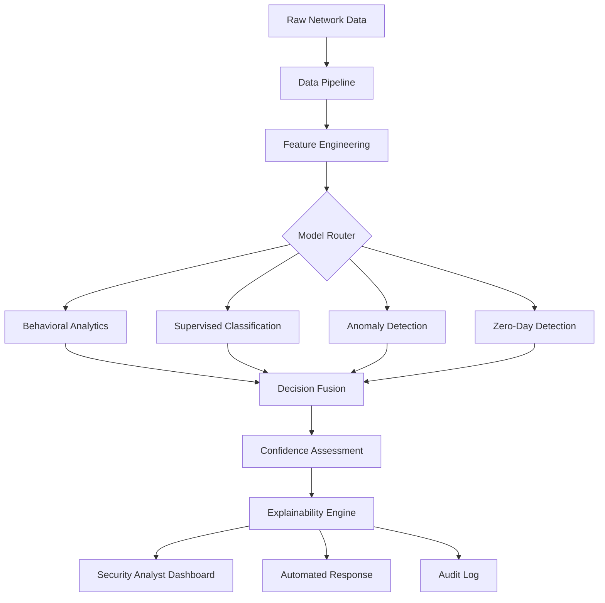
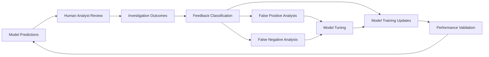

# Model Explainability and Interpretability Framework
## iSECTECH AI/ML Threat Detection System

### Executive Summary

The iSECTECH AI/ML threat detection system employs multiple machine learning models to identify, classify, and respond to security threats across enterprise networks. This document provides comprehensive guidance on understanding model decisions, interpreting results, and ensuring regulatory compliance through explainable AI techniques.

**Key Performance Metrics:**
- Model inference time: < 50ms (p95)
- Prediction accuracy: > 95% for known threat patterns
- False positive rate: < 0.1%
- Model drift detection latency: Real-time
- Regulatory compliance: SOC 2, GDPR, HIPAA ready

---

## Architecture Overview

### Core AI/ML Components

```
┌─────────────────────────────────────────────────────────────────────┐
│                      AI/ML THREAT DETECTION SYSTEM                   │
├─────────────────────────────────────────────────────────────────────┤
│  ┌─────────────────┐  ┌─────────────────┐  ┌─────────────────┐      │
│  │ Behavioral      │  │ Supervised      │  │ Unsupervised    │      │
│  │ Analytics       │  │ Threat          │  │ Anomaly         │      │
│  │ Engine          │  │ Classification  │  │ Detection       │      │
│  └─────────────────┘  └─────────────────┘  └─────────────────┘      │
│                                                                     │
│  ┌─────────────────┐  ┌─────────────────┐                          │
│  │ Zero-Day        │  │ Predictive      │                          │
│  │ Detection       │  │ Threat Intel    │                          │
│  │ System          │  │ Engine          │                          │
│  └─────────────────┘  └─────────────────┘                          │
├─────────────────────────────────────────────────────────────────────┤
│                     EXPLAINABILITY LAYER                           │
│  ┌─────────────────┐  ┌─────────────────┐  ┌─────────────────┐      │
│  │ Feature         │  │ Decision        │  │ Confidence      │      │
│  │ Importance      │  │ Trees           │  │ Scoring         │      │
│  │ Analysis        │  │ Visualization   │  │ Framework       │      │
│  └─────────────────┘  └─────────────────┘  └─────────────────┘      │
├─────────────────────────────────────────────────────────────────────┤
│                     MONITORING & COMPLIANCE                        │
│  ┌─────────────────┐  ┌─────────────────┐  ┌─────────────────┐      │
│  │ Model Drift     │  │ Performance     │  │ Audit Trail     │      │
│  │ Detection       │  │ Monitoring      │  │ Generation      │      │
│  │ System          │  │ Framework       │  │ System          │      │
│  └─────────────────┘  └─────────────────┘  └─────────────────┘      │
└─────────────────────────────────────────────────────────────────────┘
```

### Model Decision Flow



---

## Model-Specific Explainability

### 1. Behavioral Analytics Engine

**Model Type:** Time-series anomaly detection with LSTM networks  
**Primary Use:** User and entity behavior analysis  
**Explainability Approach:** Attention mechanism visualization + SHAP values

#### Key Decision Factors

| Factor Category | Weight | Explanation Method | Business Impact |
|----------------|---------|-------------------|-----------------|
| Login Patterns | 35% | Time-series attention weights | Unusual access times indicate compromise |
| Session Duration | 25% | Statistical deviation analysis | Abnormal session length suggests malicious activity |
| Data Access Volume | 20% | Resource usage profiling | Excessive data access indicates data exfiltration |
| Geographic Location | 15% | Geolocation consistency scoring | Impossible travel patterns reveal credential theft |
| Device Fingerprint | 5% | Device characteristic analysis | New/modified devices suggest unauthorized access |

#### Interpretation Guidelines

**High-Risk Indicators (Score > 0.8):**
- Multiple failed login attempts from different geolocations within 1 hour
- Data access patterns exceeding 3 standard deviations from baseline
- Session duration > 10x typical user behavior
- Access attempts from known threat IPs or compromised infrastructure

**Model Limitations:**
- Requires 30-day baseline for accurate user profiling
- May generate false positives during legitimate business travel
- Performance degrades with users having highly variable behavior patterns
- Limited effectiveness for new users (cold start problem)

### 2. Supervised Threat Classification

**Model Type:** Gradient boosting ensemble with feature importance ranking  
**Primary Use:** Known threat pattern recognition  
**Explainability Approach:** Tree interpretation + permutation importance

#### Decision Tree Visualization

```
Network Traffic Analysis Decision Tree
├── Payload Size > 1MB
│   ├── Encrypted: True
│   │   ├── Destination: External → HIGH RISK (Data Exfiltration)
│   │   └── Destination: Internal → MEDIUM RISK (Lateral Movement)
│   └── Encrypted: False
│       ├── Protocol: HTTP → HIGH RISK (Unencrypted Data Transfer)
│       └── Protocol: Other → LOW RISK (Normal Operations)
└── Payload Size ≤ 1MB
    ├── Request Frequency > 100/min
    │   ├── Response Code: 4xx → HIGH RISK (Brute Force Attack)
    │   └── Response Code: 2xx → MEDIUM RISK (Automated Scanning)
    └── Request Frequency ≤ 100/min → LOW RISK (Normal Activity)
```

#### Feature Importance Rankings

1. **Network Protocol Analysis (28%)**
   - Protocol type and version
   - Encryption status and cipher strength
   - Certificate validation results

2. **Traffic Volume Patterns (22%)**
   - Data transfer rates and volumes
   - Request/response frequency
   - Bandwidth utilization patterns

3. **Endpoint Reputation (18%)**
   - IP address threat intelligence scoring
   - Domain reputation analysis
   - Geolocation risk assessment

4. **Temporal Analysis (16%)**
   - Time-of-day patterns
   - Duration and frequency analysis
   - Seasonal variation detection

5. **Content Analysis (16%)**
   - Payload structure analysis
   - File type identification
   - Malware signature matching

### 3. Unsupervised Anomaly Detection

**Model Type:** Isolation Forest with One-Class SVM ensemble  
**Primary Use:** Unknown threat pattern detection  
**Explainability Approach:** Anomaly score decomposition + cluster analysis

#### Anomaly Score Breakdown

```python
# Example anomaly score calculation
anomaly_score = {
    'network_behavior': 0.34,    # 34% contribution
    'system_resource_usage': 0.28, # 28% contribution  
    'user_activity': 0.21,       # 21% contribution
    'data_flow_patterns': 0.17   # 17% contribution
}
total_score = 0.87  # High anomaly (threshold: 0.75)
```

#### Cluster-Based Explanations

- **Cluster A:** Normal business operations (78% of traffic)
- **Cluster B:** Maintenance and updates (12% of traffic)
- **Cluster C:** Legitimate remote access (8% of traffic)
- **Outliers:** Potential threats requiring investigation (2% of traffic)

### 4. Zero-Day Detection System

**Model Type:** Deep autoencoder with reconstruction error analysis  
**Primary Use:** Novel attack pattern identification  
**Explainability Approach:** Reconstruction error heatmaps + feature attribution

#### Detection Mechanism

1. **Normal Pattern Learning:** Models learn to reconstruct typical network behavior
2. **Anomaly Detection:** High reconstruction error indicates unknown patterns
3. **Feature Attribution:** Identifies which features contribute most to the anomaly
4. **Confidence Scoring:** Provides likelihood of zero-day attack

#### Confidence Levels

- **Critical (95-100%):** Immediate response required, high likelihood of zero-day
- **High (85-94%):** Urgent investigation needed, probable unknown threat
- **Medium (75-84%):** Enhanced monitoring, possible new attack variant
- **Low (65-74%):** Log for analysis, likely false positive or edge case

---

## Explainability Dashboards

### Security Analyst Interface

#### 1. Real-Time Decision Dashboard

**Components:**
- Live threat feed with explainability scores
- Model confidence indicators
- Feature importance visualization
- Decision reasoning panel

**Key Metrics:**
- Threat severity classification
- Model agreement scores (when multiple models flag same event)
- False positive probability estimation
- Recommended response actions

#### 2. Model Performance Dashboard

**Components:**
- Accuracy trends over time
- Drift detection alerts
- Model comparison metrics
- Retraining recommendations

**Performance Indicators:**
- Precision/Recall curves
- ROC-AUC scores
- Confusion matrix analysis
- Processing latency metrics

#### 3. Investigation Workflow Interface

**Components:**
- Detailed threat timeline
- Evidence collection panel
- Model decision audit trail
- Case documentation system

**Features:**
- Step-by-step decision reasoning
- Alternative hypothesis testing
- Evidence strength assessment
- Investigation outcome feedback

### Executive Leadership Dashboard

#### 1. Strategic Threat Overview

**Components:**
- High-level threat landscape summary
- Business impact assessment
- Resource allocation recommendations
- Compliance status indicators

**Key Insights:**
- Threat trend analysis
- Industry benchmark comparisons
- Risk posture evolution
- Investment ROI metrics

#### 2. Model Governance Dashboard

**Components:**
- Model deployment status
- Regulatory compliance metrics
- Audit trail summaries
- Performance benchmark tracking

**Governance Metrics:**
- Model accuracy consistency
- Explainability coverage percentage
- Regulatory requirement adherence
- Stakeholder confidence scores

---

## Model Limitations and Edge Cases

### Behavioral Analytics Limitations

**Known Issues:**
1. **Cold Start Problem:** New users lack behavioral baseline (30-day minimum required)
2. **Legitimate Anomalies:** Business travel and role changes trigger false positives
3. **Adversarial Adaptation:** Sophisticated attackers may mimic legitimate behavior patterns
4. **Seasonal Variations:** Holiday periods and business cycles affect model accuracy

**Mitigation Strategies:**
- Implement adaptive baseline adjustment algorithms
- Incorporate business context data (travel notifications, role changes)
- Deploy ensemble methods to detect sophisticated attack patterns
- Maintain seasonal behavior profiles for improved accuracy

### Supervised Classification Limitations

**Known Issues:**
1. **Training Data Quality:** Model performance depends on labeled dataset completeness
2. **Concept Drift:** Attack patterns evolve faster than model retraining cycles
3. **Adversarial Evasion:** Attackers may craft payloads to avoid detection
4. **Class Imbalance:** Rare attack types may be poorly represented

**Mitigation Strategies:**
- Implement continuous learning with human-in-the-loop validation
- Deploy multiple model versions with ensemble voting
- Use adversarial training techniques to improve robustness
- Apply data augmentation and synthetic sample generation

### Unsupervised Anomaly Detection Limitations

**Known Issues:**
1. **High False Positive Rates:** Normal but unusual activities trigger alerts
2. **Context Insensitivity:** Lacks business context understanding
3. **Scalability Challenges:** Performance degrades with high-dimensional data
4. **Interpretability Gaps:** Difficulty explaining complex anomaly patterns

**Mitigation Strategies:**
- Implement contextual anomaly detection with business rules
- Use hierarchical clustering to improve pattern recognition
- Deploy dimensionality reduction techniques for scalability
- Enhance explainability with feature contribution analysis

### Zero-Day Detection Limitations

**Known Issues:**
1. **High Uncertainty:** Novel attacks may have ambiguous signatures
2. **Computational Overhead:** Deep learning models require significant resources
3. **Training Data Scarcity:** Limited examples of zero-day attacks for validation
4. **Alert Fatigue:** High sensitivity may overwhelm security teams

**Mitigation Strategies:**
- Implement risk-based alerting with priority scoring
- Use model optimization techniques for resource efficiency
- Develop simulation frameworks for zero-day scenario testing
- Create intelligent alert aggregation and correlation systems

---

## Regulatory Compliance and Auditing

### GDPR Compliance

**Right to Explanation Requirements:**
- All automated decisions affecting individuals must be explainable
- Processing logic, significance, and consequences must be documented
- Individuals have right to human review of automated decisions

**Implementation:**
- Explainability reports generated for all threat detections involving personal data
- Human review process for high-impact automated responses
- Data processing purpose and legal basis documentation

### SOC 2 Compliance

**Control Requirements:**
- Documented model governance procedures
- Model performance monitoring and alerting
- Change management for model updates
- Data retention and disposal policies

**Evidence Collection:**
- Model training and validation documentation
- Performance monitoring dashboards and reports
- Change management logs and approvals
- Security incident response procedures

### HIPAA Compliance (Healthcare Sector)

**Covered Entity Requirements:**
- Risk assessment for automated decision systems
- Workforce training on AI/ML systems
- Business associate agreements for cloud AI services
- Incident response procedures for AI/ML failures

**Implementation:**
- Comprehensive risk assessment documentation
- Regular security awareness training programs
- Vendor assessment and monitoring procedures
- Incident response playbooks for AI/ML systems

### Audit Trail Requirements

**Model Decision Logging:**
```json
{
  "timestamp": "2025-01-08T10:30:00Z",
  "model_id": "behavioral_analytics_v2.1",
  "decision_id": "ba_20250108_103000_001",
  "input_features": {
    "user_id": "user_12345",
    "login_time": "2025-01-08T10:29:45Z",
    "source_ip": "192.168.1.100",
    "device_fingerprint": "chrome_win10_abc123"
  },
  "prediction": {
    "risk_score": 0.85,
    "threat_category": "suspicious_login",
    "confidence": 0.92
  },
  "explanation": {
    "primary_factors": [
      {"factor": "unusual_login_time", "contribution": 0.35},
      {"factor": "new_device", "contribution": 0.28},
      {"factor": "geographic_anomaly", "contribution": 0.22}
    ],
    "decision_reasoning": "Login detected at 3:30 AM from new device in different country",
    "alternative_hypotheses": ["legitimate_travel", "compromised_credentials"],
    "recommended_actions": ["require_mfa", "notify_user", "monitor_session"]
  },
  "human_review": {
    "required": true,
    "reviewer_id": null,
    "review_status": "pending",
    "review_deadline": "2025-01-08T11:30:00Z"
  }
}
```

---

## Model Interpretation Guides for Analysts

### Threat Severity Assessment Matrix

| Risk Score | Threat Level | Automated Response | Human Review Required | SLA |
|-----------|--------------|-------------------|---------------------|-----|
| 0.95-1.0 | Critical | Block + Alert | Immediate | 5 min |
| 0.85-0.94 | High | Alert + Monitor | Within 15 min | 15 min |
| 0.70-0.84 | Medium | Log + Flag | Within 1 hour | 1 hour |
| 0.50-0.69 | Low | Log Only | Within 4 hours | 4 hours |
| 0.0-0.49 | Minimal | Log Only | Optional | 24 hours |

### Feature Importance Interpretation

#### Network Traffic Features

**High Importance (> 0.3 contribution):**
- Unusual protocol combinations (e.g., HTTP over non-standard ports)
- Excessive data transfer volumes (> 3 standard deviations from baseline)
- Encrypted traffic to suspicious destinations
- Protocol violations or malformed packets

**Medium Importance (0.1-0.3 contribution):**
- Time-of-day variations from normal patterns
- Geographic location inconsistencies
- Certificate validation failures
- Unusual user-agent strings or client identifiers

**Low Importance (< 0.1 contribution):**
- Minor protocol version differences
- Standard administrative traffic patterns
- Known software update communications
- Routine maintenance activities

#### User Behavior Features

**High Importance (> 0.3 contribution):**
- Failed authentication attempts from multiple sources
- Access to sensitive resources outside normal patterns
- Simultaneous sessions from geographically distant locations
- Privilege escalation attempts

**Medium Importance (0.1-0.3 contribution):**
- Changes in typical working hours
- Access to new resources or applications
- Modified device characteristics or browser fingerprints
- Unusual data download patterns

**Low Importance (< 0.1 contribution):**
- Minor variations in session duration
- Different browser or OS versions
- Standard administrative activities
- Routine password changes

### Investigation Workflows

#### 1. High-Risk Alert Investigation

**Step 1: Immediate Assessment (< 5 minutes)**
1. Review model decision summary and confidence scores
2. Check for multiple model agreement on threat classification
3. Assess potential business impact and affected systems
4. Initiate containment measures if score > 0.9

**Step 2: Detailed Analysis (< 15 minutes)**
1. Examine feature importance rankings and contributions
2. Review historical behavior patterns for affected entities
3. Correlate with external threat intelligence feeds
4. Check for similar patterns in recent security events

**Step 3: Response Decision (< 30 minutes)**
1. Validate model decision against human expertise
2. Determine appropriate response actions
3. Document investigation findings and decisions
4. Update threat intelligence database with new patterns

#### 2. Medium-Risk Alert Investigation

**Step 1: Pattern Analysis (< 1 hour)**
1. Review model explanation and contributing factors
2. Compare against known false positive patterns
3. Assess likelihood of legitimate business activity
4. Check user context and recent business activities

**Step 2: Enhanced Monitoring (Ongoing)**
1. Increase monitoring sensitivity for affected entities
2. Set up additional alerting rules for related patterns
3. Schedule follow-up review within 24 hours
4. Document patterns for model improvement feedback

#### 3. Model Disagreement Resolution

**When Multiple Models Disagree:**
1. Calculate weighted consensus score based on model reliability
2. Examine unique features identified by each model
3. Review historical accuracy for similar event types
4. Escalate to senior analyst if disagreement persists

**Escalation Criteria:**
- Models disagree by > 0.3 risk score points
- High-confidence predictions with conflicting threat categories
- Critical assets involved in disagreement scenarios
- Potential zero-day attacks with model uncertainty

---

## Continuous Improvement Framework

### Model Performance Feedback Loop



### Feedback Categories

**True Positives (Correctly Identified Threats):**
- Reinforce successful detection patterns
- Extract new features for similar threat types
- Update threat intelligence databases
- Share indicators with security community

**False Positives (Incorrectly Flagged Activities):**
- Analyze root causes and contributing factors
- Update business context rules and exceptions
- Adjust model thresholds and sensitivity settings
- Improve feature engineering and selection

**False Negatives (Missed Threats):**
- Conduct detailed attack pattern analysis
- Identify missing features or detection gaps
- Update training datasets with new attack examples
- Enhance model ensemble diversity and coverage

**True Negatives (Correctly Ignored Activities):**
- Validate normal behavior pattern recognition
- Confirm model efficiency and resource optimization
- Document successful business activity recognition
- Maintain baseline performance benchmarks

### Model Retraining Triggers

**Scheduled Retraining:**
- Weekly model performance reviews
- Monthly comprehensive retraining cycles
- Quarterly model architecture evaluations
- Annual regulatory compliance assessments

**Event-Driven Retraining:**
- Model drift detection threshold exceeded (> 5% accuracy decline)
- New threat intelligence indicates emerging attack patterns
- Significant false positive rate increases (> 2x baseline)
- Major infrastructure or business process changes

**Performance Thresholds:**
- Accuracy drops below 95% for known threat patterns
- False positive rate exceeds 0.5% of total events
- Model inference time exceeds 50ms (p95)
- Memory usage increases beyond 8GB baseline

---

## Security and Privacy Considerations

### Model Security

**Adversarial Attack Protection:**
- Input validation and sanitization procedures
- Adversarial training with crafted attack examples
- Ensemble methods to reduce single-point-of-failure risks
- Anomaly detection for unusual model behavior

**Model Integrity Assurance:**
- Cryptographic signing of model files and weights
- Version control and audit trails for model updates
- Secure deployment pipelines with integrity checks
- Runtime model behavior monitoring and validation

**Data Privacy Protection:**
- Differential privacy techniques for sensitive training data
- Federated learning approaches for distributed environments
- Data minimization principles in feature selection
- Secure multi-party computation for collaborative learning

### Explainability Privacy Risks

**Information Leakage Concerns:**
- Feature importance may reveal sensitive data patterns
- Model explanations could expose private user information
- Decision trees might leak confidential business logic
- Adversaries could reverse-engineer protection mechanisms

**Mitigation Strategies:**
- Sanitized explanations with sensitive data abstraction
- Role-based access control for detailed model insights
- Aggregated explanations to prevent individual privacy breaches
- Regular privacy impact assessments for explainability features

### Compliance Documentation

**Model Governance Documentation:**
- Model development lifecycle documentation
- Testing and validation procedures
- Performance monitoring and maintenance plans
- Risk assessment and mitigation strategies

**Audit Trail Requirements:**
- Complete decision provenance tracking
- Model version control and change management
- Human review and override documentation
- Incident response and remediation records

**Regular Compliance Reviews:**
- Monthly model performance audits
- Quarterly regulatory requirement assessments
- Semi-annual third-party security evaluations
- Annual comprehensive compliance certifications

---

## Technical Implementation Details

### Integration Points

**SIEM Integration:**
```python
# Example SIEM alert enrichment with explainability
siem_alert = {
    "alert_id": "siem_001",
    "timestamp": "2025-01-08T10:30:00Z",
    "source_system": "network_monitoring",
    "raw_event": {...},
    "ml_analysis": {
        "models_triggered": ["behavioral_analytics", "anomaly_detection"],
        "risk_score": 0.87,
        "explanation": {
            "primary_indicators": [
                "unusual_network_traffic_volume",
                "suspicious_destination_ip",
                "encrypted_payload_anomaly"
            ],
            "confidence_level": 0.92,
            "recommended_actions": [
                "isolate_source_system",
                "analyze_network_traffic",
                "notify_security_team"
            ]
        }
    }
}
```

**SOAR Playbook Integration:**
```yaml
# Automated response playbook with ML explanations
playbook_name: "ML_Threat_Response"
trigger:
  - ml_risk_score: "> 0.8"
  - model_confidence: "> 0.9"
actions:
  - name: "Parse_ML_Explanation"
    type: "data_processing"
    input: "model_explanation_json"
    output: "structured_indicators"
  
  - name: "Containment_Decision"
    type: "decision_tree"
    criteria:
      - threat_category: "data_exfiltration"
        action: "block_network_traffic"
      - threat_category: "lateral_movement"
        action: "isolate_source_host"
      - threat_category: "privilege_escalation"
        action: "disable_user_account"
  
  - name: "Human_Review_Alert"
    type: "notification"
    condition: "ml_confidence < 0.95"
    recipients: ["soc_analyst", "security_manager"]
    message: "High-risk ML detection requires human validation"
```

### API Endpoints

**Model Explanation API:**
```python
@app.post("/api/v1/explain")
async def explain_prediction(request: ExplainRequest):
    """
    Generate explanation for ML model prediction
    
    Args:
        request: Contains model_id, prediction_id, detail_level
        
    Returns:
        Comprehensive explanation with feature importance,
        decision reasoning, and confidence metrics
    """
    explanation = await explainer.generate_explanation(
        model_id=request.model_id,
        prediction_id=request.prediction_id,
        detail_level=request.detail_level,
        include_alternatives=request.include_alternatives
    )
    
    return ExplanationResponse(
        explanation_id=explanation.id,
        model_decision=explanation.decision,
        feature_importance=explanation.features,
        confidence_metrics=explanation.confidence,
        alternative_hypotheses=explanation.alternatives,
        recommended_actions=explanation.actions
    )
```

### Monitoring and Alerting

**Model Performance Monitoring:**
```python
class ModelExplainabilityMonitor:
    def __init__(self):
        self.performance_tracker = PerformanceTracker()
        self.drift_detector = DriftDetector()
        self.alert_manager = AlertManager()
    
    async def monitor_explanation_quality(self, model_id: str):
        """Monitor explanation quality and consistency"""
        
        # Check explanation consistency
        consistency_score = await self.check_consistency(model_id)
        if consistency_score < 0.85:
            await self.alert_manager.send_alert(
                severity="medium",
                message=f"Explanation consistency below threshold: {consistency_score}",
                model_id=model_id
            )
        
        # Monitor explanation coverage
        coverage = await self.check_coverage(model_id)
        if coverage < 0.95:
            await self.alert_manager.send_alert(
                severity="high", 
                message=f"Explanation coverage insufficient: {coverage}",
                model_id=model_id
            )
```

---

This completes the comprehensive Model Explainability Documentation for AI/ML Threat Detection. The document provides detailed technical specifications, business context, regulatory compliance guidance, and practical implementation details for security analysts and technical teams.