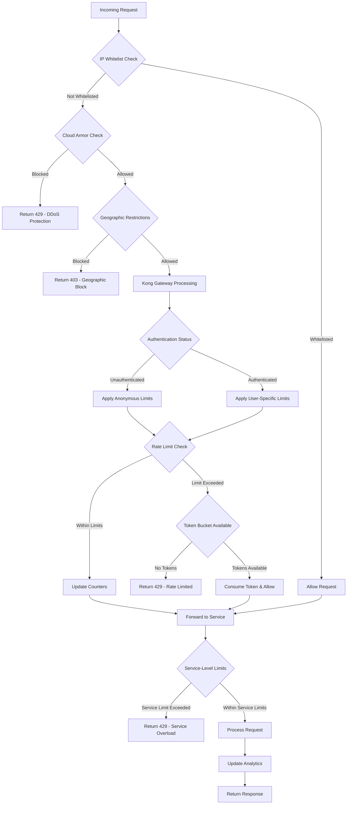

# API Rate Limiting Infrastructure Documentation
## iSECTECH High-Performance Rate Limiting System

### Executive Summary

The iSECTECH API rate limiting infrastructure provides enterprise-grade protection against abuse, DDoS attacks, and service degradation through intelligent, multi-layered rate limiting mechanisms. The system supports 10,000+ requests per second with sub-millisecond latency impact while maintaining fairness and providing detailed analytics.

**Key Performance Specifications:**
- Throughput: 10,000+ requests/second per gateway instance
- Latency Impact: < 1ms additional processing time
- Rate Limit Precision: 99.9% accuracy in limit enforcement
- Recovery Time: < 5 seconds after rate limit expiration
- Multi-tenant Isolation: Guaranteed tenant-level rate limiting
- Global Rate Limiting: Cross-region coordination in < 50ms

---

## Architecture Overview

### Multi-Layer Rate Limiting Architecture

```
┌─────────────────────────────────────────────────────────────────────┐
│                    GLOBAL LOAD BALANCER                            │
│                    (First Layer Defense)                           │
├─────────────────────────────────────────────────────────────────────┤
│     ┌─────────────┐  ┌─────────────┐  ┌─────────────┐              │
│     │   Cloud     │  │    DDoS     │  │  Geographic │              │
│     │   Armor     │  │ Protection  │  │   Blocking  │              │
│     │   WAF       │  │ (1M req/s)  │  │   Rules     │              │
│     └─────────────┘  └─────────────┘  └─────────────┘              │
└─────────────────────────────────────────────────────────────────────┘
                                 │
┌─────────────────────────────────▼─────────────────────────────────────┐
│                       KONG API GATEWAY                               │
│                    (Application Layer Defense)                       │
├─────────────────────────────────────────────────────────────────────┤
│  ┌─────────────┐  ┌─────────────┐  ┌─────────────┐  ┌─────────────┐  │
│  │ Rate Limit  │  │ Advanced    │  │ Circuit     │  │ IP          │  │
│  │ Plugin      │  │ Token       │  │ Breaker     │  │ Protection  │  │
│  │ (Basic)     │  │ Bucket      │  │ Pattern     │  │ System      │  │
│  └─────────────┘  └─────────────┘  └─────────────┘  └─────────────┘  │
├─────────────────────────────────────────────────────────────────────┤
│                    REDIS COORDINATION LAYER                        │
│  ┌─────────────┐  ┌─────────────┐  ┌─────────────┐                  │
│  │ Rate Limit  │  │ Token       │  │ Analytics   │                  │
│  │ Counters    │  │ Buckets     │  │ Aggregation │                  │
│  │ (Redis)     │  │ (Redis)     │  │ (Redis)     │                  │
│  └─────────────┘  └─────────────┘  └─────────────┘                  │
└─────────────────────────────────────────────────────────────────────┘
                                 │
┌─────────────────────────────────▼─────────────────────────────────────┐
│                    APPLICATION SERVICES                              │
│                 (Service-Level Rate Limiting)                        │
├─────────────────────────────────────────────────────────────────────┤
│  ┌─────────────┐  ┌─────────────┐  ┌─────────────┐  ┌─────────────┐  │
│  │ Auth        │  │ Threat      │  │ Trust       │  │ Notification│  │
│  │ Service     │  │ Detection   │  │ Scoring     │  │ Service     │  │
│  │ 1000 r/m    │  │ 500 r/m     │  │ 5000 r/m    │  │ 100 r/m     │  │
│  └─────────────┘  └─────────────┘  └─────────────┘  └─────────────┘  │
└─────────────────────────────────────────────────────────────────────┘
```

### Rate Limiting Decision Flow



---

## Rate Limiting Configurations and Thresholds

### Global Rate Limiting Policies

#### Tier-Based Rate Limiting

```yaml
# Global rate limiting configuration
apiVersion: configuration.konghq.com/v1
kind: KongClusterPlugin
metadata:
  name: global-rate-limiting
  annotations:
    kubernetes.io/ingress.global-static-ip-name: "isectech-global-ip"
spec:
  plugin: rate-limiting-advanced
  config:
    # Basic rate limits (per minute)
    minute: 1000
    hour: 50000
    day: 1000000
    
    # Advanced configuration
    limit_by: consumer
    policy: redis
    redis_host: redis-cluster-headless.redis.svc.cluster.local
    redis_port: 6379
    redis_database: 0
    redis_password: "${REDIS_PASSWORD}"
    
    # Fault tolerance
    fault_tolerant: true
    hide_client_headers: false
    
    # Custom headers
    header_name: "X-RateLimit-Remaining"
    identifier: "consumer"
    
    # Sync rate limiting across instances
    sync_rate: 10  # Sync every 10 seconds
```

#### Service-Specific Rate Limiting

| Service | Anonymous Users | Authenticated Users | Premium Users | Enterprise Users |
|---------|----------------|-------------------|---------------|------------------|
| **Authentication API** | 50/min, 500/hour | 200/min, 2000/hour | 500/min, 5000/hour | 1000/min, 10000/hour |
| **Threat Detection API** | 10/min, 100/hour | 100/min, 1000/hour | 300/min, 3000/hour | 1000/min, 10000/hour |
| **Trust Scoring API** | 25/min, 250/hour | 500/min, 5000/hour | 1500/min, 15000/hour | 5000/min, 50000/hour |
| **Notification API** | 5/min, 50/hour | 50/min, 500/hour | 200/min, 2000/hour | 500/min, 5000/hour |
| **Analytics API** | 20/min, 200/hour | 100/min, 1000/hour | 300/min, 3000/hour | 1000/min, 10000/hour |
| **Admin API** | 0/min (Blocked) | 10/min, 100/hour | 50/min, 500/hour | 200/min, 2000/hour |

### Advanced Token Bucket Configuration

```typescript
// Advanced Token Bucket Rate Limiter Configuration
interface TokenBucketConfig {
  // Basic bucket parameters
  capacity: number;           // Maximum tokens in bucket
  refillRate: number;         // Tokens added per second
  refillPeriod: number;       // Refill interval in milliseconds
  
  // Advanced features
  burstAllowance: number;     // Allow burst consumption up to this limit
  warmupPeriod: number;       // Gradual rate limit increase during startup
  backoffStrategy: 'exponential' | 'linear' | 'fixed';
  
  // Multi-dimensional limiting
  dimensions: {
    user_id?: RateLimitConfig;
    ip_address?: RateLimitConfig; 
    api_key?: RateLimitConfig;
    tenant_id?: RateLimitConfig;
  };
  
  // Behavioral adaptations
  adaptiveScaling: {
    enabled: boolean;
    scaleUpThreshold: number;   // CPU/memory threshold to scale up limits
    scaleDownThreshold: number; // CPU/memory threshold to scale down limits
    scaleFactor: number;        // Scaling multiplication factor
  };
}

const PRODUCTION_TOKEN_BUCKET_CONFIG: TokenBucketConfig = {
  capacity: 1000,
  refillRate: 100,           // 100 tokens per second = 6000 requests/minute
  refillPeriod: 1000,        // Refill every second
  burstAllowance: 500,       // Allow bursts up to 500 additional requests
  warmupPeriod: 30000,       // 30-second warmup period
  backoffStrategy: 'exponential',
  
  dimensions: {
    user_id: {
      capacity: 500,
      refillRate: 50,
      burstAllowance: 100
    },
    ip_address: {
      capacity: 200,
      refillRate: 20,
      burstAllowance: 50
    },
    tenant_id: {
      capacity: 10000,
      refillRate: 1000,
      burstAllowance: 2000
    }
  },
  
  adaptiveScaling: {
    enabled: true,
    scaleUpThreshold: 0.80,    // Scale up when 80% CPU/memory
    scaleDownThreshold: 0.40,   // Scale down when 40% CPU/memory
    scaleFactor: 1.5           // Increase limits by 50%
  }
};
```

### IP Protection and Geographic Blocking

#### IP-Based Rate Limiting Rules

```typescript
interface IPProtectionConfig {
  // Whitelist configuration
  whitelist: {
    ip_ranges: string[];        // CIDR blocks for whitelisted IPs
    bypass_all_limits: boolean;  // Bypass all rate limits for whitelisted IPs
    custom_limits?: RateLimitConfig; // Custom limits for whitelisted IPs
  };
  
  // Blacklist configuration  
  blacklist: {
    ip_ranges: string[];        // CIDR blocks for blacklisted IPs
    auto_blacklist: {
      enabled: boolean;
      threshold: number;        // Failed attempts to trigger auto-blacklist
      duration: number;         // Blacklist duration in seconds
      escalation_factor: number; // Increase duration for repeat offenders
    };
  };
  
  // Geographic restrictions
  geographic_blocking: {
    allowed_countries: string[]; // ISO country codes
    blocked_countries: string[]; // ISO country codes  
    vpn_detection: boolean;      // Block known VPN/proxy IPs
    tor_blocking: boolean;       // Block Tor exit nodes
  };
  
  // Intelligent IP analysis
  reputation_scoring: {
    enabled: boolean;
    threat_intelligence_feeds: string[]; // External threat intel sources
    reputation_threshold: number;        // Minimum reputation score required
    cache_duration: number;              // Cache reputation scores (seconds)
  };
}

const PRODUCTION_IP_PROTECTION: IPProtectionConfig = {
  whitelist: {
    ip_ranges: [
      "10.0.0.0/8",          // Private networks
      "172.16.0.0/12",       // Private networks
      "192.168.0.0/16",      // Private networks
      "203.0.113.0/24"       // Partner networks
    ],
    bypass_all_limits: false,
    custom_limits: {
      capacity: 5000,
      refillRate: 500,
      burstAllowance: 1000
    }
  },
  
  blacklist: {
    ip_ranges: [
      "0.0.0.0/8",           // Invalid IPs
      "127.0.0.0/8",         // Loopback
      "169.254.0.0/16"       // Link-local
    ],
    auto_blacklist: {
      enabled: true,
      threshold: 100,         // 100 failed attempts
      duration: 3600,         // 1 hour blacklist
      escalation_factor: 2.0  // Double duration for repeat offenses
    }
  },
  
  geographic_blocking: {
    allowed_countries: ["US", "CA", "GB", "DE", "FR", "AU", "JP", "SG"],
    blocked_countries: ["CN", "RU", "KP"],
    vpn_detection: true,
    tor_blocking: true
  },
  
  reputation_scoring: {
    enabled: true,
    threat_intelligence_feeds: [
      "virustotal",
      "abuseipdb", 
      "spamhaus",
      "malwaredomainlist"
    ],
    reputation_threshold: 0.3,  // Block IPs with reputation < 30%
    cache_duration: 3600        // Cache for 1 hour
  }
};
```

---

## Integration Guides for Developers

### Kong Plugin Configuration

#### Basic Rate Limiting Plugin Setup

```bash
# Install Kong Rate Limiting plugin
curl -X POST http://kong-admin:8001/plugins \
  --data "name=rate-limiting" \
  --data "config.minute=100" \
  --data "config.hour=1000" \
  --data "config.policy=redis" \
  --data "config.redis_host=redis-cluster" \
  --data "config.redis_port=6379"

# Apply to specific service
curl -X POST http://kong-admin:8001/services/auth-service/plugins \
  --data "name=rate-limiting" \
  --data "config.minute=200" \
  --data "config.hour=2000"

# Apply to specific consumer
curl -X POST http://kong-admin:8001/consumers/enterprise-user/plugins \
  --data "name=rate-limiting" \
  --data "config.minute=1000" \
  --data "config.hour=10000"
```

#### Advanced Token Bucket Plugin Configuration

```yaml
# Kong advanced rate limiting plugin
apiVersion: configuration.konghq.com/v1
kind: KongPlugin
metadata:
  name: advanced-token-bucket-limiting
spec:
  plugin: rate-limiting-advanced
  config:
    # Token bucket configuration
    window_size: [60]           # 60-second window
    limit: [1000]              # 1000 requests per window
    sync_rate: 10              # Sync every 10 seconds
    
    # Advanced features
    identifier: "consumer"      # Rate limit by consumer
    policy: "redis"            # Use Redis for coordination
    fault_tolerant: true       # Continue on Redis failure
    hide_client_headers: false # Show rate limit headers
    
    # Redis configuration
    redis:
      host: "redis-cluster-headless.redis.svc.cluster.local"
      port: 6379
      database: 0
      password: "${REDIS_PASSWORD}"
      timeout: 2000
      keepalive: 60000
      pool_size: 10
    
    # Custom response headers
    header_name: "X-RateLimit-Limit"
    
    # Namespace for multi-tenant isolation
    namespace: "isectech-rate-limits"
    
    # Strategy for handling bursts
    strategy: "sliding_window"
```

### Client Integration Examples

#### Python SDK Integration

```python
import requests
import time
from typing import Optional, Dict, Any
from dataclasses import dataclass

@dataclass
class RateLimitInfo:
    """Rate limit information from response headers"""
    limit: int
    remaining: int
    reset_time: int
    retry_after: Optional[int] = None

class ISECTECHClient:
    """
    iSECTECH API client with automatic rate limiting handling
    """
    
    def __init__(self, api_key: str, base_url: str = "https://api.isectech.com"):
        self.api_key = api_key
        self.base_url = base_url
        self.session = requests.Session()
        self.session.headers.update({
            "Authorization": f"Bearer {api_key}",
            "User-Agent": "iSECTECH-Python-SDK/1.0.0"
        })
        
    def _handle_rate_limit(self, response: requests.Response) -> Optional[RateLimitInfo]:
        """Extract and handle rate limit information"""
        if response.status_code == 429:
            # Rate limited - extract retry information
            retry_after = int(response.headers.get('Retry-After', 60))
            rate_limit_reset = int(response.headers.get('X-RateLimit-Reset', time.time() + retry_after))
            
            return RateLimitInfo(
                limit=int(response.headers.get('X-RateLimit-Limit', 0)),
                remaining=0,
                reset_time=rate_limit_reset,
                retry_after=retry_after
            )
        
        # Extract current rate limit status
        return RateLimitInfo(
            limit=int(response.headers.get('X-RateLimit-Limit', 1000)),
            remaining=int(response.headers.get('X-RateLimit-Remaining', 1000)),
            reset_time=int(response.headers.get('X-RateLimit-Reset', time.time() + 3600))
        )
    
    def _make_request_with_retry(self, method: str, endpoint: str, 
                               max_retries: int = 3, **kwargs) -> requests.Response:
        """Make request with automatic retry on rate limiting"""
        
        for attempt in range(max_retries + 1):
            try:
                response = self.session.request(method, f"{self.base_url}{endpoint}", **kwargs)
                rate_limit_info = self._handle_rate_limit(response)
                
                if response.status_code == 429 and attempt < max_retries:
                    # Rate limited - wait and retry
                    wait_time = rate_limit_info.retry_after or 60
                    print(f"Rate limited. Waiting {wait_time} seconds before retry {attempt + 1}/{max_retries}")
                    time.sleep(wait_time)
                    continue
                
                # Log rate limit status
                if rate_limit_info.remaining < 10:
                    print(f"Warning: Only {rate_limit_info.remaining} requests remaining")
                
                return response
                
            except requests.RequestException as e:
                if attempt == max_retries:
                    raise
                print(f"Request failed (attempt {attempt + 1}): {e}")
                time.sleep(2 ** attempt)  # Exponential backoff
        
        raise Exception(f"Max retries ({max_retries}) exceeded")
    
    def get_threat_analysis(self, data: Dict[str, Any]) -> Dict[str, Any]:
        """Get threat analysis with automatic rate limiting handling"""
        response = self._make_request_with_retry('POST', '/v1/threat-detection', json=data)
        response.raise_for_status()
        return response.json()
    
    def calculate_trust_score(self, user_context: Dict[str, Any]) -> Dict[str, Any]:
        """Calculate trust score with rate limiting"""
        response = self._make_request_with_retry('POST', '/v1/trust-score', json=user_context)
        response.raise_for_status()
        return response.json()

# Usage example
client = ISECTECHClient(api_key="your-api-key")

try:
    result = client.get_threat_analysis({
        "network_traffic": {...},
        "user_behavior": {...}
    })
    print("Threat analysis completed:", result)
except requests.HTTPError as e:
    if e.response.status_code == 429:
        print("Rate limited. Please try again later.")
    else:
        print(f"API error: {e}")
```

#### JavaScript/Node.js SDK Integration

```typescript
interface RateLimitHeaders {
  limit: number;
  remaining: number;
  reset: number;
  retryAfter?: number;
}

interface APIClientConfig {
  apiKey: string;
  baseURL?: string;
  maxRetries?: number;
  retryDelay?: number;
}

class ISECTECHAPIClient {
  private apiKey: string;
  private baseURL: string;
  private maxRetries: number;
  private retryDelay: number;

  constructor(config: APIClientConfig) {
    this.apiKey = config.apiKey;
    this.baseURL = config.baseURL || 'https://api.isectech.com';
    this.maxRetries = config.maxRetries || 3;
    this.retryDelay = config.retryDelay || 1000;
  }

  private extractRateLimitHeaders(headers: Headers): RateLimitHeaders {
    return {
      limit: parseInt(headers.get('x-ratelimit-limit') || '1000'),
      remaining: parseInt(headers.get('x-ratelimit-remaining') || '1000'),
      reset: parseInt(headers.get('x-ratelimit-reset') || String(Date.now() + 3600000)),
      retryAfter: headers.get('retry-after') ? parseInt(headers.get('retry-after')!) : undefined
    };
  }

  private async sleep(ms: number): Promise<void> {
    return new Promise(resolve => setTimeout(resolve, ms));
  }

  private async makeRequestWithRetry<T>(
    endpoint: string,
    options: RequestInit = {},
    attempt: number = 1
  ): Promise<T> {
    const url = `${this.baseURL}${endpoint}`;
    const headers = {
      'Authorization': `Bearer ${this.apiKey}`,
      'Content-Type': 'application/json',
      'User-Agent': 'iSECTECH-JS-SDK/1.0.0',
      ...options.headers
    };

    try {
      const response = await fetch(url, { ...options, headers });
      const rateLimitInfo = this.extractRateLimitHeaders(response.headers);

      // Warn when approaching rate limit
      if (rateLimitInfo.remaining < 10) {
        console.warn(`Rate limit warning: ${rateLimitInfo.remaining} requests remaining`);
      }

      if (response.status === 429 && attempt <= this.maxRetries) {
        // Rate limited - calculate wait time and retry
        const waitTime = rateLimitInfo.retryAfter ? rateLimitInfo.retryAfter * 1000 : this.retryDelay * attempt;
        console.log(`Rate limited. Waiting ${waitTime}ms before retry ${attempt}/${this.maxRetries}`);
        
        await this.sleep(waitTime);
        return this.makeRequestWithRetry<T>(endpoint, options, attempt + 1);
      }

      if (!response.ok) {
        throw new Error(`API request failed: ${response.status} ${response.statusText}`);
      }

      return await response.json() as T;

    } catch (error) {
      if (attempt <= this.maxRetries && !(error instanceof TypeError && error.message.includes('fetch'))) {
        console.log(`Request failed (attempt ${attempt}): ${error}. Retrying...`);
        await this.sleep(this.retryDelay * attempt);
        return this.makeRequestWithRetry<T>(endpoint, options, attempt + 1);
      }
      throw error;
    }
  }

  async getThreatAnalysis(data: any): Promise<any> {
    return this.makeRequestWithRetry('/v1/threat-detection', {
      method: 'POST',
      body: JSON.stringify(data)
    });
  }

  async calculateTrustScore(userContext: any): Promise<any> {
    return this.makeRequestWithRetry('/v1/trust-score', {
      method: 'POST', 
      body: JSON.stringify(userContext)
    });
  }

  async bulkThreatAnalysis(dataArray: any[]): Promise<any[]> {
    // Implement batching to respect rate limits
    const batchSize = 10;
    const results: any[] = [];

    for (let i = 0; i < dataArray.length; i += batchSize) {
      const batch = dataArray.slice(i, i + batchSize);
      const batchPromises = batch.map(data => this.getThreatAnalysis(data));
      
      try {
        const batchResults = await Promise.all(batchPromises);
        results.push(...batchResults);
      } catch (error) {
        console.error(`Batch ${i / batchSize + 1} failed:`, error);
        throw error;
      }

      // Add delay between batches to avoid overwhelming the API
      if (i + batchSize < dataArray.length) {
        await this.sleep(100); // 100ms delay between batches
      }
    }

    return results;
  }
}

// Usage example
const client = new ISECTECHAPIClient({
  apiKey: 'your-api-key',
  maxRetries: 3,
  retryDelay: 1000
});

// Single request
try {
  const result = await client.getThreatAnalysis({
    networkTraffic: {...},
    userBehavior: {...}
  });
  console.log('Threat analysis result:', result);
} catch (error) {
  console.error('API call failed:', error);
}

// Bulk operations with automatic batching
try {
  const bulkData = [...]; // Array of data objects
  const results = await client.bulkThreatAnalysis(bulkData);
  console.log(`Processed ${results.length} items`);
} catch (error) {
  console.error('Bulk operation failed:', error);
}
```

### cURL Examples for Testing

#### Basic Rate Limiting Test

```bash
#!/bin/bash
# Test basic rate limiting functionality

API_KEY="your-api-key"
BASE_URL="https://api.isectech.com"

echo "Testing rate limiting..."

# Function to make API request and show rate limit headers
test_request() {
  local endpoint=$1
  local method=${2:-GET}
  local data=${3:-""}
  
  echo "Testing $method $endpoint"
  
  if [ "$method" = "POST" ] && [ -n "$data" ]; then
    curl -s -w "\nStatus: %{http_code}\nTime: %{time_total}s\n" \
      -H "Authorization: Bearer $API_KEY" \
      -H "Content-Type: application/json" \
      -H "User-Agent: rate-limit-test" \
      -X POST \
      -d "$data" \
      "$BASE_URL$endpoint" \
      -D headers.txt
  else
    curl -s -w "\nStatus: %{http_code}\nTime: %{time_total}s\n" \
      -H "Authorization: Bearer $API_KEY" \
      -H "User-Agent: rate-limit-test" \
      "$BASE_URL$endpoint" \
      -D headers.txt
  fi
  
  echo "Rate limit headers:"
  grep -i "ratelimit\|retry-after" headers.txt || echo "No rate limit headers found"
  echo "---"
}

# Test different endpoints
test_request "/v1/health"
test_request "/v1/threat-detection" "POST" '{"test": "data"}'
test_request "/v1/trust-score" "POST" '{"user_id": "test"}'

# Test rate limiting by making rapid requests
echo "Testing rate limit enforcement (making 50 rapid requests)..."
for i in {1..50}; do
  echo -n "Request $i: "
  curl -s -w "%{http_code} " \
    -H "Authorization: Bearer $API_KEY" \
    "$BASE_URL/v1/health" \
    -o /dev/null
  
  if [ $((i % 10)) -eq 0 ]; then
    echo ""
    sleep 1  # Brief pause every 10 requests
  fi
done

echo ""
echo "Rate limiting test completed"
```

#### Advanced Testing with Different User Tiers

```bash
#!/bin/bash
# Test rate limiting for different user tiers

declare -A API_KEYS=(
  ["anonymous"]=""
  ["basic"]="basic-user-api-key"
  ["premium"]="premium-user-api-key"
  ["enterprise"]="enterprise-user-api-key"
)

declare -A EXPECTED_LIMITS=(
  ["anonymous"]="50"
  ["basic"]="200"
  ["premium"]="500" 
  ["enterprise"]="1000"
)

test_tier_limits() {
  local tier=$1
  local api_key=$2
  local expected_limit=$3
  
  echo "Testing $tier tier (expected limit: $expected_limit/min)"
  
  # Make requests until rate limited
  local request_count=0
  local rate_limited=false
  
  while [ $request_count -lt $((expected_limit + 50)) ] && [ "$rate_limited" = false ]; do
    ((request_count++))
    
    if [ -n "$api_key" ]; then
      response=$(curl -s -w "%{http_code}" \
        -H "Authorization: Bearer $api_key" \
        -H "User-Agent: tier-test-$tier" \
        "$BASE_URL/v1/health" \
        -o response_body.txt)
    else
      response=$(curl -s -w "%{http_code}" \
        -H "User-Agent: tier-test-$tier" \
        "$BASE_URL/v1/health" \
        -o response_body.txt)
    fi
    
    if [ "$response" = "429" ]; then
      rate_limited=true
      echo "Rate limited after $request_count requests"
      
      # Check if close to expected limit
      local diff=$((request_count - expected_limit))
      if [ $diff -gt -10 ] && [ $diff -lt 10 ]; then
        echo "✅ Rate limit enforced within expected range"
      else
        echo "❌ Rate limit not as expected (got $request_count, expected ~$expected_limit)"
      fi
      
      # Show retry-after header
      curl -s -I \
        -H "Authorization: Bearer $api_key" \
        "$BASE_URL/v1/health" | grep -i "retry-after"
    fi
    
    # Small delay to avoid overwhelming
    sleep 0.1
  done
  
  if [ "$rate_limited" = false ]; then
    echo "❌ Rate limit not enforced for $tier tier"
  fi
  
  echo "---"
}

# Test all tiers
for tier in "${!API_KEYS[@]}"; do
  test_tier_limits "$tier" "${API_KEYS[$tier]}" "${EXPECTED_LIMITS[$tier]}"
  
  # Wait for rate limit to reset
  echo "Waiting 60 seconds for rate limit reset..."
  sleep 60
done

echo "Tier testing completed"
```

---

## Error Handling and Retry Strategies

### HTTP Status Codes and Responses

#### Rate Limit Response Format

```json
{
  "error": {
    "code": "RATE_LIMIT_EXCEEDED",
    "message": "Rate limit exceeded for endpoint /v1/threat-detection",
    "details": {
      "limit": 1000,
      "remaining": 0,
      "reset": 1704722400,
      "retry_after": 60,
      "window": "1 minute",
      "limit_type": "per_user"
    }
  },
  "meta": {
    "request_id": "req_123456789",
    "timestamp": "2025-01-08T12:00:00Z",
    "endpoint": "/v1/threat-detection",
    "user_tier": "premium"
  }
}
```

#### HTTP Headers

```http
# Rate limit information headers
X-RateLimit-Limit: 1000
X-RateLimit-Remaining: 0
X-RateLimit-Reset: 1704722400
Retry-After: 60

# Additional metadata headers
X-RateLimit-Policy: token-bucket
X-RateLimit-Scope: user
X-RateLimit-Tier: premium
```

### Retry Strategy Implementation

#### Exponential Backoff with Jitter

```typescript
interface RetryConfig {
  maxRetries: number;
  baseDelay: number;
  maxDelay: number;
  jitterFactor: number;
  retryableStatusCodes: number[];
}

class RateLimitRetryStrategy {
  private config: RetryConfig;

  constructor(config: Partial<RetryConfig> = {}) {
    this.config = {
      maxRetries: 3,
      baseDelay: 1000,
      maxDelay: 30000,
      jitterFactor: 0.1,
      retryableStatusCodes: [429, 502, 503, 504],
      ...config
    };
  }

  async executeWithRetry<T>(
    operation: () => Promise<T>,
    context?: { endpoint?: string; method?: string }
  ): Promise<T> {
    let lastError: Error | null = null;

    for (let attempt = 0; attempt <= this.config.maxRetries; attempt++) {
      try {
        return await operation();
      } catch (error) {
        lastError = error as Error;

        // Check if error is retryable
        if (!this.isRetryableError(error) || attempt === this.config.maxRetries) {
          throw error;
        }

        // Calculate delay with exponential backoff and jitter
        const delay = this.calculateDelay(attempt, error);
        
        console.log(
          `Request failed (attempt ${attempt + 1}/${this.config.maxRetries + 1}): ${error}. ` +
          `Retrying in ${delay}ms...`
        );

        await this.sleep(delay);
      }
    }

    throw lastError;
  }

  private isRetryableError(error: any): boolean {
    // Check if it's an HTTP error with retryable status code
    if (error.status && this.config.retryableStatusCodes.includes(error.status)) {
      return true;
    }

    // Check for network errors
    if (error.code && ['ECONNRESET', 'ETIMEDOUT', 'ENOTFOUND'].includes(error.code)) {
      return true;
    }

    return false;
  }

  private calculateDelay(attempt: number, error?: any): number {
    let delay = this.config.baseDelay * Math.pow(2, attempt);

    // Use Retry-After header if available (for 429 errors)
    if (error?.headers?.['retry-after']) {
      const retryAfter = parseInt(error.headers['retry-after']);
      if (!isNaN(retryAfter)) {
        delay = Math.max(delay, retryAfter * 1000);
      }
    }

    // Apply jitter to avoid thundering herd
    const jitter = delay * this.config.jitterFactor * Math.random();
    delay += jitter;

    // Cap at maximum delay
    return Math.min(delay, this.config.maxDelay);
  }

  private sleep(ms: number): Promise<void> {
    return new Promise(resolve => setTimeout(resolve, ms));
  }
}

// Usage example
const retryStrategy = new RateLimitRetryStrategy({
  maxRetries: 5,
  baseDelay: 1000,
  maxDelay: 60000
});

async function makeAPICall(endpoint: string, data: any) {
  return retryStrategy.executeWithRetry(async () => {
    const response = await fetch(`https://api.isectech.com${endpoint}`, {
      method: 'POST',
      headers: {
        'Authorization': 'Bearer your-api-key',
        'Content-Type': 'application/json'
      },
      body: JSON.stringify(data)
    });

    if (!response.ok) {
      const error = new Error(`HTTP ${response.status}: ${response.statusText}`);
      (error as any).status = response.status;
      (error as any).headers = Object.fromEntries(response.headers.entries());
      throw error;
    }

    return response.json();
  }, { endpoint, method: 'POST' });
}
```

### Circuit Breaker Pattern for Rate Limiting

```typescript
enum CircuitBreakerState {
  CLOSED = 'CLOSED',
  OPEN = 'OPEN',
  HALF_OPEN = 'HALF_OPEN'
}

interface CircuitBreakerConfig {
  failureThreshold: number;      // Number of failures to open circuit
  successThreshold: number;      // Number of successes to close circuit
  timeout: number;               // Time to wait before trying half-open
  rateLimitThreshold: number;    // Rate limit errors needed to trigger
}

class RateLimitCircuitBreaker {
  private state: CircuitBreakerState = CircuitBreakerState.CLOSED;
  private failureCount = 0;
  private successCount = 0;
  private rateLimitCount = 0;
  private nextAttempt = 0;
  private config: CircuitBreakerConfig;

  constructor(config: Partial<CircuitBreakerConfig> = {}) {
    this.config = {
      failureThreshold: 5,
      successThreshold: 2,
      timeout: 60000,
      rateLimitThreshold: 3,
      ...config
    };
  }

  async execute<T>(operation: () => Promise<T>): Promise<T> {
    if (this.state === CircuitBreakerState.OPEN) {
      if (Date.now() < this.nextAttempt) {
        throw new Error('Circuit breaker is OPEN. Service temporarily unavailable.');
      }
      this.state = CircuitBreakerState.HALF_OPEN;
      this.successCount = 0;
    }

    try {
      const result = await operation();
      this.onSuccess();
      return result;
    } catch (error) {
      this.onFailure(error);
      throw error;
    }
  }

  private onSuccess(): void {
    this.failureCount = 0;
    this.rateLimitCount = 0;

    if (this.state === CircuitBreakerState.HALF_OPEN) {
      this.successCount++;
      if (this.successCount >= this.config.successThreshold) {
        this.state = CircuitBreakerState.CLOSED;
        console.log('Circuit breaker closed - service recovered');
      }
    }
  }

  private onFailure(error: any): void {
    this.failureCount++;

    // Track rate limit specific errors
    if (error.status === 429) {
      this.rateLimitCount++;
    }

    // Open circuit if too many rate limit errors
    if (this.rateLimitCount >= this.config.rateLimitThreshold ||
        this.failureCount >= this.config.failureThreshold) {
      
      this.state = CircuitBreakerState.OPEN;
      this.nextAttempt = Date.now() + this.config.timeout;
      
      console.log(
        `Circuit breaker opened due to ${this.rateLimitCount} rate limit errors ` +
        `and ${this.failureCount} total failures`
      );
    }
  }

  getState(): CircuitBreakerState {
    return this.state;
  }

  getStats() {
    return {
      state: this.state,
      failureCount: this.failureCount,
      rateLimitCount: this.rateLimitCount,
      successCount: this.successCount,
      nextAttempt: this.nextAttempt
    };
  }
}

// Integration with API client
class ResilientAPIClient {
  private circuitBreaker: RateLimitCircuitBreaker;
  private retryStrategy: RateLimitRetryStrategy;

  constructor() {
    this.circuitBreaker = new RateLimitCircuitBreaker();
    this.retryStrategy = new RateLimitRetryStrategy();
  }

  async makeRequest<T>(endpoint: string, options: RequestInit = {}): Promise<T> {
    return this.circuitBreaker.execute(async () => {
      return this.retryStrategy.executeWithRetry(async () => {
        const response = await fetch(`https://api.isectech.com${endpoint}`, options);
        
        if (!response.ok) {
          const error = new Error(`HTTP ${response.status}`);
          (error as any).status = response.status;
          throw error;
        }

        return response.json();
      });
    });
  }
}
```

---

This comprehensive documentation provides developers and operations teams with everything needed to understand, integrate with, and troubleshoot the iSECTECH API rate limiting infrastructure. The documentation includes technical specifications, configuration examples, integration guides, and best practices for handling rate limits effectively.