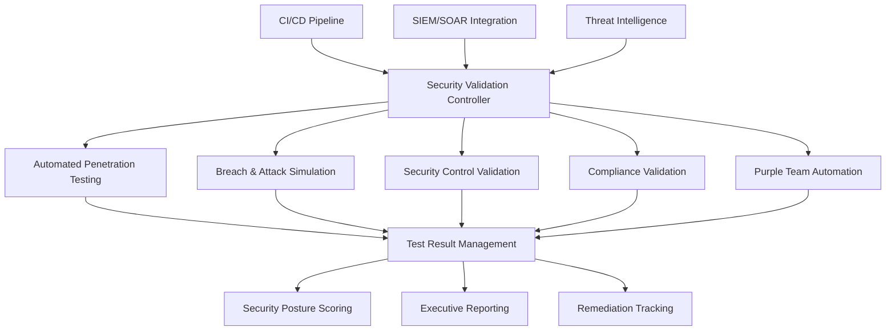

# Continuous Security Validation Framework - Architecture Design

## Executive Summary

The Continuous Security Validation Framework provides automated, real-time security testing and validation capabilities for ISec Technologies' security platform. This framework implements a comprehensive approach to continuous security assessment through automated penetration testing, breach and attack simulation, security control effectiveness validation, and compliance monitoring.

## Architecture Overview

### Core Components



### High-Level Data Flow

1. **Validation Trigger Sources**
   - Scheduled execution (daily, weekly, monthly)
   - CI/CD pipeline integration
   - Manual trigger via API
   - Event-driven triggers from SIEM
   - Configuration change detection

2. **Validation Execution Engine**
   - Orchestrates multiple security testing tools
   - Manages test execution queues and priorities
   - Handles concurrent execution and resource allocation
   - Implements circuit breakers for system protection

3. **Results Processing Pipeline**
   - Normalizes results from different tools
   - Correlates findings across multiple sources
   - Deduplicates and prioritizes vulnerabilities
   - Enriches findings with threat intelligence

4. **Reporting and Visualization**
   - Real-time security posture dashboards
   - Executive-level KPI reporting
   - Detailed technical reports for security teams
   - Compliance reporting for audit purposes

## Technology Stack Selection

### Core Platform Technologies

- **Container Orchestration**: Kubernetes with Istio service mesh
- **Database**: PostgreSQL for structured data, Elasticsearch for logs/findings
- **Message Queue**: Apache Kafka for event streaming
- **Cache**: Redis for session and result caching
- **API Gateway**: Kong for API management and security

### Security Testing Tools

#### Automated Penetration Testing
- **OWASP ZAP** (v2.14.0): Web application security scanning
- **Nuclei** (v2.9.4): Vulnerability scanning with community templates
- **Nmap** (v7.93): Network discovery and security auditing
- **Burp Suite Professional**: Advanced web security testing

#### Breach and Attack Simulation
- **AttackIQ** or **SafeBreach**: Commercial BAS platform
- **Atomic Red Team**: Open source atomic tests
- **MITRE Caldera**: Automated adversary emulation

#### Infrastructure Security
- **Trivy** (v0.43.1): Container and infrastructure security scanning
- **Kubescape** (v2.3.1): Kubernetes security posture management
- **Prowler** (v3.0.0): Cloud security best practices assessment
- **CloudSploit**: Multi-cloud security scanning

### Development and Integration
- **Programming Languages**: Go (backend services), Python (security tools), TypeScript (frontend)
- **CI/CD Integration**: GitHub Actions, GitLab CI/CD, Jenkins
- **Infrastructure as Code**: Terraform, Helm charts
- **Monitoring**: Prometheus, Grafana, Jaeger for distributed tracing

## Detailed Component Design

### 1. Security Validation Controller

**Purpose**: Central orchestration service managing all validation activities

**Key Features**:
- REST API for external integrations
- GraphQL endpoint for dashboard queries
- Webhook support for event-driven execution
- Multi-tenant isolation and resource management

**Configuration Management**:
```yaml
validation_controller:
  api:
    port: 8080
    tls_enabled: true
    cors_enabled: true
  
  scheduling:
    max_concurrent_jobs: 10
    job_timeout: 3600s
    retry_attempts: 3
  
  integrations:
    siem_webhook_url: "https://siem.isectech.com/webhooks/security-validation"
    jira_project: "VULN"
    slack_channel: "#security-findings"
```

### 2. Automated Penetration Testing Framework

**Architecture Pattern**: Microservices with containerized tool execution

**Components**:
- **Tool Orchestrator**: Manages execution of different security tools
- **Result Normalizer**: Converts tool-specific outputs to common format
- **False Positive Filter**: ML-based filtering of known false positives
- **Target Manager**: Maintains inventory of scan targets and schedules

**Tool Integration Patterns**:

#### OWASP ZAP Integration
```yaml
zap_configuration:
  docker_image: "owasp/zap2docker-stable:2.14.0"
  scan_profiles:
    full_scan:
      spider_duration: 600
      passive_scan: true
      active_scan: true
      ajax_spider: true
    quick_scan:
      spider_duration: 120
      passive_scan: true
      active_scan: false
```

#### Nuclei Integration
```yaml
nuclei_configuration:
  docker_image: "projectdiscovery/nuclei:v2.9.4"
  template_sources:
    - "nuclei-templates"
    - "custom-templates"
  severity_filters: ["critical", "high", "medium"]
  rate_limit: 150
```

### 3. Breach and Attack Simulation Engine

**MITRE ATT&CK Integration**:
- **Technique Coverage Matrix**: Mapping of available tests to ATT&CK techniques
- **Campaign Management**: Orchestrated attack scenarios
- **Blue Team Validation**: Automated verification of detection capabilities

**BAS Platform Integration**:
```yaml
bas_configuration:
  platform: "attackiq"
  api_endpoint: "https://api.attackiq.com"
  scenario_library:
    - technique: "T1078"
      name: "Valid Accounts"
      test_frequency: "weekly"
    - technique: "T1190"
      name: "Exploit Public-Facing Application"
      test_frequency: "daily"
```

### 4. Security Control Effectiveness Validation

**Control Categories**:
- **Network Controls**: Firewall, IDS/IPS, DLP
- **Endpoint Controls**: EDR, Antivirus, Host-based firewalls
- **Cloud Controls**: WAF, Identity management, Resource policies
- **Application Controls**: Authentication, authorization, input validation

**Validation Methodology**:
1. **Baseline Establishment**: Document expected control behavior
2. **Test Case Generation**: Automated generation of test scenarios
3. **Execution and Monitoring**: Run tests with real-time monitoring
4. **Effectiveness Scoring**: Quantitative assessment of control performance

### 5. Compliance Validation Engine

**Supported Frameworks**:
- **CIS Controls**: Automated implementation checks
- **NIST 800-53**: Control assessment procedures
- **ISO 27001**: Information security management system validation
- **SOC 2**: Service organization controls assessment

**Compliance Assessment Pipeline**:
```yaml
compliance_frameworks:
  cis_controls:
    version: "v8"
    assessment_frequency: "daily"
    critical_controls: [1, 2, 3, 4, 5]
  
  nist_800_53:
    revision: "rev5"
    assessment_frequency: "weekly"
    control_families: ["AC", "AU", "CA", "CM", "CP"]
```

### 6. Integration Architecture

#### CI/CD Pipeline Integration

**GitHub Actions Example**:
```yaml
name: Security Validation Pipeline
on:
  push:
    branches: [main]
  schedule:
    - cron: '0 2 * * *'

jobs:
  security_validation:
    runs-on: ubuntu-latest
    steps:
      - name: Trigger Security Scan
        uses: ./actions/security-validation
        with:
          scan_type: "full"
          target_environment: "staging"
```

#### SIEM/SOAR Integration

**Event Flow**:
1. Security validation results published to Kafka topic
2. SIEM consumes events for correlation and analysis
3. SOAR platform triggered for automated response
4. Results enriched with threat intelligence data

### 7. Data Architecture

#### Database Schema Design

**PostgreSQL Tables**:
```sql
-- Validation jobs tracking
CREATE TABLE validation_jobs (
    id SERIAL PRIMARY KEY,
    job_type VARCHAR(50) NOT NULL,
    target_system VARCHAR(255) NOT NULL,
    status VARCHAR(20) NOT NULL,
    started_at TIMESTAMP NOT NULL,
    completed_at TIMESTAMP,
    configuration JSONB,
    results JSONB
);

-- Security findings
CREATE TABLE security_findings (
    id SERIAL PRIMARY KEY,
    job_id INTEGER REFERENCES validation_jobs(id),
    finding_type VARCHAR(50) NOT NULL,
    severity VARCHAR(20) NOT NULL,
    title VARCHAR(255) NOT NULL,
    description TEXT,
    remediation_advice TEXT,
    cve_ids TEXT[],
    mitre_tactics TEXT[],
    created_at TIMESTAMP DEFAULT NOW(),
    status VARCHAR(20) DEFAULT 'open'
);
```

#### Elasticsearch Indexes

**Findings Index Mapping**:
```json
{
  "mappings": {
    "properties": {
      "timestamp": {"type": "date"},
      "finding_id": {"type": "keyword"},
      "severity": {"type": "keyword"},
      "tool": {"type": "keyword"},
      "target": {"type": "keyword"},
      "description": {"type": "text", "analyzer": "standard"},
      "remediation": {"type": "text"},
      "mitre_attack": {
        "properties": {
          "technique": {"type": "keyword"},
          "tactic": {"type": "keyword"}
        }
      }
    }
  }
}
```

## Security and Compliance Considerations

### Authentication and Authorization
- **OAuth 2.0/OIDC**: Integration with enterprise identity providers
- **RBAC**: Role-based access control for different user types
- **API Security**: Rate limiting, API key management, request validation

### Data Protection
- **Encryption**: TLS 1.3 for data in transit, AES-256 for data at rest
- **Data Classification**: Automatic classification of sensitive findings
- **Access Logging**: Comprehensive audit trails for compliance

### Network Security
- **Network Segmentation**: Isolated execution environments for testing
- **Egress Control**: Restricted outbound communications
- **Monitoring**: Network traffic analysis and anomaly detection

## Scalability and Performance

### Horizontal Scaling Design
- **Stateless Services**: All validation services designed for horizontal scaling
- **Load Balancing**: Kong API gateway with intelligent routing
- **Resource Management**: Kubernetes-based auto-scaling

### Performance Optimization
- **Caching Strategy**: Redis for frequently accessed data
- **Database Optimization**: Read replicas and query optimization
- **Asynchronous Processing**: Event-driven architecture for non-blocking operations

## Disaster Recovery and Business Continuity

### Backup Strategy
- **Database Backups**: Automated daily backups with point-in-time recovery
- **Configuration Backups**: Version-controlled infrastructure configurations
- **Results Archive**: Long-term storage of validation results for trending

### High Availability
- **Multi-Region Deployment**: Active-active configuration across regions
- **Failover Mechanisms**: Automated failover for critical components
- **Health Monitoring**: Comprehensive health checks and alerting

## Implementation Roadmap

### Phase 1: Foundation (Weeks 1-4)
- Deploy core infrastructure components
- Implement Security Validation Controller
- Set up basic tool integrations (ZAP, Nuclei)

### Phase 2: Core Features (Weeks 5-8)
- Complete automated penetration testing framework
- Implement compliance validation engine
- Develop security posture scoring system

### Phase 3: Advanced Features (Weeks 9-12)
- Deploy BAS integration with MITRE ATT&CK
- Implement purple team automation
- Complete executive reporting dashboards

### Phase 4: Integration and Optimization (Weeks 13-16)
- CI/CD pipeline integration
- SIEM/SOAR integration
- Performance optimization and scalability testing

## Success Metrics and KPIs

### Technical Metrics
- **Scan Coverage**: Percentage of infrastructure covered by automated scans
- **Detection Rate**: Percentage of known vulnerabilities detected
- **False Positive Rate**: Ratio of false positives to true findings
- **Time to Detection**: Average time to identify new vulnerabilities

### Business Metrics
- **Mean Time to Remediation**: Average time from detection to resolution
- **Compliance Score**: Percentage compliance with security frameworks
- **Risk Reduction**: Quantitative measure of security posture improvement
- **Cost Efficiency**: Reduction in manual security assessment costs

## Risk Assessment and Mitigation

### Technical Risks
- **Tool Integration Complexity**: Mitigated by standardized APIs and extensive testing
- **Performance Impact**: Mitigated by resource throttling and scheduling
- **False Positive Management**: Mitigated by ML-based filtering and feedback loops

### Operational Risks
- **Alert Fatigue**: Mitigated by intelligent alerting and prioritization
- **Resource Consumption**: Mitigated by resource limits and monitoring
- **Skills Gap**: Mitigated by comprehensive documentation and training

## Conclusion

This architecture provides a robust, scalable foundation for continuous security validation at ISec Technologies. The modular design ensures flexibility for future enhancements while maintaining security and compliance requirements. The implementation roadmap provides a clear path to deployment with measurable success criteria.